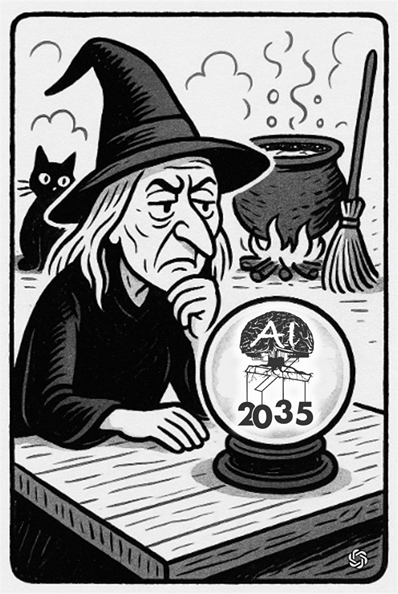

#### [Project Overview](../README.md)
----

# A software project in 2035

In this purely fictional story I want to take a look into the future, at a software transition project in 2035.

**Morla Chemicals** is a traditional mid-size company with around 240 employees. They still sit on classical mix of software from the 90th, modernized begin of the 2020th. A lot components are custom-built, tailored or have been customized internally (e.g., macros).

After handing over the company to the next generation, the new leader decided to finally address the painful IT-problem which had been postponed for several years.

**Talsamon Consulting and Operation Corp.** has been chosen to help with migration and transition because of their award-winning heavily AI-driven *Lightspeed process*.

We are witnesses of a meeting between a group of people from Morla (**CEO Karen Miller**, **CTO Chen Yarn**, **Hans Berg from HR**) and **Laura Winter from Talsamon**.

---

**Laura:** I am senior project manager at Talsamon, and I am here today to make you familiar with Talsamon's *Lightspeed Project Enforcement*. Thank you, Karen, for the opportunity! With the information you provided earlier I am pretty confident that we can get this project done within a few months.

**Chen:** *(laughing)*

**Laura:** Yes, this is the typical reaction, and indeed there are obstacles. But if our process is applicable, then a period of only a few months is indeed realistic.

**Karen:** Recently, I read about your success story with Metagrav Electrics.

**Laura:** Yeah, my colleagues did a fantastic job!

I would suggest that I will first give an overview how we work and how we would apply the process to your organization. Don't hesitate to ask if you have any questions or concerns.

**Karen:** Please start!

**Laura:** Talsamon is a relatively young company, founded in 2028, fully focussed on AI. Hence, our mantra *"you don't need to understand us, we understand you!"*. We don't see us as a tech company in the first place. Although we are actively maintaining our AI core product *Talsamon Graven*, the focus of our business is helping traditional companies transitioning to modern IT-processes.

**Chen:** So, you still have your own software engineering team?

**Laura:** Yes, although the core team of course uses AI-solutions to speed-up development, the evolution of Graven is still driven by humans. I am not so deeply involved, but as I understand, partially it is a matter of trust and marketing. *(smiling)*

**Hans:** *(tortured smile)*

**Laura:** Ok, let's first introduce the process, so you can better understand why we can move so fast compared to classical project durations. 

When we talk about a transformation project like you have in mind, then you typically have two major sometimes conflicting goals: Processes must remain intact vs. all processes must be improved *significantly*, best case at lower cost. 

The *Lightspeed* approach addresses this with consequent parallelism. After signing the required agreements (which unfortunately can take some time), Graven will right-away start scanning your IT-infrastructure, sources, binaries, documentation, whatever you can make available. At the same time we conduct *big picture event storming*, sometimes followed by process modeling workshops. The results are additional inputs for Graven.

**Chen:** Isn't that redundant? If Graven knows all the details why wasting time with process modeling workshops?

**Laura:** *Good catch!* The problem is the *representational gap*. The truth is somewhere between how the processes are designed, how they are used, how well they are understood and what they are supposed to do.

**Chen:** *(laughing, nodding)* Makes sense, last week we had this funny incident, ..., but please go ahead.

**Laura:** Best case, within a day we have what we call *base line, stage I*. Graven understands now what you have and what might be mandatory to be preserved.

**Karen:** *(skeptic)* Don't get me wrong, Laura, but it is hard to believe. Aren't there many uncertainties and problems? Especially, technical ones?

**Laura:** Interestingly, the technical side (scanning) works like a charm. I would say, more than 90% of all problems are related to legal questions. Most companies are not aware that even if they paid for a software solution and its documentation, they may still not be entitled to give Talsamon Graven access. This is a mine-field. Even after the AI-freedom act from 2031 in the US which gives AI card blanche to analyze all binary and source code as long as the results are not published, a customer sitting outside the US still won't be allowed to run *Graven Scan* without special permission. But don't worry, we at Talsamon offer fallback solutions like *Graven Observe* or *Graven Process Miner*. This just slows down the overall transition. I remember a case where we had to run Graven Observe for 24 months. Sometimes also data is a problem. Graven of course sees data. It is sometimes not so easy to explain this to data protection officers - although there have been introduced AI-exemptions to CCPA and GDPR in 2029. However, in my last project it took months to convince the internal IT to let Graven send surveys using a company-email-account. *(sigh)*

**Karen:** Hopefully not in our case.

**Laura:** *(smiling)* Most of the time we quickly find a good compromise.

**Hans:** What happens after this initial phase? You don't want to replicate everything as is, don't you?

**Laura:** *Correct.* Usually, starting in week two of the project, Graven will automatically prepare and conduct surveys for all staff members. You will see, these surveys are not too long, motivating and tailored. Gamification helps a lot! Also, Graven uses ascription not to overload the people with questions. The result of these surveys is a *4D-picture* (**dependent**, **desired**, **dysfunctional**, **detested**) of your employees' feature world. This is Graven's *base line, stage II*.

**Chen, Hans:** *(very skeptic)*

**Laura:** I see, you have doubts, and you are correct. This is not the whole truth. In one of the first bigger projects Talsamon almost failed, because we overlooked what we call the human impact. Meanwhile, we have put the human into the center. Let me explain how the next step works, the *Iterative Human-Driven Refinement*.

**Hans:** Ok ...

**Laura:** In fact, there is a fifth dimension hidden in the first survey results. Some people are scared, angry, skeptic, they feel uncomfortable or they just ignore the process. 

Graven can detect this and instruct our *Tactical Human Intervention Team (THIT)*. Talsamon-interally, the team members are called *humanitizers*. They bridge the gap between the digital world and the human.

**Hans:** Are there many THIT-teams?

**Laura:** You will be surprised. 70% of the Talsamon personnel are humanitizers, specially trained consultants.

**Hans:** So, they brain-wash our staff ... *(smiling)*

**Laura:** *(laughing)* No, humanitizing is not in the first place about convincing. We want people to *participate*. Sometimes, a bowling event helps, sometimes a discrete one-on-one. Most of the time the follow-up survey leads to much better results. I mentioned one of our first projects almost failing. This was because of hidden knowledge (abuse of existing processes, special cases, workarounds, even *business-critical Excel-macros*). 

Since we introduced THIT, this problem is gone, because people can meet other people in person.

**Karen:** Do you often find problems in this grey zone?

**Laura:** Yes, every organization has some, most of the time harmless. But in around 3% of all projects we have MCFs, mission-critical findings. Graven is able to detect these problems automatically and raise an alert.  

**Karen:** What does mission-critical mean?

**Laura:** This is typically a bug or wrong flow that sits in your existing processes causing a disadvantage for a third party, e.g., a partner paying too much, or tax was computed incorrectly. You could call it *accidentally illegal*.

**Karen:** Who does Graven inform?

**Laura:** Of course, these findings are highly confidential. Maybe you and Chen would be informed.

**Karen:** What next?

**Laura:** Talsamon clearly recommends open communication and "paying the ticket". You may wonder how many partners react positively and agree to a minor compensation when you show transparency! 

However, you may also decide to fix the problem silently. What you cannot do is ignoring the problem and instruct Graven to reproduce the illegal practice. This would violate Talsamon's ethical standards and lead to the immediate termination of our contract.

**Karen:** *(laughing)* Then hopefully we don't have any skeleton in the closet ...

**Laura:** Ok, let's go on, assuming, the THIT-phase was short and successful. Now Graven is at *base line, stage 3* (called batting tee) and can start the generation process. It will create a prototype (actually a smaller but full-fledged solution) running with generated test data on Talsamon-infrastructure. 

With the knowledge about the processes from the existing system, Graven will conduct complex test scenarios. I think, in our last project it were around 1.8 million different cases. Your staff afterwards gets enough time to play with the solution, tightly monitored by Graven. The built-in chatbot will be always at your side in case of questions.

**Hans:** Will there be trainings?

**Laura:** Usually just online, videos and interactive sessions automatically generated by Graven. In some situations we involve a THIT team for better acceptance. This is especially the case if a workflow gets replaced that was favored by a larger group of people. The trainings usually start in parallel to or right after the first hands-on contact with the test instance.

**Hans:** Makes sense.

**Chen:** You say, Talsamon infrastructure, is that mandatory?

**Laura:** It is easier and cheaper for you. If you want a standalone environment for the testing, we can organize it for you in one of the major clouds. On-prem is still beta but we are on it.

**Chen:** And eventually the migration. *Big bang?*

**Laura:** It depends. Due to the fact that development time is no longer a limiting factor, we can indeed avoid lengthy transition periods. However, we still see scenarios where a step-by-step replacement is required. Graven will consider patterns like strangler-fig or change data capture and automatically generate convenient integration UIs for the transition period.

**Chen:** And documentation?

**Laura:** Graven does that on-demand. If there are legal requirements to have anything printed, Graven can organize that for you. *(smiling)*

**Chen:** Who operates the system? How does the hand-over to the operation team work.

**Laura:** *(hem)* This is a bit critical every time we talk about. You won't need a classical operation team anymore after the transition is complete. Graven will run the entire show, no matter if you deploy your software on Talsamon infrastructure or anywhere else. It is called *autonomous operation*. 

A chatbot is available 24/7. Initially, we typically assign a THIT-team as human contacts.

*(silence)*

**Karen:** And after some time I have to repeat the whole process to update/adjust the solution?

**Laura:** *No!* That's the advantage of Talsamon's approach. We call it *Continuous Progress Advantage*. 24/7, 365 days a year, Graven not only monitors the processes as they are, it also detects potential flaws, people fighting inefficient dialogs, evaluates the questions raised to the chat bot, runs simulations, yada, yada, yada. Literally, over night improvements will be available. Sometimes people can't even tell why a certain dialog is suddenly easier to work with. As a nice side-effect your apps will never look outdated, promised! *(laughing)*

**Chen:** Ok, that's internal cosmetics, but what about external events. Security risks, library updates, legal changes.

**Laura:** Graven literally reads *all* the news and can react to incidents within a split-second. And even more. Last week we saw a new record, Graven automatically conducted a complex ISO-9001 re-certification in under 3 minutes!

**Karen:** *(frowning)* This all pretty-much relies on Graven and Talsamon to properly operate and maintain it. How can you trust, how should my investors and I?

**Laura:** Most clients hesitate in the first place. But, honestly, even in the classical scenarios, who is really independent from a chosen cloud vendor? Who is perfectly prepared for breaches or has backup-vendors for everything in case one vanishes? No question, with Talsamon you will have a tight relationship - but with a strong partner! However, for clients with special needs who don't want to run the solution on Talsamon infrastructure, our solution has a built-in *protected Graven split-mode*. A local Graven instance only occasionally talks to a Talsamon instance. Safe-points act as a protection mechanism (luckily, this was never required so far). Let there be a global incident in the news, and you want to isolate your instance for a while. You can do that without losing your main applications. Even Graven will still run, just less efficient and not updated anymore.

**Karen:** Makes sense, we will discuss this point internally.

**Chen:** Just out of curiosity, how do you protect Graven against AI-jacking?

**Laura:** I think, this is a problem of the past. I am not an expert, but recently, I talked to the core team, and they explained it to me like this: The *Graven Agentic Hive* processes a flood of internal and external events every day (learning). There was a potential risk that Graven changes behavior suddenly in any unexpected unwanted/evil way with the consequence of making silly decisions. This was solved with the *AI-fusebox*. As far as I understand, it is an independent model with no-learn access to the hive and access to a share of the incoming events plus a large history conducting simulations and making predictions all the time. This technique protects Graven from suddenly running mad.

**Karen:** Ok, time is up for today. Thank you Laura for your exciting presentation!

**Laura:** Great! Feel free to contact me if you have any further questions.

---

### chatGPT summary (unredacted):
----
The fictional story takes place in **2035 at Morla Chemicals**, a mid-sized company struggling with outdated IT systems. After a leadership change, the company hires **Talsamon Consulting** to modernize its IT using their AI-driven **Lightspeed Process**.

**Key elements of the process:**

 * **Analysis phase:** The AI “Graven” scans IT infrastructure, code, and documentation, while workshops capture the real business processes to bridge gaps between design and reality.
 * **Legal hurdles:** Technical issues are minor; legal challenges (licenses, data protection, international laws) are the real obstacles.
 * **Employee involvement:** Graven conducts surveys to map employee needs (the “4D picture”). Human concerns are addressed by THIT teams (“Humanitizers”), consultants who engage personally with staff.
 * **Mission-Critical Findings (MCFs):** Graven can detect serious hidden flaws in business processes that may cause legal or financial risks. Talsamon requires transparent handling of these.
 * **Prototyping & testing:** Graven rapidly generates prototypes, tested extensively with employee participation. Training is usually automated, sometimes supported by Humanitizers.
 * **Migration & operations:** Transition can be staged or done as a “big bang.” Afterward, Graven autonomously operates the system, supported by chatbots, making traditional IT operations teams unnecessary.
 * **Continuous Progress Advantage:** Graven continuously improves processes, interfaces, and compliance, reacting instantly to security risks, software updates, or regulatory changes.
 * **Trust & safety:** Clients depend heavily on Talsamon but can use a “split-mode” for partial independence. Graven is safeguarded from malfunction or manipulation by an **AI Fusebox** system.

**Core message:** The Lightspeed approach enables ultra-fast IT transformation through AI automation combined with human support. The main challenges are not technical, but legal issues, trust, and human acceptance.
