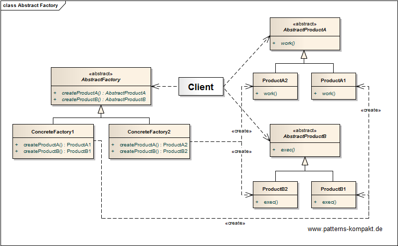
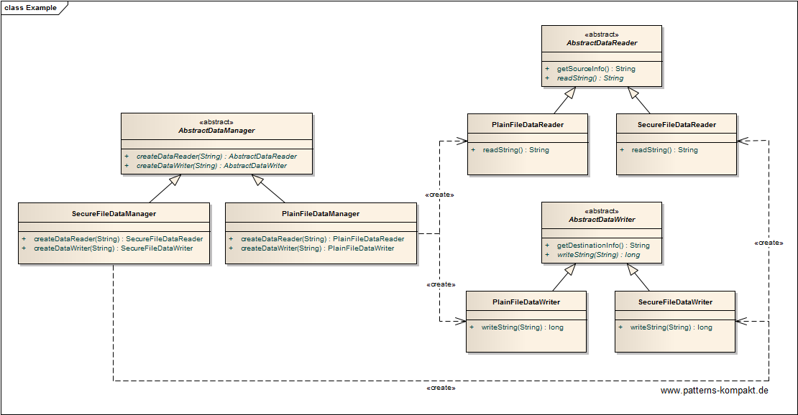

#### [Project Overview](../../../../../../../README.md)
----

# Generic One-Hashing Bloom Filter (OHBF)

## Introduction

After playing with cryptographic hashes in 2020 to create keys (see [MUHAI](../../../../../../test/java/de/calamanari/pk/muhai/README.md)) and being fascinated about the _randomness_ of these hashes, I wondered if it was possible to leverage the output of a single cryptographic hash to "simulate" multiple hash-functions required for a [Bloom Filters](https://en.wikipedia.org/wiki/Bloom_filter). The point is: a cryptographic hash computation may be expensive, but iterating over the input k-times (for computing k _cheap_ hash-functions) isn't for free either. Furthermore, selecting the _right_ k hash-functions can be a headache, sometimes highly depending on the use-case and its data types. So, why not spending more effort for computing a single well-investigated cryptographic hash? No need to "guess" any hash functions anymore, and with a large k most likely comparable speed.

Soon, I realized that I was obviously not the first one reasoning about this :smirk: - and found the conference paper _[One-Hashing Bloom Filter](https://www.researchgate.net/publication/284283336_One-Hashing_Bloom_Filter)_ published in 2015 by Jianyuan Lu, Tong Yang, Yi Wang, Huichen Dai, Linxiao Jin, Haoyu Song and Bin Liu.
The authors have successfully demonstrated that the k independent hash-functions a bloom filter requires can be replaced by leveraging the output of a single cryptographic hash.
Therefore, they suggest a multi-stage approach, where the first stage is computing a single hash followed by the application to k partitions of the filter (forming together m* >= m bits).
Their partition mechanism creates k partitions to fit m as good as possible, where the individual partition sizes are unique and prime. This way they can "simulate k hash-functions" using modulo(partition size) to find the bit to set in each partition for a particular hashed input. Finding a good partition setup with minimal waste `(m* - m)`based on primes is of course not trivial. However, the authors have demonstrated, that the waste is acceptable and the resulting bloom filter outperforms certain other approaches.

While I find the modulo-approach with prime-aligned partitions clever, I wondered if we were able to avoid that kind of complexity. The point is: We assume the hash to be random and not to contain any internal patterns (otherwise the cryptographic hash would be vulnerable). So, for randomization we should not need any additional sophisticated shuffling. The challenge is finding a mechanism to derive k pseudo-hash-values to set bits in the k partitions, so that these partitions are going to fill up uniformly.

## Concept

My idea was to use hash-bits as-is. Assumption: any b bits taken from the hash can be considered random, thus every integer number created of b bits from left to right should be random in range [0..2^b]. Thus, we can create k partitions and derive k random numbers from the hash. The k random numbers are the results from k _virtual hash functions_ and can be used directly to set bits. Given these numbers are random we do not need any modulo, we just need enough hash bits to read. Modern hash functions like SHA of the JDK provide you with 512 (or even more) bits per hash run out of the box, and the optimal k is often not too high. So, a single hash run should provide us with the desired input.

## Implementation

In the first implementation attempt I tried to create an optimal partition setup based on partition sizes alligned to 2^x. This alignment is necessary because the random numbers to be read from the hash bits are always in a range [0..2^x], and modulo I wanted to avoid. If mi is the size of a single partition, then the ultimate goal is to minimize m* = sum(mi) >= m. I wrote a partition optimizer that put together bigger and smaller partition and nicely minimized the waste. While some results really impressed me, in other cases the false-positive-rate completely derailed. I assume this is related to an effect I call _premature decrease of k_ if the partition layout contains larger and smaller (maybe tiny) partitions. The problem is that each insert into the bloom filter causes a write (one bit) to each partition. Consequently, a small partition will be _full_ (all bits set to 1) sooner than a large partition. Let's say to reduce waste some partition has a size of 2 bits. Latest after a handful of inserts most likely both bits will be set to 1. This means, for every subsequent insert this partition is meaningless, the number of hash-functions k has been virtually decreased by 1, with major impact on the quality of the filter. For a reliable (predictable) behavior of the filter until all n elements have been inserted it is essential to create partitions of (almost) equal size. 

After this rather unsatisfying experience I didn't want to give up and decided to drop the optimizer and ignore the waste issue in the first place. The new partitioner selected ma = 2^x <= m/k and increased partitions (x+1) partition by partition until sum(ma') >= m. The maximum waste this method causes is m/k - 1, potentially huge and maybe unacceptable, but still ok for the experiment.

The results were actually quite good and stable. The false-positive rate was below the configured/predicted rate in all my tests. Furthermore, the common estimation for bloom filters, the prediction of the number of elements in the filter based on the count of 1s worked quite well. Only the high waste deviation (sometimes super nice, in other cases close to m/k) made the solution uncomely. A main motivation to use bloom filters is memory efficiency, so, if the configured m is large and k is computed (unknown in advance) the difference between expected and real memory consumption could be too high.

I decided to step back. The idea of partioning obviously works, but only if all partitions are close to m/k (or bigger). So, best would be to use ma = m/k - but not necessary aligned to 2^x. If so, the maximum waste would be k-1 and thus negligible. But this brought back my old problem: The random values I read from the hash bits are by definition in a range [0..2^x] while my partition size can now be any number. The new challenge was to efficiently distribute the random number (range [0..2^x] to the partition's bits **in a fair manner**. This is what the current implementation does.

 * 

 * <b>Conclusion:</b>
 * 

 * I could demonstrate that the technique works and leads to a configurable and reliable bloom filter. It is easy to use and does not require the user to do any
 * complicated "guessing". The measured false-positive rate being less than the configured rate and the results from
 * {@link #getEstimatedNumberOfElementsInserted()} compared to the measured insert count indicate high reliability. It is interesting how well theory (see
 * formulas at <a href="https://en.wikipedia.org/wiki/Bloom_filter">https://en.wikipedia.org/wiki/Bloom_filter</a> fits the measurements, at least for the few
 * tests I did.

### Requirements Overview

The purpose of the file exchange feature is storing files in a specific format and reading this format. 

_Main Features_

* Write output String to file
* Return the effective size (bytes) of the written output
* Return textual description of the output file
* Read file to String
* Return textual info about source file
* Support standard (plain text) file support
* Support secure file support

### Quality Goals

_Table 1. Quality Goals_

No.|Quality|Motivation
---|-------|----------
1|Low Coupling|The application code shall be kept separated from implementation details regarding a particular file format.
2|Cohesion|Reading and writing belong together, the architecture shall reflect "the object family" without mixing the two concerns.
3|Extendability|It shall be easy to extend the system with future file formats.
4|Testability|The design shall encourage testing decoupled from the rest of the application.

## Choice of Pattern
In this scenario we want to apply the **Abstract Factory Pattern** to _provide an interface for creating families of related or dependent objects without specifying their concrete classes_ (GoF). 

We have identified _DataWriter_ and _DataReader_ as a **pair** (object family). Reading and writing remain different concerns but the chosen architecture reflects that they belong together. A new _DataManager_ can be added when we need to support an additional format. This does not affect other "families". The same would be true if we wanted to remove a particular DataManager after it became obsolete.

The client only depends on abstractions, not on concrete reader/writer implementations. In a more realistic implementation this would be left to configuration.

## Try it out!

Open [AbstractFactoryTest.java](AbstractFactoryTest.java) to start playing with this pattern. By setting the log-level for this pattern to DEBUG in [logback.xml](../../../../../../../src/main/resources/logback.xml) you can watch the pattern working step by step.

## Remarks
* The interface design (here `AbstractDataManager`, `AbstractDataReader` and `AbstractDataWriter`) is absolutely crucial (best guess upfront design), as later changes will trigger changes to potentially many implementation classes. This can even affect classes not contained in the initial code base, maybe maintained by external providers.

## References

* (GoF) Gamma, E., Helm, R., Johnson, R., Vlissides, J.: Design Patterns – Elements of Reusable Object-Oriented Software. Addison-Wesley (1995).
* (SteMa) Stelting, S., Maassen, O.: Applied Java Patterns. A Hands-On Guide to Design Pattern Developers. Prentice-Hall, Upper Saddle River (NJ, USA) (2001)
