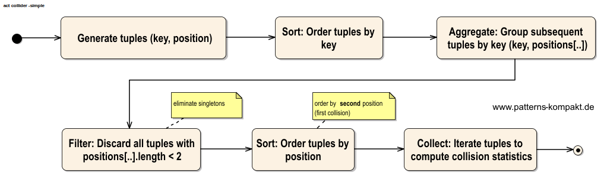
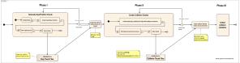
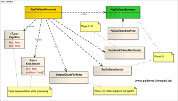

#### [Project Overview](../../../../../../../../README.md)
#### [MUHAI](../../../../../../../test/java/de/calamanari/pk/muhai/README.md)
----

# The collider package

## Overview

[KeyCollisionProcessor](KeyCollisionProcessor.java) and its supplementary classes have been created to support collision behavior analysis for [MUHAI](../../../../../../../test/java/de/calamanari/pk/muhai/README.md).

The processor can analyze billions of generated keys to find collisions and report a few statistics. I in general recommend some simulation before using MUHAIs. If you're lucky, you can test all the keys that may ever occur in your key-universe and maybe you can show that there won't be collisions at all. In any case, simulation insights can help you to get more confidence or convince other stakeholders.

## Collision detection and collection

In this context a _collision_ is defined as a key that occurred multiple times in a sequence of **n** generated keys in a keyspace of **m** keys.

Some questions to be answered after generating and testing **n** keys are:

1. How many collisions occurred in total?
2. How many keys were involved?
3. How many times did the same keys occur?
4. How many collisions occurred after *k* generated keys?

Finding collisions in a list of keys is a _holistic_ operation, because you need all keys. Even the last created key could collide with any key created before. Thus, first of all, we must collect _all keys_with some payload.

For a small number of keys we can do everything in memory. A HashMap that maps keys to payload (e.g. positions we found the key) serves as the collection data structure. For each generated key we either create a new entry in the map or update the payload (add position) if the key was present before. In a second step we iterate over the map entries and discard each key that only has a single occurrence. As a result, we know all collisions (question 1), the involved keys (question 2) as well as the number of collisions for each key. The latter information can be taken to answer question 3 and 4.

With a few lines of code we should be done.

Unfortunately, this solution won't scale. A couple of 100,000 keys may work out of the box, with some tricks (e.g. using efficient primitive maps like [ALM Works](https://bitbucket.org/almworks/integers/src/master/)) we can collect a few millions. But creating and storing billions of java objects in memory is not a good idea. You could involve an external cache, but consider the infrastructure overhead and the accumulated cache access durations (in total several days!).

So we need something else ...

### A sequential approach

The simplicity of the in-memory-solution above results from the random access capability. 
Alternatively, we can process elements sequentially and make use of the power of sorting.

The flow depicted above allows us to store most of the data in a data store and only a rather small portion of data in memory at a time.

### Parallel processing?

An easy candidate for parallel processing is the key-generation phase. If _k_ parallel key-producers shall create _n_ keys in total, we can let them create _k_ chunks (size = _n/k_) and give every instance its own start position _p_, so that the chunk generators create _(key, position)_ tuples with disjoint positions. The partial results can finally be combined to a superset containing the total number of _(key, position)_ tuples.

As mentioned before, collision detection is a _holistic_ operation. We could of course introduce an intermediate step that detects collisions in a chunk but preserves the singleton keys. Further steps would then merge these intermediate chunks and merge more singletons until a final step would remove the remaining singletons. This sounds fancy, but would it improve the performance? Most likely processing would be _slower_ then before. The reason is the rather small number of collisions we expect. Furthermore, collisions should be well distributed. Consequently, our intermediate steps would spend most of the time spooling singletons.

Collision insights and statistic computation would be again a good candidate for parallel execution. Computing counters and filling slots for a histogram can be done for several chunks independently, followed by a merge of the results.

### Implementation

This scenario is an ideal candidate for leveraging [Apache Spark](https://spark.apache.org/docs/0.9.1/scala-programming-guide.html). The data is potentially large (several billions of records) and operations like sorting and writing to chunks (see [RDD](https://spark.apache.org/docs/0.9.1/scala-programming-guide.html#resilient-distributed-datasets-rdds)) as well as the work load distribution are _the_ domain of Spark.

However, the code examples for the book are all written in Java. Spark jobs should be implemented in Scala. Mixing Scala and Java in the same project ist not ideal, also the _dependency trail_ (number of required libraries) of Spark is significant.

Finally, I decided to implement the sequential approach single-threaded in plain Java and took the chance to show the patterns [Value Object](../../../../../../../test/java/de/calamanari/pk/valueobject/README.md), [Iterator](../../../../../../../test/java/de/calamanari/pk/iterator/README.md), [Decorator](../../../../../../../test/java/de/calamanari/pk/decorator/README.md), [Policy](../../../../../../../test/java/de/calamanari/pk/policy/README.md) and [Factoy Method](../../../../../../../test/java/de/calamanari/pk/factorymethod/README.md) playing together in a further scenario.

* **Phase I:** Generate the keys and create tuples (key, position). These keys will be stored in a chunk file of configurable size. Each chunk is ordered by key.
* **Phase II:** Find collections as tuples (key, positions[]) and store the new tuples again in chunk files. The chunk files are ordered by the first collision position, means the _second position_ in the positions array is the sorting criteria.
* **Phase III:** Iterate _orderly_ over all chunks at the same time. The outcome is a single ordered stream of all collisions. We can now gather some insights about collisions to create the summary.

The [KeyCollisionProcessor](KeyCollisionProcessor.java) is a convenient tool to test large sequences of keys for collisions. Memory consumption (buffering) is configurable. There is also an option to leave all the intermediate result files (e.g. the keys at their positions) in place after completion for further investigation.

The result, [KeyCollisionSummary](KeyCollisionSummary.java) along with the detected collision counts (question 4 from above) also includes the _expected number of collisions_. 

The calculation is based on the function depicted above and leverages [apfloat](http://www.apfloat.org/apfloat_java/tutorial.html) for high precision computation. MUHAIs based on cryptographic hashes should follow the expectation curve quite well, an indicator of randomness. Nevertheless, for small keyspaces don't be surprised to see the first collision earlier than you thought!

Thanks to [Dmitry Dodin](https://de.linkedin.com/in/dodin-dmitry-56398295), data scientist and a great colleague, for helping me to transform the series _Sn_ into the formula _c(m,n)_.
