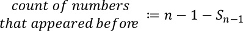

#### [Project Overview](../../../../../../../../README.md)
#### [The collider package](README.md)
----

# About estimating the expected number of collisions

**_How many collisions do we expect after generating n keys in a keyspace of m keys, if the distribution of generated keys is truly random?_**

The key generator ([MUHAI](../../../../../../../test/java/de/calamanari/pk/muhai/README.md)) does not have any state. Ideally, each key generation can be considered an independent random event. To put it simple, we assume the key generator to behave like dices. The generator can be considered as a fair dice with m sides because each time every key out of m has the same chance to appear.

Let us take an ordinary fair dice. Every time you throw it, you get the same chance to see 1, 2, 3, 4, 5 or 6. The events (throws) are independent. 

When you throw the dice 6 times, you intuitively will not expect to see all numbers. Most likely some numbers will be missing and some will appear twice in this experiment. Because a number that was the outcome of a previous throw appears again, we will call that a _collision_. Obviously, the chance to see a collision with any previously occurred number is strongly related to the times you have thrown the dice before - the more throws, the more likely it is to see a collision. Our goal is to estimate the expected number of collisions when throwing the dice n times.

When you throw the dice the first time, the chance of a collision is zero. Let us assume, you got a 3. If you throw the dice another time, the chance to get a 1, 2, 3, 4, 5 or 6 is the same, so to get a 3 is one out of six available numbers on the dice: 1/6. Alternatively we can say:

The absolute number of collisions after throwing the dice for the nth time we can estimate as:

We can now substitute the term _count of collisions before_ with the expected count of collisions after throwing the dice for the (n-1)th time. The count of possible numbers is fixed (here **m=6**).

We will call this series **_Sn_**.

Now we look at the remaining term _count of numbers that appeared before_. For the first throw there is no Sn-1 (0) and the _count of numbers that appeared before_ is 0. For the second throw Sn-1 is still 0 but the _count of numbers that appeared before_ is 1. Starting with the 3rd throw it gets interesting, because the _count of numbers that appeared before_ can be 2, or with a chance of 1/6 it can still be 1 (second throw was a collision). For each subsequent throw, the _count of numbers that appeared before_ depends on the number of collisions we saw before, specifically:

The _count of numbers that could have appeared_ when throwing the dice for the nth time is **n-1** (assuming n <= m). E.g. when throwing the dice for the 5th time, we could have seen 4 unique numbers _at most_ (no collision occurred). 

The term _count of collisions before_ we can substitute again with Sn-1.

After substituting the terms, our series looks like this:

We can rewrite this:

Because we assume that the key generator behaves like a fair dice, this series can be used to estimate the number of expected collisions after generating **n** keys in a keyspace with **m** possible keys.

Unfortunately, computing a series for estimation is inconvenient and very slow. Instead of iteratively computing **_Sn_** you can leverage the function **_c(m,n)_** depicted below:

> Thanks to [Dmitry Dodin](https://de.linkedin.com/in/dodin-dmitry-56398295), data scientist and a great colleague, for helping me to transform the series _Sn_ into the formula _c(m,n)_.

:warning: Be aware that during computation of _c(m,n)_ extremely large numbers and extremely small numbers come into play. Thus, the precision of common calculators and libraries will be insufficient.