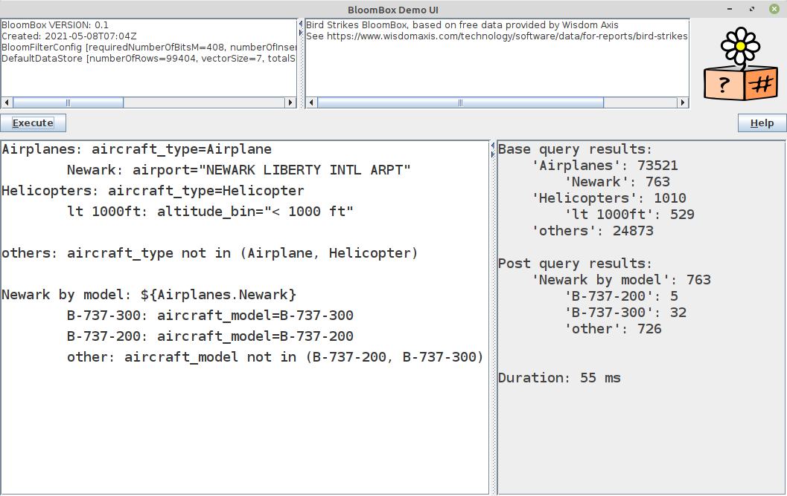

#### [Project Overview](../../../../../../../../README.md)
----

# The BloomBox

_A probabilistic "data-free" counting engine._&nbsp;&nbsp;&nbsp;&nbsp;&nbsp;&nbsp;&nbsp;&nbsp;&nbsp;&nbsp;&nbsp;&nbsp;&nbsp;&nbsp;&nbsp;

## Introduction

Data files with a couple of thousand columns are a challenge to most database systems. There are of course specialized databases that can deal with this problem, but especially if you
just need a way to quickly get some insights about the contained data it can be clumsy or expensive to prepare the database for your queries.

After finishing my experiments on [Generic Bloom Filters](../README.md) I thought it might be possible to leverage this technology for faster counting. Ok, there is a risk of false-positives, but it is small and it should not matter if we are just interested in some overview numbers (maybe percentages) whether the one or the other wrong row gets counted. So, the idea was born to represent each row with a bloom filter resp. its vector and built a _counting engine_.

An interesting aspect of this approach is that it would be "data-free". After feeding has completed, a BloomBox neither knows any source data nor any field meta data. The BloomBox can return result counts based on arbitrary queries, but it cannot tell you what to query. This makes the technique interesting whenever privacy concerns are a problem. A BloomBox cannot be used to reconstruct the rows it originally has been fed with!

## Concept

* For each row of the input data create a bloom filter.
* Feed the row's filter with the key-value pairs (create a hash-key ([MUHAI](../../../../../../../test/java/de/calamanari/pk/muhai/README.md)) for each pair).
* Consequently, the row store becomes a large number of bit vectors, one per row.
* For any query create a query bloom filter with the filter conditions.
* Scan the store and count any row bloom filter that matches (AND) the query bloom filter.

## Implementation


Constructing a BloomBox as described above is quite simple as it is just a large array of long values for representing the bit vectors. The main challenge was providing a convenient and performant way to run queries.

The diagram above shows the main levels of abstraction. The data store and its feeding have been separated first. Today, there is just an in-memory data store and (for some experiments) a _slow_ file-based implementation. Feeding happens single-threaded. However, you can easily provide custom data stores or feeding mechanisms. Besides support for feeding, the store just needs to _dispatch_ the query ([QueryDelegate](QueryDelegate.java)) to the rows, that's it. Results could be summed-up if you plan to distribute the work.

To simplify integration, the interface of the [BloomBoxQueryRunner](BloomBoxQueryRunner.java), which parses the query and coordinates the execution is very simple. You pass-in a [QueryBundle](QueryBundle.java) and get back a [QueryBundleResult](QueryBundleResult.java). All counts, warnings and error messages are contained in this result. I decided to use query _bundles_ because the scan is the most expensive part. By allowing an arbitrary number of queries to be executed during a single scan we get a performance advantage compared to many queries, each running a separate scan.

Not depicted above is the [ANTLR](https://www.antlr.org/)-based transformation of the textual queries into the binary [BbqExpression](bbq/BbqExpression.java) tree. Besides parsing, some basic validations and [optimizations](bbq/IntermediateExpressionOptimizer.java) lead to a unique representation for fast processing of the query bundle.

Still experimental is the support for upscaling. This is a useful feature if you only want to put a sufficient (and considerably smaller) sample into the box but report numbers extrapolated to the real dataset (called _target population_). While linear upscaling based on a representative sample is trivial (apply a fixed multiplier), it gets tricky if you want to correct a bias in the target population. I quickly realized that this needs more research, so I introducted the [UpScaler](UpScaler.java) interface as a further abstraction. The [DefaultUpScaler](DefaultUpScaler.java) is a first attempt. It uses supplementary queries in addition to the current user query to improve upscaling results. However, you can implement your own upscaler.


## The query language BBQ ("Barbecue")

I needed an easy-to-use query language and I wanted to make the best out of the query bundle concept. The result is a dual-grammar query language with optional dependencies among queries.

* Basic Queries cover the typical field matches. Supported are `=`, `!=`, `IN(...)`, `NOT IN(...)`, `AND` and `OR` plus parenthesis to group expressions ([ANTLR Grammar](../../../../../../../../src/main/antlr4/de/calamanari/pk/ohbf/bloombox/bbq/Bbq.g4)).
* Post Queries allow the user to combine queries using `INTERSECT`, `UNION` and `MINUS` ([ANTLR Grammar](../../../../../../../../src/main/antlr4/de/calamanari/pk/ohbf/bloombox/bbq/PostBbq.g4)).
* Every query can have sub-queries (single level). This is useful for the common case that you want to know the numbers split by another criterion (e.g. "color").
* In BBQ you only need to put a name or value in quotes when necessary (e.g. a space character contained). For simplicity, both, double and single quotes are supported.
* If you need to escape a character inside quotes then use the backslash. The backslash itself can be escaped by doubling it.

A clear separation of the two grammars made the implementation much simpler and hopefully will lead to less usage problems. 

### Basic query examples

```
vendor=Audi and model=A3

(color=red or color="ice blue") and (electro=yes)

color NOT IN (red, blue, black)

vendor=Ford and model=Mustang

type!=sedan

```

### Post query examples

```

${query1} INTERSECT ${query2}

${query1} UNION ${query2}

(${query1} UNION ${query2}) MINUS ${query3}

```


### Errors and Warnings

To keep the interface easy and clean I decided to include error and warning codes in the messages returned by the engine. This way a client may either display the messages as is or pick the codes and display custom messages.

All codes are defined in [BbxMessage](BbxMessage.java).

## Storage format

The core format is just an array of long-values. Whenever written to disk these longs get [big-endian](https://en.wikipedia.org/wiki/Endianness)-encoded into 8 bytes per long. This raw format (just the bytes, no meta-information) is called BBS-format.

The [BloomBox](BloomBox.java)'s storage format puts some meta data headers in front of the store and BBS-section. This format is called BBX. Only a BBX-file can be restored to a valid BloomBox. If you want to inspect the metadata of a BBX-file on UNIX, write `head -n 1 <my-bloom-box-file>.bbx`. It will show you the single-line json that describes the box. The box header is followed by the data store header, usually followed by the BBS-section.
This way, any BloomBox using the [FileDataStore](FileDataStore.java) can run on the BBX-file without having to copy the BBS-store before start.

See also [BloomBoxHeader](BloomBoxHeader.java) and [DataStoreHeader](DataStoreHeader.java).

## Known Limitations

* No support for quantitative data.
 * You can mitigate this restriction by _binning_ (create clases like 0-99, 100-199, 200-299, etc.)
* No fuzzy queries, uppercase/lowercase, spelling etc.
 * "Aliased feeding" may help, use a generic representation for multiple variations of an input value
* The size of the box still grows linearly with the number of rows.
 * You may feed the box with a representative sample and perform upscaling.
 


## The Bird Strikes Example

For making your own experiments with the BloomBox I have prepared some data. 

I originally obtained this record set from [Wisdom Axis](https://www.wisdomaxis.com/technology/software/data/for-reports/bird-strikes-data-for-reports.php) who provided the sample for free. 

This data is about aircraft incidents. I have chosen this example because we have a certain data volume (99,404 rows, 17 columns) that can still be handled by any ordinary RDBMS like MySQL/MariaDB, so that we can compare results.

### Preparation

* Unzip [birdstrikes.csv.zip](../../../../../../../../src/test/resources/birdstrikes.csv.zip) to some folder of your choice.
* Install a MySQL or MariaDB database.
* Create a table   

```
CREATE TABLE BIRD_STRIKES (
    id INT NOT NULL AUTO_INCREMENT,
	aircraft_type VARCHAR(255) NULL,
	airport VARCHAR(255) NULL,
	altitude_bin VARCHAR(255) NULL,
	aircraft_model VARCHAR(255) NULL,
	num_of_strikes VARCHAR(255) NULL,
	impact_to_flight VARCHAR(255) NULL,
	effect VARCHAR(255) NULL,
	num_of_engines INT NULL,
	airline VARCHAR(255) NULL,
	state VARCHAR(255) NULL,
	phase_of_flight VARCHAR(255) NULL,
	special_conditions VARCHAR(255) NULL,
	bird_size VARCHAR(255) NULL,
	sky_conditions VARCHAR(255) NULL,
	species VARCHAR(255) NULL,
	time_of_day VARCHAR(255) NULL,
	prewarned VARCHAR(1) NULL,
    PRIMARY KEY (id)
);
``` 
* Import the CSV-data

```
LOAD DATA INFILE '/mytemp/birdstrikes.csv' 
INTO TABLE BIRD_STRIKES
FIELDS TERMINATED BY ';' 
LINES TERMINATED BY '\n'
IGNORE 1 ROWS
(aircraft_type, airport, altitude_bin, aircraft_model, num_of_strikes, impact_to_flight, effect, @vnum_of_engines, airline, state, phase_of_flight, special_conditions, bird_size, sky_conditions, species, time_of_day, prewarned)
SET num_of_engines = NULLIF(@vnum_of_engines,'')
; 
```
* This is your stable basis for deterministic counting and comparison.
* Now open [BloomBoxTest.java](../../../../../../../test/java/de/calamanari/pk/ohbf/bloombox/BloomBoxTest.java)
* Adjust (file names) and run the test case `testCreateBirdStrikesBloomBox` which will create a light-weight BloomBox (5.5MB) that reflects the data you have just imported into your local database.
* This test data is not impressive, yet (just 17 columns). Please adjust and run the case `testCreateEnrichedBirdStrikesBloomBox`. It will use the same input but add 10,000 extra columns (see description in the test case). The new box size is around 2.9 GB, it reflects a table with 99,404 rows, each 10017 columns, too big for most DBs. Here lies the strength of the BloomBox.


### Querying the BloomBox

* Adjust the test case `testBloomBoxDemoUI` to run the little demo application (see screenshot  below).
* Please first use the small box (5.5MB). 
* Now you can run the same queries against your local database and compare the results to what you get from the BloomBox.
* The results should match very well, because of the settings provided for the false-positive rate epsilon.
* But you can also show that it is a probabilistic store. Enter this query: `wrong: i=9`. You would expect `0` but you will see `1` for the small box!
* You can now make experiments with an increased epsilon. Then query results will deviate more and more from the deterministic counts returned by your database.
* Finally, run the demo again with the large box. You should see that the queries based on the first 17 columns still match the database results. Then you can play with the 10,000 special columns. E.g. if you add an AND-condition `occ_9940=1` (true for 10% of all rows) then your query results should approx. go down to 10% of the original counts.
* **Have fun!** 

