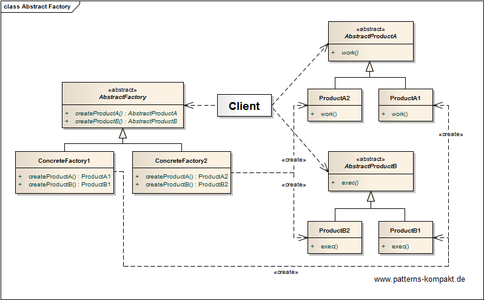
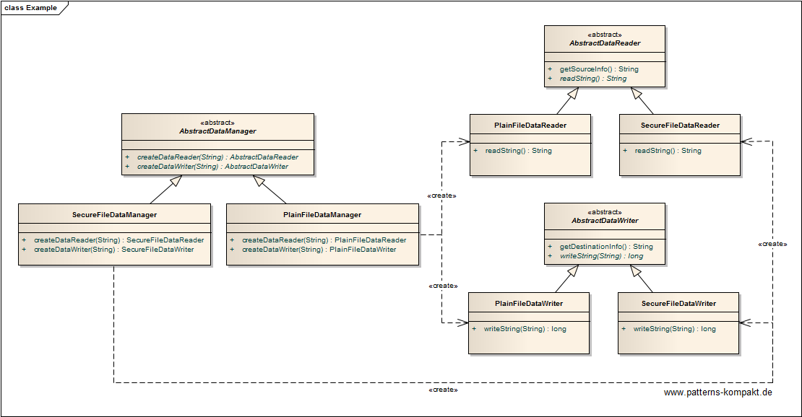

#### [Project Overview](../../../../../../../README.md)
----

# Abstract Factory

## Scenario

Multiglom Medical, market leader for artificial appendixes, needs to update parts of their internal software to support standard and secure file communication.

Because it is not yet clear, how many different formats will have to be supported in future the client looks for an extendable solution not limited to a single implementation.

### Requirements Overview

The purpose of the file exchange feature is storing files in a specific format and reading this format. 

_Main Features_

* Write output String to file
* Return the effective size (bytes) of the written output
* Return textual description of the output file
* Read file to String
* Return textual info about source file
* Support standard (plain text) file support
* Support secure file support

### Quality Goals

_Table 1. Quality Goals_

No.|Quality|Motivation
---|-------|----------
1|Low Coupling|The application code shall be kept separated from implementation details regarding a particular file format.
2|Cohesion|Reading and writing belong together, the architecture shall reflect "the object family" without mixing the two concerns.
3|Extendability|It shall be easy to extend the system with future file formats.
4|Testability|The design shall encourage testing decoupled from the rest of the application.

## Choice of Pattern
In this scenario we want to apply the **Abstract Factory Pattern** to _provide an interface for creating families of related or dependent objects without specifying their concrete classes_ (GoF). 

We have identified _DataWriter_ and _DataReader_ as a **pair** (object family). Reading and writing remain different concerns but the chosen architecture reflects that they belong together. A new _DataManager_ can be added when we need to support an additional format. This does not affect other "families". The same would be true if we wanted to remove a particular DataManager after it became obsolete.

The client only depends on abstractions, not on concrete reader/writer implementations. In a more realistic implementation this would be left to configuration.

## Try it out!

Open [AbstractFactoryTest.java](AbstractFactoryTest.java) to start playing with this pattern. By setting the log-level for this pattern to DEBUG in [logback.xml](../../../../../../../src/main/resources/logback.xml) you can watch the pattern working step by step.

## Remarks
* The interface design (here `AbstractDataManager`, `AbstractDataReader` and `AbstractDataWriter`) is absolutely crucial (best guess upfront design), as later changes will trigger changes to potentially many implementation classes. This can even affect classes not contained in the initial code base, maybe maintained by external providers.

## References

* (GoF) Gamma, E., Helm, R., Johnson, R., Vlissides, J.: Design Patterns – Elements of Reusable Object-Oriented Software. Addison-Wesley (1995).
* (SteMa) Stelting, S., Maassen, O.: Applied Java Patterns. A Hands-On Guide to Design Pattern Developers. Prentice-Hall, Upper Saddle River (NJ, USA) (2001)
