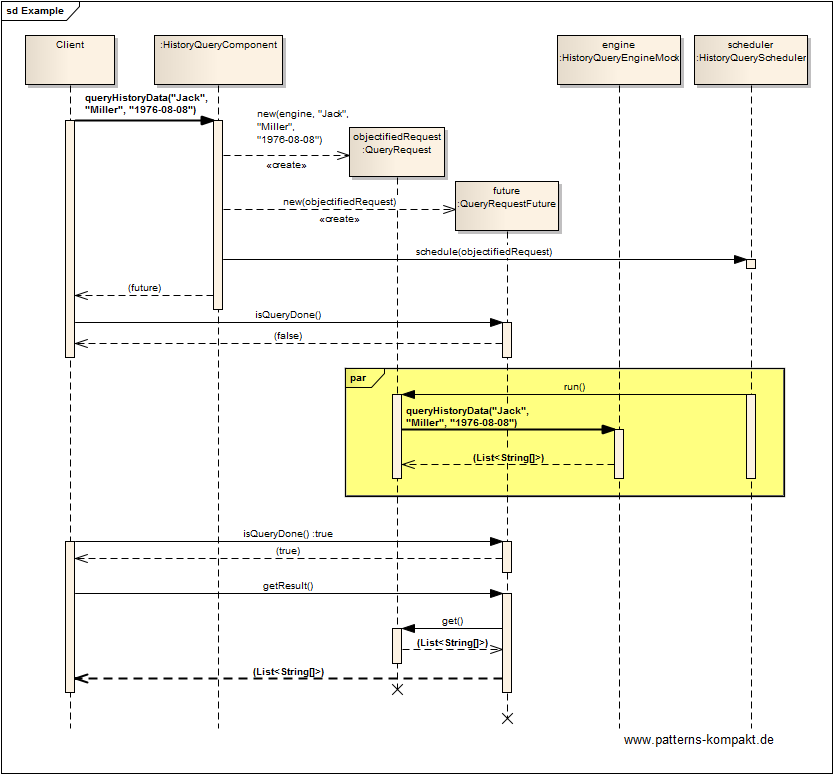

#### [Project Overview](../../../../../../../README.md)
----

# Active Object

## Scenario

Multiglom Media, vendor of the popular archiving solutions Devnull, currently reworks the "search-by-person" feature.

A search run needs to query various databases and users complain about a lack of responsiveness, long waiting times and not even a cancel option.
The engineering team wants to replace the solution with an asynchronous search.

### Requirements Overview

The purpose of the new search-by-person-feature is a decoupled search functionality, so that the user won't have to wait for the result, is unblocked to other tasks and can even cancel a search run.

_Main Features_

* Search criteria can be entered in the same way as before.
* Search can be awaited or put into the background to check later.
* Search run can be canceled by the user.

### Quality Goals

_Table 1. Quality Goals_

No.|Quality|Motivation
---|-------|----------
1|Responsiveness|While performance in terms of "absolute search duration" cannot be guaranteed, we want to ensure that the user never feels blocked or jailed in waiting position.

## Choice of Pattern
In this scenario we want to apply the **Active Object Pattern** to _define the units of concurrency to be service requests on components, and run service requests on a component in a different thread from the requesting client thread. Enable the client and component to interact asynchronously to produce and consume service results_ (POSA). 

In the scenario above the complex search takes time in the backend and shall run decoupled from the user's interaction with the application. 

Therefore we objectify the query as a _HistoryQueryRequest_ to schedule it for execution.
The client gets an immediate response in form of the _QueryRequestFuture_.

By polling the future the client can check for completion from time to time or even cancel the request. The client is no longer blocked.

## Try it out!

Open [ActiveObjectTest.java](ActiveObjectTest.java) to start playing with this pattern. By setting the log-level for this pattern to DEBUG in [logback.xml](../../../../../../../src/main/resources/logback.xml) you can watch the pattern working step by step.

## Remarks
* The implementation effort seems quite high, but this pattern can **really** make users happy. For a human the absolute time an operation may take is often not the main concern, _waiting_ resp. _feeling left alone waiting_ is painful, especially, when the user is locked in a particular screen. :grin:

## References

* (POSA) Buschmann, F., Henney, K., Schmidt, D.C.: Pattern-Oriented Software Architecture: A Pattern Language for Distributed Computing. Wiley, Hoboken (NJ, USA) (2007)
