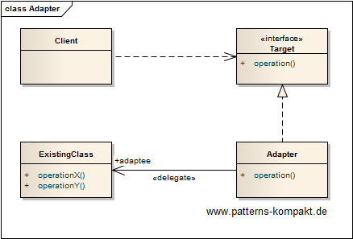
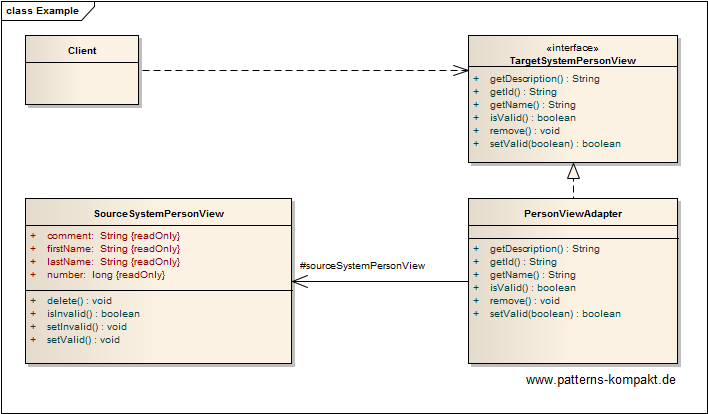

#### [Project Overview](../../../../../../../README.md)
----

# Adapter

## Scenario

Multiglom Crapjuls, a vendor of compostable jewels, is currently running a large IT-project to refurbish its CRM-platform BABBLER.

BABBLER is quite aged, so it was decided to renovate module by module including a fresh data model under the hood. A couple of weeks before the planned release a serious problem has been discovered. Team Gogo has made great progress with their application TARGET and is only waiting for the data for the _PersonView_, which is only a small aspect of TARGET but crucial for the release. Unfortunately, it is now clear that the module NEWPEOPLE won't make it into the upcoming release. Endless discussions about multitenancy aspects have ruined the timeline and eroded the confidence about delivery.

Team Gogo is quite disappointed because they are ready, but without the _PersonView_ it won't make sense to ship TARGET. The idea to "quickly write some SQLs on the old DB" has been rejected. The only feasible workaround seems to be a temporary dependency to a package of the legacy system SOURCE. This way the developers would have access to the _SourceSystemPersonView_. It contains all the information the _PersonView_ in the TARGET application should display, but in a different way (types, formats).

Team Gogo is looking for a way to show the legacy data from SOURCE in the TARGET application while keeping the "workaround dependency" as small and _explicit_ as possible.

### Requirements Overview

The purpose of the SOURCE person data loader in TARGET is a quick integration to be replaced as soon as the NEWPEOPLE module will be ready.

_Main Features_

* Show SOURCE data regarding Person in TARGET.

### Quality Goals

_Table 1. Quality Goals_

No.|Quality|Motivation
---|-------|----------
1|Isolation|It is a clear design goal to avoid or at least minimize dependencies to the old system SOURCE. The compromise we make must not lead to eroding standards in TARGET.
2|Speed|A quick solution is required to unblock the release.
3|Replaceability|Module NEWPERSON is expected to be ready, soon. At that time it shall be easy to eliminate the workaround.

## Choice of Pattern
In this scenario we want to apply the **Adapter Pattern** to _convert the interface of a class into another interface clients expect_ (GoF). 

We have identified the _SourcePersonView_ as the existing class that contains the right information, but represented in the wrong way.

The solution is the introduction of the _TargetSystemPersonView_. Code of the TARGET application implemented by the Gogo team following the new standards only depends on this interface. The _PersonViewAdapter_ adapts now _SourcePersonView_ to the _TargetSystemPersonView_ interface.
In a later release the "workaround adapter" can be replaced with the person data provided by the NEWPERSON module with minimal effort.

## Try it out!

Open [AdapterTest.java](AdapterTest.java) to start playing with this pattern. By setting the log-level for this pattern to DEBUG in [logback.xml](../../../../../../../src/main/resources/logback.xml) you can watch the pattern working step by step.

## Remarks
* It is worth mentioning that the _Adapter_ pattern is about adapting a single class. In practice you will often see the name _Adapter_ when it is actually a _[Facade](../facade/README.md)_ or a _[Wrapper](../wrapper/README.md)_. I personally see it pragmatically: it is ok as long as readers can understand the intention and function.

## References

* (GoF) Gamma, E., Helm, R., Johnson, R., Vlissides, J.: Design Patterns – Elements of Reusable Object-Oriented Software. Addison-Wesley (1995).

