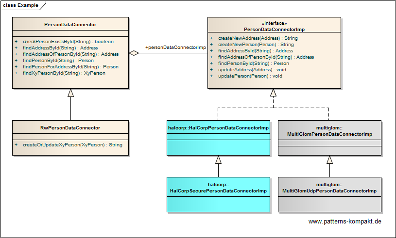

#### [Project Overview](../../../../../../../README.md)
----

# Bridge

## Scenario

Foobar&Sons Multigrate is a new platform that aims to integrate CRM data from various vendors.
In an early project stage the team is discussing the person data access with support for HalCorp and Multiglom.

While one objective of the new Partner System Access Interface (PSAI) is a clear separation between read-only access and write access, the other main concern is developing a design that will allow adding support for more external platforms besides HalCorp and Multiglom.

* Per partner system we need a certain core functionality for the access.
* For the transparent access we want to provide several connectors, each with a certain focus (for the time being a pure read-only-connector and a read-write-connector). Connectors shall realize their feature set based on the functionality of the partner systems without depending on a particular partner system.

### Requirements Overview

The purpose of PSAI is an extendable integration solution for partner-CRMs so that the PSAI feature set can evolve independently from the list of supported partners.

_Main Features_

* Integrate with HalCorp and Multiglom.
* Provide read-only connector to the person management.
* Provide read-write connector to the person management.

### Quality Goals

_Table 1. Quality Goals_

No.|Quality|Motivation
---|-------|----------
1|Extendability|We want to implement new PSAI-features in future and we want to exchange data with more platforms. The feature set and the number of supported partners shall evolve as independent as possible from each other.

## Choice of Pattern
In this scenario we want to apply the **Bridge Pattern** to _decouple an abstraction from its implementation so that the two can vary independently_ (GoF). 

We have identified two aspects which should evolve independently from each other: the connectors to exchange data with external systems (_HalCorpPersonDataConnector_ and _MultiglomPersonDataConnector_) on the one hand and the feature set, means the connectors PSAI provides to its clients, here the basic _PersonDataConnector_ (read-only) and the _RwPersonDataConnector_.

The connector family can now evolve independently from the family of _PersonDataConnectors_.

Below you can see depicted how the connectors for external systems can be further decoupled by configuration. 

All dependencies go away from these connectors. In other words: a different team or even a different company can implement further connectors while PSAIs internal feature set (e.g. add a VipPersonDataConnector) can be extended independently.

## Try it out!

Open [BridgeTest.java](BridgeTest.java) to start playing with this pattern. By setting the log-level for this pattern to DEBUG in [logback.xml](../../../../../../../src/main/resources/logback.xml) you can watch the pattern working step by step.

## Remarks
* Bridge is definitely not an easy pattern (see also (Shalloway-Trott)) and adds some complexity to a project. It may need more explanation (documentation) to be sure everybody understands the motivation and the implementation correctly.
* Unfortunately, the name "bridge" often creates confusion. The term has real-world meanings (e.g. a bridge over a river or a network bridge) that do not map intuitively to the idea behind the bridge pattern. So, you may see classes named "Bridge" which don't have anything to do with this pattern.

## References

* (GoF) Gamma, E., Helm, R., Johnson, R., Vlissides, J.: Design Patterns – Elements of Reusable Object-Oriented Software. Addison-Wesley (1995).
* (Shalloway-Trott) Shalloway, A., Trott, J.R.: Design Patterns Explained – A New Perspective on Object-Oriented Design. Addision-Wesley (2002). Additional information at www.netobjectives.com.
