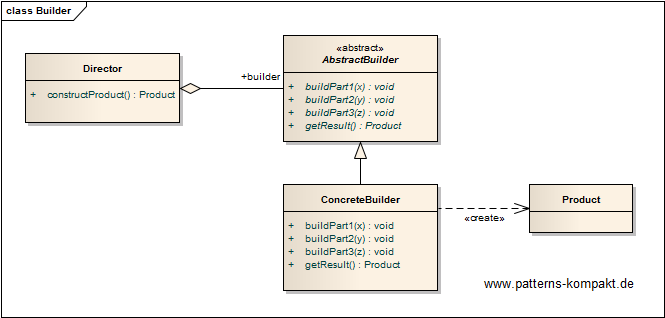
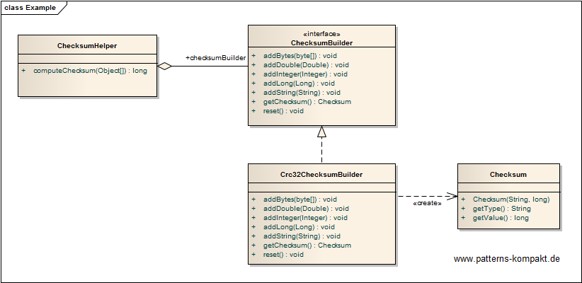

#### [Project Overview](../../../../../../../README.md)
----

# Builder

## Scenario

Multiglom Media, vendor of archiving solutions, runs an internal project to refactor mechanisms for checksum computations.

The existing solution consists of a couple of scripts and lacks maintainability. Additionally, new requirements force the client to support several types of checksums, not just a single one as today.

### Requirements Overview

The purpose of the checksum generator is computing checksums over selected properties.

_Main Features_

* Compute checksum over a given (configurable) list of properties.
* Support the following property types: double, int, long, String, byte array
* The checksum shall be represented in the system as a **long value** with a certain **associated type** to allow different typed checksums for the same content at the same time

### Quality Goals

_Table 1. Quality Goals_

No.|Quality|Motivation
---|-------|----------
1|Reusability|The checksum generator shall be reusable, so it can be "recycled" to avoid unnecessary instances.
2|Streaming-capability|In the first version all properties are available as an array but future scenarios may require to process the properties one after another (stretched computation). The design shall consider this aspect.
3|Extendability|It shall be easy to add further checksum types.
4|Testability|The design shall encourage testing decoupled from the rest of the application.

## Choice of Pattern
In this scenario we want to apply the **Builder Pattern** to _separate the constructon of a complex object from its representation so that the same construction process can create different representations_ (GoF). 

We have identified the typed _Checksum_ as a more or less complex object to be created. The construction process itself (checksum type and properties to be included) shall be configurable.

The client only depends on the ChecksumHelper (aka Director), while the latter only depends on the interface of the ChecksumBuilder. There could be multiple concrete implementations besides the Crc32ChecksumBuilder (configurable type). In the first implementation all properties are available as an Object array that gets passed to the ChecksumHelper. The ChecksumHelper then calls the appropriate methods on the builder step by step (per property). This design would also allow a construction stretched over time if the properties reached the ChecksumHelper one after another (streaming). To allow reuse, the ChecksumBuilder has a `reset()`-method.

## Try it out!

Open [BuilderTest.java](BuilderTest.java) to start playing with this pattern. By setting the log-level for this pattern to DEBUG in [logback.xml](../../../../../../../src/main/resources/logback.xml) you can watch the pattern working step by step.

## Remarks
* Making the construction process independent from the constructor of a class is often used for stretching the process over time or to avoid a plethora of constructors (resp. constructor arguments). A variation of this principle can be observed in implementations of **[fluent APIs](https://en.wikipedia.org/wiki/Fluent_interface)**.
* Builders allow a much finer handling of error scenarios. Instead of rejecting the whole construction (what a constructor would do by throwing an exception), the _Director_ has more options to react on a single issue.
* Often the Builder pattern can be found without any _explicit Director_ (clients just use the Builder). However, the _Director_ in the Builder pattern is noteworthy as it adds the option to separate the decision _how_ to construct the product from the actual stretched construction process. In the example the ChecksumHelper could _choose_ the concrete ChecksumBuilder based on configuration or contextual information.
* A _Builder_ is very tightly coupled to its _Product_ (here the checksum), this can lead to cascading change efforts.

## References

* (GoF) Gamma, E., Helm, R., Johnson, R., Vlissides, J.: Design Patterns – Elements of Reusable Object-Oriented Software. Addison-Wesley (1995).
* (SteMa) Stelting, S., Maassen, O.: Applied Java Patterns. A Hands-On Guide to Design Pattern Developers. Prentice-Hall, Upper Saddle River (NJ, USA) (2001)
