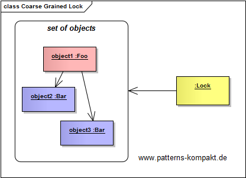
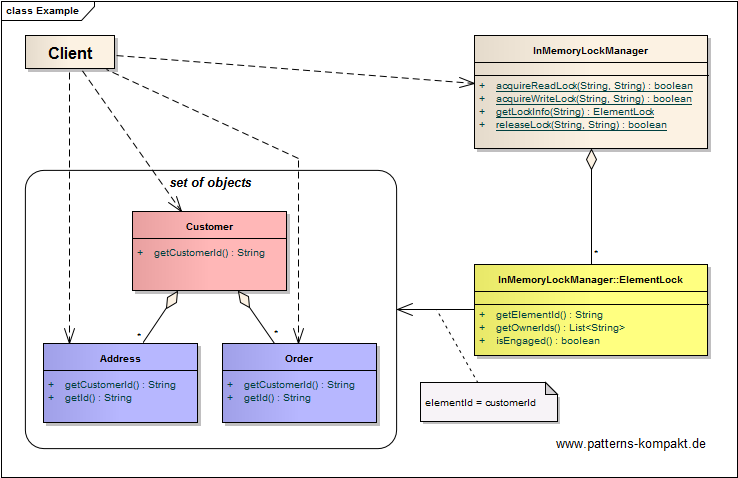
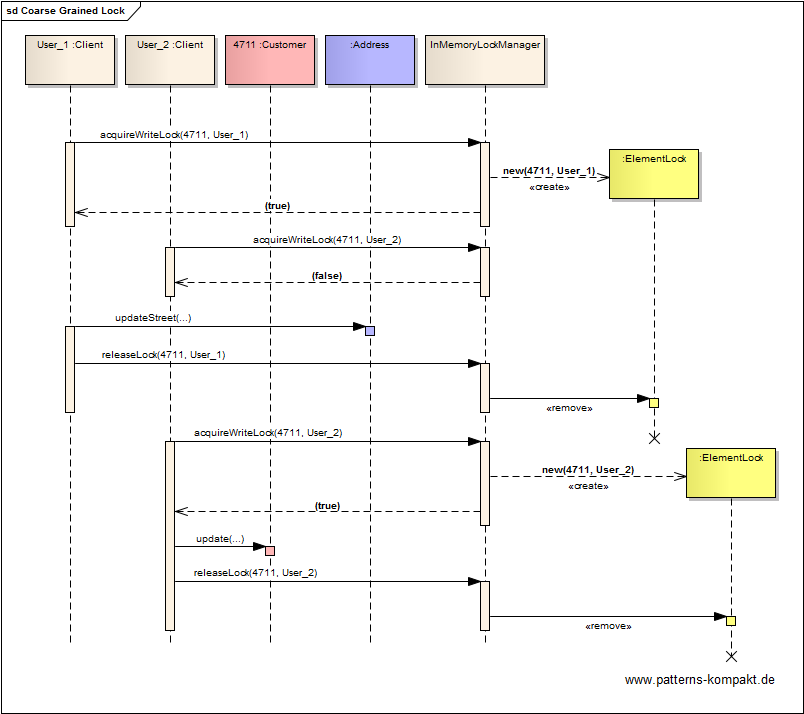

#### [Project Overview](../../../../../../../README.md)
----

# Coarse-Grained Lock

## Scenario

Multiglom Smart Business, vendor of the web shop solution WANNAWEB, is currently investigating occasional deadlocks and inconsistencies.
The problems have been drilled down to the data model and the access patterns involving the business entities _Customer_, _Address_ and _Order_.

To improve the situation the team wants to change the way how modification of these related entities is managed.

### Requirements Overview

The purpose of the entity control improvement initiative is avoiding inconsistencies when multiple users or processes manage a customer's data.

_Main Features_

* Ensure that the customer data cannot be modified concurrently, even if this data set consists of multiple business entities.

### Quality Goals

_Table 1. Quality Goals_

No.|Quality|Motivation
---|-------|----------
1|Consistency|At any time only one user or process shall deal with the customer data. For example during a session where a user works with customer's order data, it must not happen that the customer's name or address gets modified by another user.
2|Isolation|We want to make explicit that there is a modification ongoing, so that a user can decide to wait or come back later for working with a particular customer's data.

## Choice of Pattern
In this scenario we want to apply the **Coarse-Grained Lock pattern** to _lock a set of related objects with a single lock_ (Fowler). 

In the given scenario _Customer_, _Address_ and _Order_ are the related objects.

We control modification (access) to this group of entities by introducing a single lock. 

As long as a _User&#95;1_ holds the lock, _User&#95;2_'s requests will be rejected. After _User&#95;1_ has released the lock, _User&#95;2_ can acquire a new lock to continue with her changes.

## Try it out!

Open [CoarseGrainedLockTest.java](CoarseGrainedLockTest.java) to start playing with this pattern. By setting the log-level for this pattern to DEBUG in [logback.xml](../../../../../../../src/main/resources/logback.xml) you can watch the pattern working step by step.

## Remarks
* At first glance, it might look tempting to implement this pattern as it enforces strict consistency and prevents users from modifying related data concurrently. However, as mentioned in the book, this reduces the flexibility, data in the model can be modified/accessed and requires careful consideration of possible relations (and use cases) to lock an aggregation of objects. Additionally, it can be a real pain if you later identify an overlapping aggregation related to a different use case, so you would need to always lock both or to create a larger aggregation. In the attempt to implement a _Coarse-Grained Lock_ for an aggregation, even artificial new object relationships may have to be introduced (see (Fowler)).

## References

* (Fowler) Fowler, M.: Patterns of Enterprise Application Architecture. Addison-Wesley (2002)

