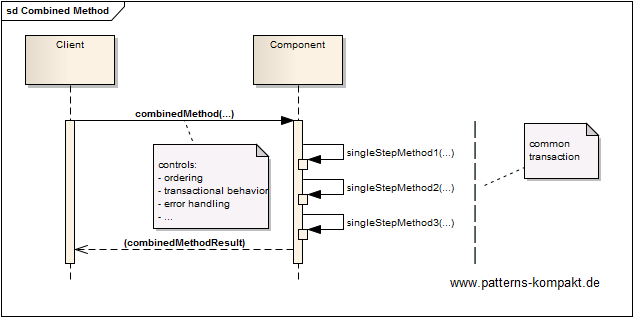
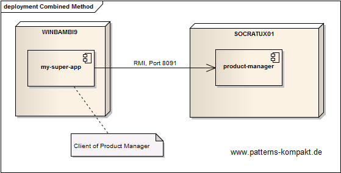
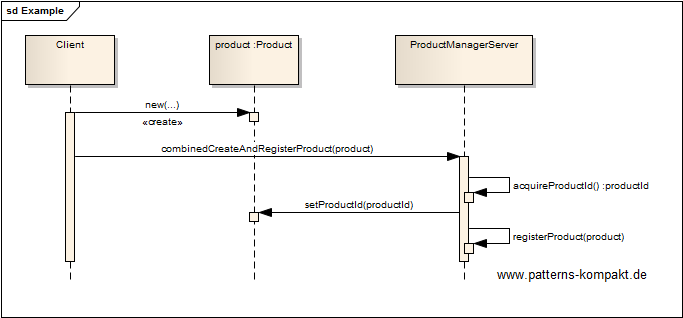

#### [Project Overview](../../../../../../../README.md)
----

# Combined Method

## Scenario

Multiglom Sillitek develops the Product Management Suite PMS. For the last 20 years PMS had a monolithic architecture, which is currently being replaced with a distributed approach. The client module, which was previously an integrated part of PMS, now potentially sits in a different process running on a different node.

Recently, it was discovered that the product creation and registration process occasionally leads to inconsistencies.
Investigations have shown that the old system implicitly ran transactional leveraging the underlying database. Now the calls for product creation and registration are remote operations and lead to two independent transactions. This potentially causes a fatal inconsistency: a new product could be created without successful registration.

The team is discussing ways to avoid this problem.

## Choice of Pattern
In this scenario we want to apply the **Combined Method Pattern** to _combine methods that must be, or commonly are, executed together on a component in a single method_ (POSA). 

In the scenario above it was discovered that the two separate operations of creating and registering a product are not really independent, they should be executed together. While this was implicitly guaranteed by the old version of the software, there are no guarantees in the distributed deployment scenario.

Thus we apply the Combined Method pattern by adding the method `combineCreateAndRegisterProduct()` to the interface of the _ProductManagerServer_. 

Now the server can ensure that both methods either complete successfully or none of them. The desired consistency is back, because it cannot happen that new products remain unregistered.

## Try it out!

Open [CombinedMethodTest.java](CombinedMethodTest.java) to start playing with this pattern. By setting the log-level for this pattern to DEBUG in [logback.xml](../../../../../../../src/main/resources/logback.xml) you can watch the pattern working step by step.

## Remarks
* Combined Methods are client-oriented, so depending on the concrete scenario it can happen that you identify many of such methods pumping up the interface in an unhealthy manner. In this case multiple interfaces for different clients should be defined ([ISP](https://en.wikipedia.org/wiki/Interface_segregation_principle)). 

## References

* (POSA) Buschmann, F., Henney, K., Schmidt, D.C.: Pattern-Oriented Software Architecture: A Pattern Language for Distributed Computing. Wiley, Hoboken (NJ, USA) (2007)
