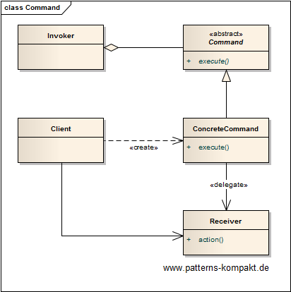
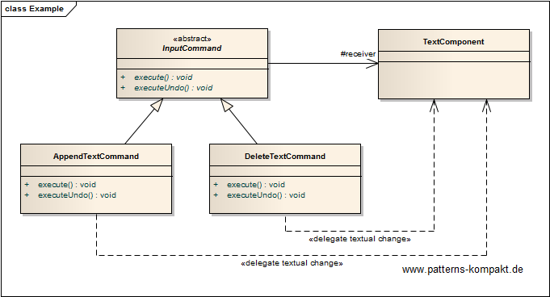

#### [Project Overview](../../../../../../../README.md)
----

# Command

## Scenario

Multiglom Logistics provides a tool for order management to its clients. Originally planned as a workaround the software has become quite popular due to its simplicity and focus. However, clients are missing an undo/redo for the text input component.

It was decided to add this functionality with the upcoming release.

### Requirements Overview

The purpose of the new flexible text processor is to provide the usual undo and redo functionality known from common text processors.

_Main Features_

* There shall be an **undo**-button for every text input action of a user.
* A corresponding **redo**-button shall allow the user to compensate the last undo-action.
* A sequence of redo-clicks shall compensate the previous sequence of undo-clicks (if any).

### Quality Goals

_Table 1. Quality Goals_

No.|Quality|Motivation
---|-------|----------
1|Usability|The feature shall work as in any other common application.

## Choice of Pattern
In this scenario we want to apply the **Command Pattern** to _encapsulate a request as an object, thereby letting you parameterize clients with different requests, queue or log requests, and support undoable operations_ (GoF). 

We have identified "typing text" (append/delete letters) as actions (commands) that shall support undo.

Each command has an `execute()` and a corresponding `executeUndo()` operation to compensate the action.

## Try it out!

Open [CommandTest.java](CommandTest.java) to start playing with this pattern. By setting the log-level for this pattern to DEBUG in [logback.xml](../../../../../../../src/main/resources/logback.xml) you can watch the pattern working step by step.

_See also [Command Processor](../commandprocessor/README.md)._

## Remarks
* The Command pattern looks simple in the first place and gets tricky when it comes to the details. A command encapsulates _what to do_ in _what context_. This means: commands _include_ or _assume_ state.
* Commands usually _defer_ execution. The latter is an interesting aspect when you use the Command pattern in more complex scenarios. A good example is the user context: A properly authenticated and authorized user performs an action. Now you want to encapsulate that action in a command to be stored in a queue or database to eventually execute it later leveraging a scheduler. How do you restore the user context at the later execution time of that command?
* Technically, Lambda expressions (closures) are a kind of Command. Programming languages have found different ways to handle the context problem of the deferred execution when accessing variables (see also [Java Lambda Expressions](https://docs.oracle.com/javase/tutorial/java/javaOO/lambdaexpressions.html#accessing-local-variables)).

## References

* (GoF) Gamma, E., Helm, R., Johnson, R., Vlissides, J.: Design Patterns – Elements of Reusable Object-Oriented Software. Addison-Wesley (1995).
* (Martin) Martin, R.C.: Agile Software Development: Principles, Patterns and Practices. Addison-Wesley (2002)
