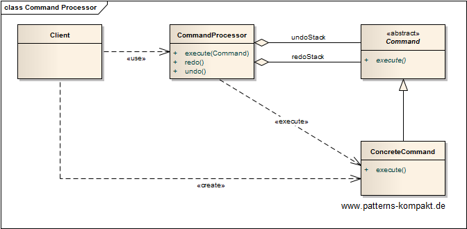

#### [Project Overview](../../../../../../../README.md)
----

# Command Processor

## Scenario

_See [Command](../command/README.md)._

## Choice of Pattern
In this scenario we want to apply the **Command Processor Pattern** to _execute requests to the application. The command processor acts on behalf of the clients and within the constraints of the application_ (POSA). 

We have identified "typing text" (append/delete letters) as a actions (commands) that shall support undo. So the command processor needs to manage sequences of executing, undoing and redoing commands.

The text processing logic behind the text component now maintains undo and redo stacks. Typing anything is represented by an _AppendTextCommand_ or a _DeleteTextCommand_ and goes to the undo-stack. By clicking undo, the last command on the stack gets compensated and then goes to the redo-stack. For redo, the logic works vice-versa.

## Try it out!

Open [CommandProcessorTest.java](CommandProcessorTest.java) to start playing with this pattern. By setting the log-level for this pattern to DEBUG in [logback.xml](../../../../../../../src/main/resources/logback.xml) you can watch the pattern working step by step.

## Remarks
* The biggest challenge (for the command processor) is executing a command (deferred) _within the constraints of the application_. As mentioned in [Command](../command/README.md) this can be quite tricky.

## References

* (POSA) Buschmann, F., Meunier, R., Rohnert, H., Sommerlad, P., Stal, M.: Pattern-Oriented Software Architecture: A System of Patterns. Wiley (1996)
