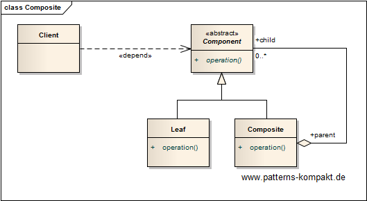
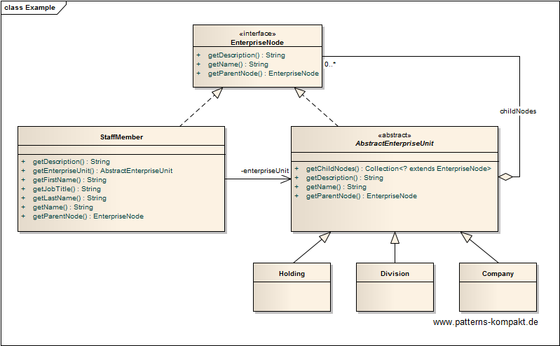

#### [Project Overview](../../../../../../../README.md)
----

# Composite

## Scenario

Multiglom B2B, vendor of the CRM suite Manjok for small businesses, currently reworks the internal data model.

Manjok supports the mapping of various levels of a customer's enterprise. They are represented by a couple of entities, such as holding, company, and division and staff member. One goal of the new design is to detect common aspects and build hierarchies to treat these entities in the same way in certain use cases.

Thinking in terms of a graph obviously all the entities belong to the enterprise and can be seen as enterprise nodes. However, holding, company and division nodes can have child nodes (part-of-relation), staff member cannot.

The goal is to reflect these basic relationships in the design to simplify common tasks like listing or counting.

## Choice of Pattern
In this scenario we want to apply the **Composite Pattern** to _compose objects into tree structures to represent part-whole hierarchies_ (GoF). 

We have identified the _EnterpriseNode_ as a common interface for _Holding_, _Company_, _Division_ and _StaffMember_, further we have detected that only the first three can be parent nodes in a part-of-relation. This can be reflected by an abstract base class _AbstractEnterpriseUnit_.

Only entities inheriting from _AbstractEnterpriseUnit_ can have child nodes, all elements (including _StaffMember_) can have a parent node.
So bottom-up we can navigate without any explicit type checking.

## Try it out!

Open [CompositeTest.java](CompositeTest.java) to start playing with this pattern. By setting the log-level for this pattern to DEBUG in [logback.xml](../../../../../../../src/main/resources/logback.xml) you can watch the pattern working step by step.

## Remarks
* The most familiar example of a composite is the **File**, which can be plain file or a directory.
* The initial design of a good composite is tricky, starting with plausible naming. Also it can be a pain, if any property or method decided to be _common_ is in fact _not common_. A consequence is the ugly UnsupportedOperationException violating [LSP](https://en.wikipedia.org/wiki/Liskov_substitution_principle). On the other hand later making anything _common_ leads to subsequent changes. 

## References

* (GoF) Gamma, E., Helm, R., Johnson, R., Vlissides, J.: Design Patterns – Elements of Reusable Object-Oriented Software. Addison-Wesley (1995).

