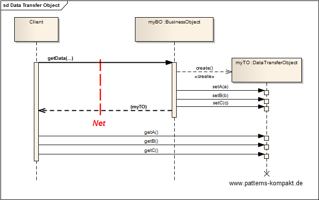
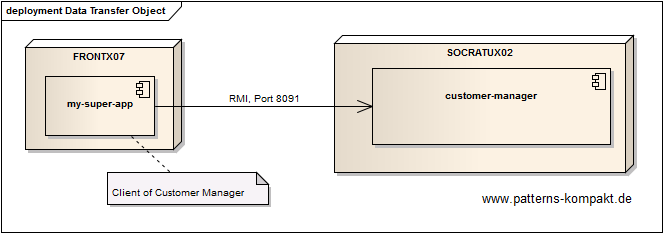
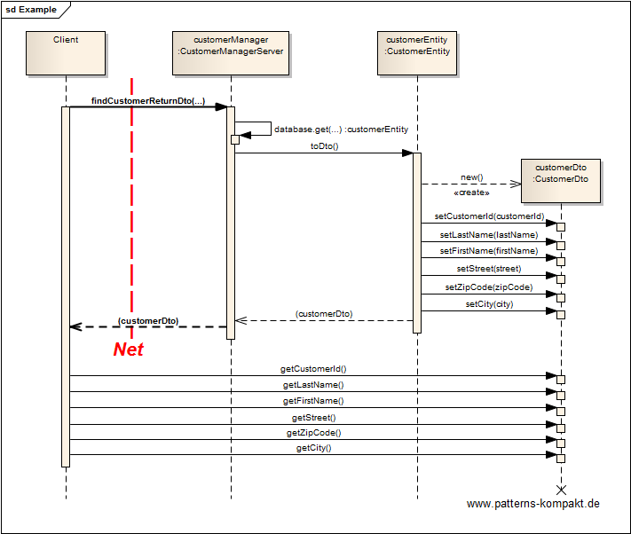

#### [Project Overview](../../../../../../../README.md)
----

# Data Transfer Object (DTO)

## Scenario

Multiglom Sillitek develops the Product Management Suite PMS. For the last 20 years PMS had a monolithic architecture, which is currently being replaced with a distributed approach. The client module, which was previously an integrated part of PMS, now potentially sits in a different process running on a different node.

In a first iteration remote interfaces have been added to all entities and the remaining logic remained the same. For some business objects (e.g. the _Customer_) a certain slowness has been discovered because of the traffic the simple remoting causes. Latencies are piling up.

## Choice of Pattern
In this scenario we want to apply the **Data Transfer Object Pattern** to create _an object that carries data between processes in order to reduce the number of method calls_ (Fowler). 

In the scenario above the distributed deployment causes problems related to the Customer object. The direct usage from a remote process just like a local object leads to a lot of traffic and makes the application slow.

The solution is the introduction of the _CustomerDTO_ that can be transferred in a single call. 

As a result latency goes down to a single call, the clients reads the field values locally after transferring the whole object.

## Try it out!

Open [DataTransferObjectTest.java](DataTransferObjectTest.java) to start playing with this pattern. By setting the log-level for this pattern to DEBUG in [logback.xml](../../../../../../../src/main/resources/logback.xml) you can watch the pattern working step by step.

## Remarks
* DTOs seem old-school in times of modern REST-interfaces and JSON. However, taking a closer look at a REST-entity and how its inventor [Fielding](http://www.ics.uci.edu/~fielding/pubs/dissertation/rest_arch_style.htm#sec_5_2_1_1) described it, you may realize that the body of a REST entity is nothing else but a "DTO in a tuxedo". :grin:
* This pattern has been introduced in (SUN) for J2EE under the (misleading) name _Value Object_, not to be confused with the [Value Object pattern](../valueobject/README.md).

## References

* (Fowler) Fowler, M.: Patterns of Enterprise Application Architecture. Addison-Wesley (2002)
* (SUN) Alur, D., Crupi, J., Malks, D.: Core J2EE Patterns: Best Practices and Design Strategies. Prentice Hall, Upper Saddle River (NJ, USA) (2001).

