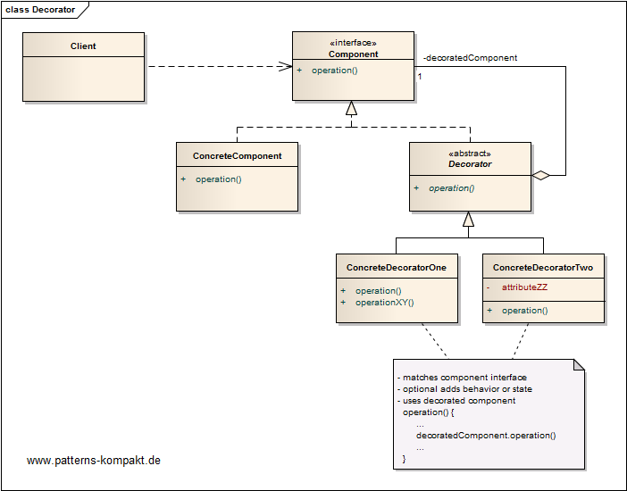
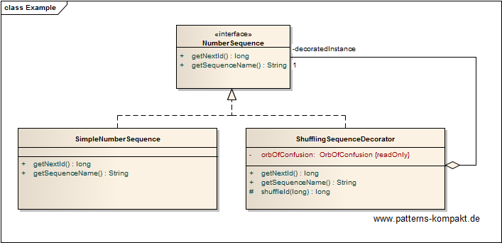
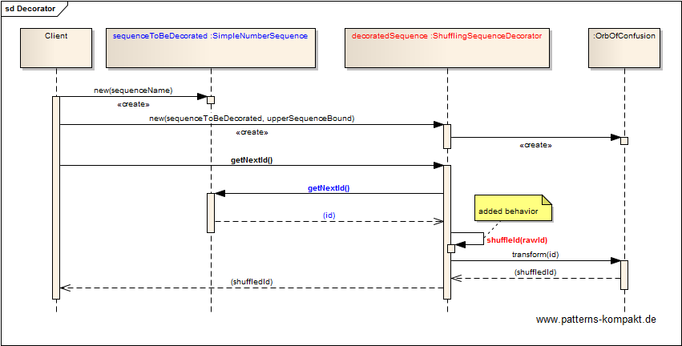

#### [Project Overview](../../../../../../../README.md)
----

# Decorator

## Scenario

Mrs. Freaklies, a progressive mom-and-pop store in Chicago, faces a problem with the voucher creation of the web shop.

Mrs. Freakly's grandchild Linda, who runs the IT for the shop, has already identified the problem. EasyVoucher, a module of the Multiglom webshop leverages a database sequence and simply formats the voucher code as hex-code. Some evil customers seem to exploit that by guessing codes.

Multiglom did not react at all on Linda's the complaints, so she decided to implement her own extension. Thankfully, EasyVoucher has a hook for that. You can configure your own sequence (type long) for the voucher codes.

Linda looks for a way to make a sequence that cannot be guessed out of a sequence that is upcounting.

### Requirements Overview

The purpose of the voucher sequence is to provide a sequence of long values that cannot be guessed.

_Main Features_

* Provide a transactional non-repeating persistent sequence of voucher codes (type long).

### Quality Goals

_Table 1. Quality Goals_

No.|Quality|Motivation
---|-------|----------
1|Unpredictability|For a human without super natural powers it shall be impossible to guess next values given the knowledge of earlier voucher codes.

## Choice of Pattern
In this scenario we want to apply the **Decorator Pattern** to _Attach additional responsibilities to an object dynamically_ (GoF). 

We have an underlying (transactional, persistent and unfortunately predictable) database sequence. We want to add the _behavior_ that the value gets shuffled (to become unpredictable). 

Now the vouchers are still based on a database sequence but the _ShufflingSequenceDecorator_ makes them unpredictable.

For the client (here Multiglom EasyVoucher) nothing changes.

## Try it out!

Open [BuilderTest.java](BuilderTest.java) to start playing with this pattern. By setting the log-level for this pattern to DEBUG or TRACE in [logback.xml](../../../../../../../src/main/resources/logback.xml) you can watch the pattern working step by step.

## Remarks
* The example above shows the simplest form of a decorator (you may even argue that it is a [Proxy](../proxy/README.md)) as it only adds behavior without enriching the interface. More sophisticated  decorators add additional operations or state. 
* Decorator classes are often called Wrapper. The [Wrapper pattern](../wrapper/README.md) described in our book focuses on a bunch of classes/subsystems/APIs while a decorator _wraps_ a single class.

## References

* (GoF) Gamma, E., Helm, R., Johnson, R., Vlissides, J.: Design Patterns – Elements of Reusable Object-Oriented Software. Addison-Wesley (1995).

