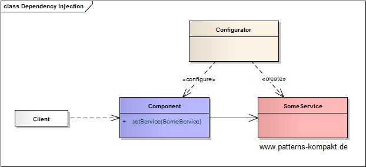
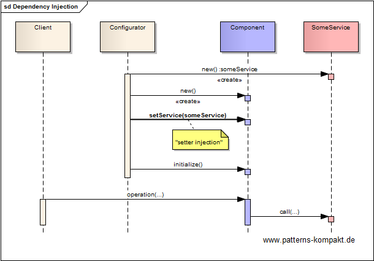
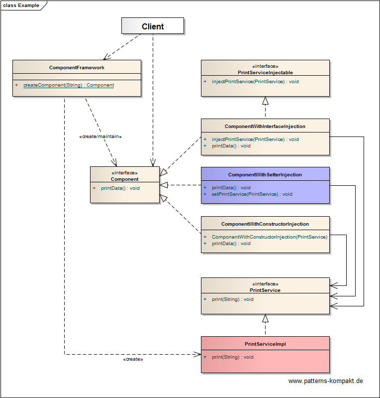

#### [Project Overview](../../../../../../../README.md)
----

# Dependency Injection

## Scenario

A print service shall be made available in various components, without any need for the components to lookup the service. So the component can deal with the service without knowing how it is provided or how it realizes its functionality.

## Choice of Pattern
In this scenario we want to apply the **Dependency Injection Pattern**, to _decouple components from configured services, so that the using components neither need to know the service names nor anything about their concrete nature_. 

The basic idea is that setting the dependencies (injection) is a responsibility outside the component that later uses these dependencies.

In our example scenario we want to demonstrate the **three types of depenency injection** identified by (Fowler).

The 3 components _ComponentWithConstructorInjection_, _ComponentWithSetterInjection_ and _ComponentWithInterfaceInjection_ each get the _PrintService_ injected by the _ComponentFramework_, but in a slightly different way (at a different time).

## Try it out!

Open [DependencyInjectionTest.java](DependencyInjectionTest.java) to start playing with this pattern. By setting the log-level for this pattern to DEBUG in [logback.xml](../../../../../../../src/main/resources/logback.xml) you can watch the pattern working step by step.

## Remarks
* Implementing this pattern is more or less the job of frameworks (e.g. [Spring](https://spring.io/projects/spring-framework)). However, it is helpful to understand its principles and advantages.
* Annotated attributes to be filled at startup with property values (e.g. from a file or command line) also fall into the category of dependency injection.

## References

* (Fowler) https://www.martinfowler.com/articles/injection.html
