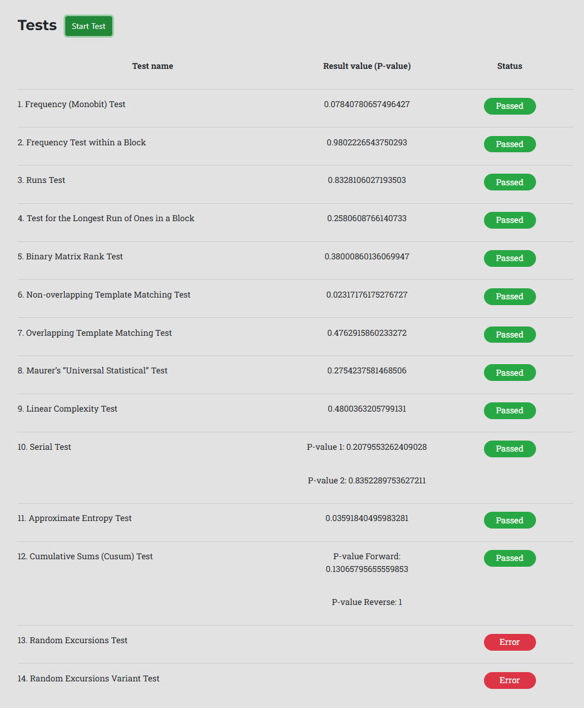
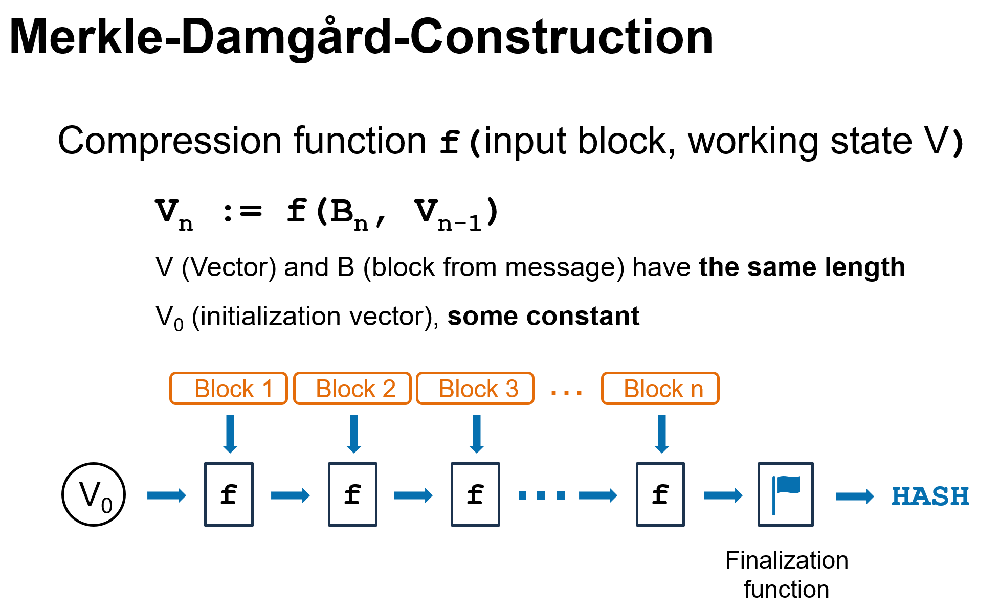
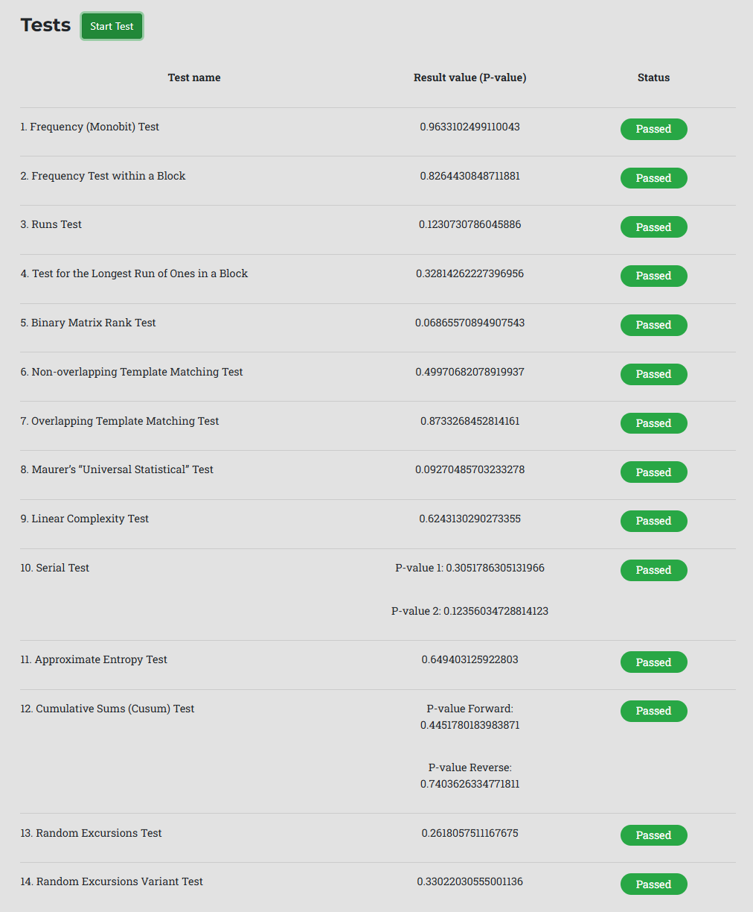
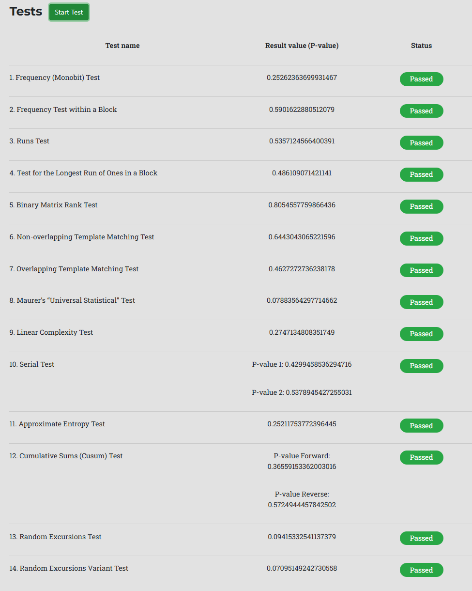

####  [Project Overview](../../../../../../../README.md)

# Distribution, Random, Hash, Encryption


* [Introduction](#Introduction)
* [Goals](#Goals)
* [Idea](#Idea)
* [Preparation](#Preparation)
	* [Concept of Result Assessment](#Concept-of-Result-Assessment)
		* [What is a pseudo-random distribution?](#What-is-a-pseudo-random-distribution)
		* [How to quickly detect a *bad* distribution?](#How-to-quickly-detect-a-bad-distribution)
	* [Providing a Tool Set](#Providing-a-Tool-Set)
* [The Experiments](#The-Experiments)
	* [Experiment I: Distribution of Numbers](#Experiment-I-Distribution-of-Numbers)
	* [Experiment II: Random Numbers](#Experiment-II-Random-Numbers)
	* [Experiment III: Hashing](#Experiment-III-Hashing)
	* [Experiment IV: Encryption](#Experiment-IV-Encryption)
* [Observations and Criticism](#Observations-and-Criticism)
	* [Consider Godhart's Law](#Consider-Godharts-Law)
	* [What about these two errors reported by the Random Bitstream Tester?](#What-about-these-two-errors-reported-by-the-Random-Bitstream-Tester)
	* [Keep It Simple Stupid](#Keep-It-Simple-Stupid)
	* [Avoid *Desparate Fixing*](#Avoid-Desparate-Fixing)
	* [Repetition is not your friend](#Repetition-is-not-your-friend)


## Introduction

Shuffling the numbers to create a pseudo-random distribution is usually a holistic operation. You take the list with all the elements and apply any kind of shuffling method.

However, what do you do if the range is too large and thus contains way too many elements to hold them in memory?

Wouldn't it be great if there was a function $f(n)$ that for any number in a given range $R$ returns a number in $R$ where all the mappings are unique and the output sequence for $n=1,2,3,4...$ *looks* random?

The experiments below provide an investigation of the above random distribution challenge and connected problems.

## Goals

* Implement a stateless distribution function $f(n)$ to distribute a sequence $1,2,3,4, ...$ of a particular range $R$ to bijectively to numbers in the same range.

* Use the created distribution function to implement further utilities:
  * a random number generator
  * a hash function
  * a symmetric encryption method

### Limitations

The range $R$ cannot be chosen arbitrarily. It will be aligned to the common data types $byte$ ($2^8=256$ values), $short$ ($2^{16}=65,536$ values), $int$ ($2^{32}=4,294,967,296$ values), and $long$ ($2^{64}=18,446,744,073,709,551,616$ values).

### A Word of Caution

This is a pure fun project to demonstrate how certain algorithms may be constructed, their interrelation and and how pseudo-random distribution can be judged.

:warning: **You should not implement your own random number generators, hash functions or encryption methods for use in production!**

There are plenty of well-tested and investigated implementations available. Relying on robust libraries will save you time and headaches. :wink:

## Idea

My approach is based on the assumption that prime numbers don't follow any pattern or rule. At least none of the most intelligent brains has ever found one. So, somehow prime numbers *must* imply any irregularity resp. randomness.

If this is true, then it is also true for the bit patterns of their underlying binary representation.

Can we somehow leverage this intrinsic randomness to *spread disorder* over a range of numbers?

I want to try to do so by only applying the operations `XOR` ($\oplus$) and `ROTATE`.
* Let $P[]$ be a list of unique prime numbers 
* Step 0: Set the working state $WS$ to the input number.
* Step 1: Take next prime number $P$ from $P[]$.
* Step 2: Perform $WS = WS \oplus P$.
* Step 3: Rotate the working state $WS$ by the number of $1s$ in $WS$.
* Step 4: If there are more prime numbers, continue with Step 1, else return $result:=WS$.

This is a bijective mapping, no two inputs can ever result in the same output. We can *undo* the operation by simply applying $P[]$ in reverse order using the same algorithm.

After a few rounds (patterns in ($P[]$)) the $result$ should look completely unpredictable, hopefully pseudo-random.

## Preparation

Before we start we should have a solid foundation, some tests and tools to judge the outcome: the randomness of the distribution created by our algorithm.

### Concept of Result Assessment

When we produce a result we need a defined way to tell whether it is good or bad.

With a handful of values we might be able to do this *by looking closely*, however, with millions or billions this is hopeless.

So, what are we looking for? Randomness, right? - Hmm ... :confused:

#### What is a pseudo-random distribution?

Unfortunately, there is no rule or algorithm to simply decide whether a distribution is random or not.

Until the 1980s there was not even a proper foundation for randomness!

Here are two prominent quotes that show how shady the field of pseudo-randomness was (and is):

> *"Anyone who attempts to generate random numbers by deterministic means is, of course, living in a state of sin."*

[John von Neumann](https://en.wikipedia.org/wiki/John_von_Neumann)

> *"A random sequence is a vague notion embodying the idea of a sequence in which each term is unpredictable to the uninitiated and whose digits pass a certain number of tests, traditional with statisticians and depending on the uses to which the sequence is to be put."*

[Derrick Henry Lehmer](https://en.wikipedia.org/wiki/D._H._Lehmer), 1941

Finally, in 1982, [Andrew Yao](https://en.wikipedia.org/wiki/Andrew_Yao) developed the concept of **Computational Indistinguishability**. In 2000 he recieved the Turing Award for his work on pseudo-randomness.

Drastically simplified: A sequence is pseudo-random if you cannot distinguish it from a truly random sequence (e.g. from radio-active decay) using stastical methods. This leads to a set of tests along with thresholds to judge the randomness of any given distribution.

Yao's work can be seen as the theoretic foundation of the [NIST test suite](https://csrc.nist.gov/Projects/Random-Bit-Generation/Documentation-and-Software).

Luckily, with the [Random Bitstream Tester](https://mzsoltmolnar.github.io/random-bitstream-tester/) Zsolt Molnár provides an a JavaScript-implementation of the test suite with a simple web-interface.

Although the Random Bitstream tester is no officially certified implementation, it should be sufficient for our purposes.

#### How to quickly detect a *bad* distribution?

Whenever we implement a new algorithm or tweak/tune an existing one we need to perform again all the tests on a large number of output bits.

Obviously, this is tedious work. We cannot completely avoid these tests but maybe we can implement a *quick test* to detect and discard *bad* candidates early.

So, how can we observe a stream and tell that its output is *not* random?

When we perform a bijective mapping of numbers of a range on the numbers in the same range, then there are a few cheap KPIs we can gather easily. 

* KPI $sucDist$: The distance between two subsequently generated (mapped) numbers.

If our function $output = f(input)$ creates an even and pseudo-random distribution, then the *average* of the successor distances $avgSucDist$ should move towards the *average* distance of two *randomly chosen* numbers in that same interval, [given that we generate (map) a large amount of mappings](https://en.wikipedia.org/wiki/Law_of_large_numbers). If this is not the case then our distribution is not worth further investigation. 

Reasoning: If $avgSucDist$ is way too low or way too high, then our distribution process *must* produce some unwanted pattern. 

* KPI $srcDist$: The distance between the input (sequential number) and the output (mapped number).

When we think beyond, then also the average distance $avgSrcDist$  between the sequence number $input$ and the mapped number $output = f(input)$ should also move towards the average distance of two randomly selected numbers in the interval over time. It may take longer because the input is heavily biased (it is not randomly picked but a steadily increasing sequence with the increment $1$). If the $avgSrcDist$ is *not* moving towards (close to) the expected value, then there must be a hidden pattern disqualifying the candidate from further investigation.

**Clarification:** This test only detects *bad* candidates early. You cannot take these KPIs as a proof of a good distribution!

**Conclusion:** When we observe the two KPIs while generating (mapping) a sequence of numbers we should be able to discard the majority of bad recipes, so we can concentrate on the remaining good ones. To those we still must apply the expensive tests.

### Providing a Tool Set

Implementing the experiments will require some trial and error. This often leads to duplicated code and relicts from previous attempts. Especially, multiple implementations of the same methods (e.g., for measurement) quickly diverge which leads to errors, frustration, and fixing effort.

Thus, I want to start with a small set of tools encapsulating some boilerplate code which will help me to concentrate on the actual experiments later. These tools you can find in the `util` package.

#### [GenStats](../../../../../../../src/main/java/de/calamanari/pk/drhe/util/GenStats.java)

As explained before I want to observe the *source distance* and the *successor distance* during the experiments to use them as KPIs. Collection, minimum, maximum as well as average computation should be implemented once and once only.

Depending on the size of the range $R$ the source and target values stem from we can simply collect and compute based on data type `java.lang.long` (64 bits) which is very fast.
Unfortunately, when we analyze $R=2^{64}$ the required value sums no longer fit into a `long` and will cause overflows. Typically, we would use now `BigInteger` and call it a day. But incrementing vast amounts of numbers using `BigInteger` makes data collection extremely slow (compared to incrementing `long`). `GenStats` avoids this by implementing the data collection based on `long`-values and only performing the final computation with `BigInteger`.

*See also [GenStatsTest](../../../../../../../src/test/java/de/calamanari/pk/drhe/util/GenStatsTest.java)*

#### [BitUtils](../../../../../../../src/main/java/de/calamanari/pk/drhe/util/BitUtils.java)

Working with large binary values can be painful, especially in languages like Java that provide *signed* data types.

It is complicated to compose or decompose values. Trivial log statements for debugging purposes suffer from problems like unexpected accidential promotion. Of course, the JDK provides solutions in the form of auxiliary methods. But they are sometimes hard to find. This causes repetitive boilerplate code for simple operations. Bugs will sneak in quickly.

Thus, I decided to implement `BitUtils` along with some tests to help working with binaries in a natural (left-to-right) way consistently across all the related types (`byte`, `short`, `int` and `long`).

*See also [BitUtilsTest](../../../../../../../src/test/java/de/calamanari/pk/drhe/util/BitUtilsTest.java)*

#### [PrimePatterns](../../../../../../../src/main/java/de/calamanari/pk/drhe/util/PrimePatterns.java)

To realize the idea of using prime numbers we of course need a reasonable number of prime numbers of various sizes (according to the data type we process: 8, 16, 32 and 64 bits) with certain qualities. These constants can be found in the `PrimePatterns` class along with some documentation.

You may wonder about the *bit-flip-distances*. The reasoning behind is that when we `XOR` a prime pattern with a given bit sequence (working state) then each bit ideally should change with a 50%-probability. The `PrimePatterns` have been selected considering the number of `1`s in a pattern (`0` doesn't change anything!) on the one hand and the bit-flip-distance among the prime patterns. This shall reduce the likelihood that applying the next prime subsequently will undo the effect of the previous round or amplify any pattern.

Try it out! Use `XoRotUtils` to apply some of the patterns to a given value and `BitUtils` to check what's happening on bit-level.

#### [XoRotUtils](../../../../../../../src/main/java/de/calamanari/pk/drhe/util/XoRotUtils.java)

Previously, I explained the basic idea to combine `XOR` and bit-rotation to achieve my goal: mapping a stream of values to create a pseudo-random distribution.

Because I'll need the same logic for different data types multiple times it makes sense to implement a couple of utility methods along with tests.

The class `XoRotUtils` contains a set of functions. Besides the standard rotation I also implemented sign-preserving rotations which is useful for experiments where signed values should not change their signum.

*See also [XoRotUtilsTest](../../../../../../../src/test/java/de/calamanari/pk/drhe/util/XoRotUtilsTest.java)*


## The Experiments

### Experiment I: Distribution of Numbers

The class [DistributionCodec](../../../../../../../src/main/java/de/calamanari/pk/drhe/DistributionCodec.java) provides a number of static methods to `encode` and `decode` numbers. They cover the types `byte` (8 bit), `short` (16 bit), `int` (32 bit), and `long` (64 bit).

Out of curiosity I also added `encodePreserveSign` and `decodePreserveSign` methods. As the name states they apply the same algorithm but so that any negative number will be mapped to a negative number and any positive number (incl. `0`) will be mapped to a positive number.

The corresponding tests (simulations) can be found in [DistributionCodecTest](../../../../../../../src/test/java/de/calamanari/pk/drhe/DistributionCodecTest.java).

#### Expectations

Based on the formula for the average distance $d$ of two randomly selected numbers in an interval we can set some expectations:

If $b$ is the number of available bits, then the range has $2^b$ elements.

$Dist_{avg}$ &rarr; $\dfrac{2^b}{3}$ *([explanation](avgDistInRange.md))*

If we preserve the sign then the effective range is just half the size, accordingly:

$Dist_{avg}'$ &rarr; $\dfrac{2^{b-1}}{3} = \dfrac{2^b}{6}$

|  $Type$   | $bit$ $count$ | $Dist_{avg}$                                  | $Dist_{avg}'$ $(sign$ $preserved)$                |
|---------|-----------|------------------------------------------|------------------------------------------|
| `byte`  | $8$       | $85.\overline{3}$                        | $42.\overline{6}$                        |
| `short` | $16$      | $21,845.\overline{3}$                    | $10,922.\overline{6}$                    |
| `int`   | $32$      | $1,431,655,765.\overline{3}$             | $715,827,882.\overline{6}$               |
| `long`  | $64$      | $6,148,914,691,236,517,205.\overline{3}$ | $3,074,457,345,618,258,602.\overline{6}$ |

#### Results `byte`

**`testByteCodecFull()`**

```
GenStats {
Total count:      256

Minimum src diff: 1
Maximum src diff: 237
Average src diff: 87

Minimum suc diff: 1
Maximum suc diff: 231
Average suc diff: 86

Self-mapped:      0
}
```

**`testByteCodecPreserveSignFull()`**

```
GenStats {
Total count:      256

Minimum src diff: 1
Maximum src diff: 115
Average src diff: 41

Minimum suc diff: 1
Maximum suc diff: 119
Average suc diff: 42

Self-mapped:      0
}
```

Although the range of the `byte` data type is small, we see the expected averages, which looks great. Unfortunately, with just 256 possible values in a range we cannot apply the NIST tests with the Random Bitstream Tester.

#### Results `short`

**`testShortCodecFull()`**

```
GenStats {
Total count:      65536

Minimum src diff: 1
Maximum src diff: 64918
Average src diff: 21819

Minimum suc diff: 1
Maximum suc diff: 65089
Average suc diff: 21879

Self-mapped:      0
}
```

**`testShortCodecPreserveSignFull()`**

```
GenStats {
Total count:      65536

Minimum src diff: 1
Maximum src diff: 32693
Average src diff: 10889

Minimum suc diff: 1
Maximum suc diff: 32672
Average suc diff: 10931

Self-mapped:      0
}
```

For the `short` data type the averages are also very close to the expected values. Unfortunately, with just 65,536 possible values in a range we still cannot apply the NIST tests with the Random Bitstream Tester.

#### Results `int`

**`testIntCodecFull()`**

```
GenStats {
Total count:      4294967296

Minimum src diff: 1
Maximum src diff: 4294933813
Average src diff: 1431733275

Minimum suc diff: 1
Maximum suc diff: 4294900458
Average suc diff: 1431651907

Self-mapped:      0
}
```

**`testIntCodecPreserveSignFull()`**

```
GenStats {
Total count:      4294967296

Minimum src diff: 1
Maximum src diff: 2147445334
Average src diff: 715831073

Minimum suc diff: 1
Maximum suc diff: 2147427639
Average suc diff: 715700251

Self-mapped:      0
}
```

For the `int` data type with its $2^{32}=4,294,967,296$ values we see the averages *very* close to the expected values. 

This time the range is big enough, so we can feed the Random Bit Stream Tester.

**`testIntDistPattern()`**


I see two errors for the last two tests I could not find any explanation for - but the other tests look great! 

We can assume that the 1 million bits created from the sequence indeed *look random*.

#### Results `long`

**`testLongCodec()`**

```
GenStats {
Total count:      4294967296

Minimum src diff: 1786079634
Maximum src diff: 18446461873646289201
Average src diff: 6143413651019470283

Minimum suc diff: 3
Maximum suc diff: 18446408542927331498
Average suc diff: 6148871959460087487

Self-mapped:      0
}
```

**`testLongCodecPreserveSign()`**

```
GenStats {
Total count:      4294967296

Minimum src diff: 3343366927
Maximum src diff: 9223041817990852893
Average src diff: 3074464191414455403

Minimum suc diff: 1
Maximum suc diff: 9223236968881150431
Average suc diff: 3073819925782603098

Self-mapped:      0
}
```

For the `long` data type with its $2^{64}=18,446,744,073,709,551,616$ the range is way too big to test *all* values, so I took a sample of 4 billion elements across the range.

Again, we see the observed averages close to the expected values, which is a good sign for our candidate.

Let's feed the Random Bit Stream Tester again.

**`testLongDistPattern()`**



Again, I see these errors for the last two tests, and all the other tests look great. 

We can assume that the 1 million bits created from the sequence indeed *look random*.

#### Conclusion

Apart from the last two tests who neither failed nor passed but ran into errors, I see the results as a success. With only a few operations we could realize an implementation that passes complicated statistical tests!

For the types `int` and `long` we can now assume the produced distribution is *pseudo-random*.

### Experiment II: Random Numbers

The next challenge shall be implementing a random number generator (64 bits) based on our distribution function.

Note, that simply taking the next element, $f(1), f(2), f(3), ...$, would look random, but it wouldn't produce what we expect from a random number generator.
* There should be a seed, so that we can produce different sequences of values.
* It must be possible to get the same number a few times in a row.

As our distribution function is bijective, it would just create a single long sequence and start over when the range is exhausted.

Thus, the [DistributionCodecRandomGenerator](../../../../../../../src/main/java/de/calamanari/pk/drhe/DistributionCodecRandomGenerator.java) uses a different approach. 

In a first attempt, I just took the last value to encode it again, but that quickly created unwanted patterns. Thus, the current implementation works with an extra internal `noise` which evolves independently from the last returned value and gets involved in computing the next value the generator returns.

You can find the related simulations in [DistributionCodecRandomGeneratorTest](../../../../../../../src/test/java/de/calamanari/pk/drhe/DistributionCodecRandomGeneratorTest.java).

#### Results

**`testRandom()`**

```
GenStats {
Total count:      4294967296

Minimum src diff: 1307188592
Maximum src diff: 18446592376029438236
Average src diff: 6148918652859093665

Minimum suc diff: 2235341302
Maximum suc diff: 18446712165080022615
Average suc diff: 6148852070620812323

Self-mapped:      0
}
```

:bulb: To gather the typical statistics in the usual way I needed a source value `src`, which is of course unavailable. I could have used a simple sequence number `1,2,3, ...`, but that creates a heavy bias because we are not producing $2^{64}$ numbers. To avoid this problem I use the same sampling approach as in the distribution test with an increment of $2^{32}$ to compute a the *virtual* `src` that covers the full range. This only affects the statistics, not the random number generation itself.

As you can see, both averages are very close to the expected ideal of $6,148,914,691,236,517,205.\overline{3}$ which makes us hope for good results in the Random Bitstream Tester!

Let's feed the Random Bitstream Tester with bits from our generator.

**`testRandomPattern()`**


Well, that looks great! Finally, all tests passed, no error this time.

#### Conclusion

Now we have our own home-made 64-bit random number generator.

:warning: I have not investigated if and how soon this random number generator goes into a cycle.

### Experiment III: Hashing

After the first experiment we have a distribution method `d(n)` which bijectively maps inputs of a range to values of the same range with pseudo-random characteristics.

**Approach**

* Split a source message into input blocks ($input_i$ with $i$ as block index) of the same length (add padding if required). 
* Use $d(input_i)$ ($i=1..n$) as keys to encode the working state (same length as the block length) *over and over again* until the full input has been considered.
* Return the working state as result, a hashcode of a fixed length.

This approach roughly follows the idea of a [Merkle-Damgård-Construction](https://en.wikipedia.org/wiki/Merkle%E2%80%93Damg%C3%A5rd_construction).



My implementation can be found in [DistributionCodecHashBuilder](../../../../../../../src/main/java/de/calamanari/pk/drhe/DistributionCodecHashBuilder.java).

It generates 64-bit hashes for arbitrary inputs.

In [DistributionCodecHashBuilderTest](../../../../../../../src/test/java/de/calamanari/pk/drhe/DistributionCodecHashBuilderTest.java) you can find the related tests and simulations.

#### Results

**`testHash()`**

```
GenStats {
Total count:      4294967296

Minimum src diff: 60509038
Maximum src diff: 18446457744536997112
Average src diff: 6149018109453884815

Minimum suc diff: 4
Maximum suc diff: 18446356868256507009
Average suc diff: 6148884193996035760

Self-mapped:      0
}
```

To get an idea of the randomness of the created hashes I hashed a sample of 4 billion numbers out of the available space $2^{64}$.

The two main KPIs look excellent (expected was $6,148,914,691,236,517,205.\overline{3}$). Thus we can be optimistic that the produced hashes look random.

**`testRandomPatternFromHash()`**

Of course a single hash value is way too short to perform any statistical tests, so I will simply hash the input and concatenate the hash values.

To make the test more challenging the available input will be a single short sentence.
> "Fluffy, Tuffy and Muffy went to town. They all got killed in a terrible accident."

However, we must be sure to create different hash values in every round, so we add the current sequential number as a [hash salt](https://en.wikipedia.org/wiki/Salt_(cryptography)).

Let's feed the Random Bitstream Tester one again.



Excellent! All tests passed, despite the fact that the input was super repetitive.

#### Conclusion

Now we have our own home-made 64-bit hash function.

:warning: I have not investigated [collision resistance](https://en.wikipedia.org/wiki/Collision_resistance).


### Experiment IV: Encryption

In a final experiment I want to use my previously created functions to implement [symmetric-key encryption](https://en.wikipedia.org/wiki/Symmetric-key_algorithm).

The algorithm is quite simple:
* Take some plain text and a password
* Use the [DistributionCodecHashBuilder](../../../../../../../src/main/java/de/calamanari/pk/drhe/DistributionCodecHashBuilder.java) to turn the password into a 64-bit hash value.
* Initialize a new instance of [DistributionCodecRandomGenerator](../../../../../../../src/main/java/de/calamanari/pk/drhe/DistributionCodecRandomGenerator.java) with the hash value as its seed.
* Use the random generator to create a [oneTimePad](https://en.wikipedia.org/wiki/One-time_pad) of the same length as the input.
* Encrypt the message with the one-time pad using `XOR`: $encrypted = message \oplus oneTimePad$.
* Decrypt the encrypted message with the same operation: $message = encrypted \oplus oneTimePad$

My implementation can be found in [SecureDistributionCodec](../../../../../../../src/main/java/de/calamanari/pk/drhe/SecureDistributionCodec.java).

Please review the related simulations and tests in [SecureDistributionCodecTest](../../../../../../../src/test/java/de/calamanari/pk/drhe/SecureDistributionCodecTest.java). 

#### Results

**`testRandomPatternFromEncryption()`**

For this test we will again use a short input sentences and repeat (concatenate) it until we get the desired length, so that the encoded version will have enough bits to feed the Random Bitstream Tester.

> "The quick brown fox jumped over the lazy dog."

The resulting monotone (boring) plain text will be used to challenge the encryption method. Password shall be `1234`.

Let's feed the Random Bitstream Tester with the encrypted binary sequence.



Once again, we have passed all tests! So we can assume our encryption method creates pseudo-random output.


## Observations and Criticism

### Consider Godhart's Law

First of all: **I plead guilty for cheating!** :wink:

If you just read through this article you may wonder about the excellent test results I achieved with minor effort. I have to admit, I have cheated a little bit. 

No worries, I did not *fake* anything. All results you see are real, and you can reproduce the tests.

However, I had *full control* about the selected example *inputs* for hashing and encryption resp. the *seed* of the random number generator.

*Why does it matter?*

1975, [Charles Godhart](https://en.wikipedia.org/wiki/Goodhart%27s_law) stated 

> *"When a measure becomes a target, it ceases to be a good measure."*

Although it was hard work to get this NIST test suite within the Random Bitstream Tester fully green for a particular input, it was not impossible. Consequently, if you change the input (test sentence, seed, password, etc.) some tests may suddenly fail, especially the *Runs test* is painful to pass.

It would be way harder to design an algorithm that passes all the tests for *arbitrary* inputs!

You are invited to play with the given examples and the code to get a better understanding of this effect.

### What about these two errors reported by the Random Bitstream Tester?

I did not further investigate these issues. 

**[Random Excursions Test](https://csrc.nist.gov/glossary/term/Random_Excursion_Test#:~:text=Random%20Excursion%20Test%20Definitions%3A%20The%20purpose%20of%20this,what%20one%20would%20expect%20for%20a%20random%20sequence.)**
> The purpose of the this test is to determine if the number of visits to a state within a random walk exceeds what one would expect for a random sequence.

As I understand this test needs a considerable number of values to be collected in memory. 

I *speculate* that the errors we see occasionally may stem from internal overflows when building internal structures for further analysis. So, the test neither says passed nor failed. 

Another explanation might be that for this test the required sample size should be bigger (somehow depending on the characteristics of the sample?).

### Keep It Simple Stupid

The [KISS-principle](https://en.wikipedia.org/wiki/KISS_principle) also applies to our experiments. Adding too many parameters or fancy operations to your recipe makes it hard to understand what is happening and why. Also, obscure implementations are hard to optimize.

### Avoid *Desparate Fixing*

In the shady field of pseudo-randomness you often see results which seem to be *close to perfect*, only a little bit off, etc. Tweaking here and there seems to be *so* promising!

However, one observation during my experiments was that you should not try to fix a broken concept by adding further complex operations (another rotate, invert, whatever you like).

Whenever you do so, you just increase complexity, runtime and obscurity.

It is almost guaranteed that improving one end will lead to worse results on the other.

**Conclusion:** Concentrate on a few operations. If your approach doesn't work well, think about a new attempt, again with only a few operations.

### Repetition is not your friend

Temptation is high to try improving results by applying the same operation again: $f'(input) = f(f(input))$, like shaking a bottle again when mixing a cocktail.

This is not a good idea. Sometimes, you may even see test results getting worse rather than better. 

*But why?*

The NIST test suite among others focusses on unexpected regularities (patterns). By applying the same imperfect transformation multiple times you increase the likelihood of *amplifying* an unwanted pattern hidden in your approach.

If you want to apply your recipe in multiple *rounds*, you must ensure that every subsequent run clearly differs from the previous one (either algorithmic or through parameters), like $f'(input) = g(f(input))$ or $f'(input) = f(f(input, X), Y)$.

### Performance

I have not further investigated the runtime of my implementations. However, it should be obvious that we will not break any speed records. :wink: 


