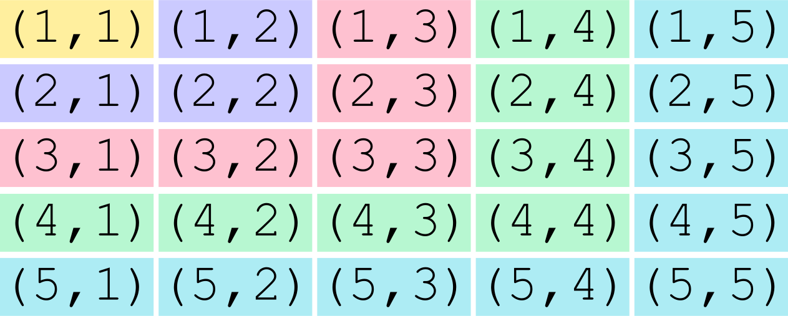
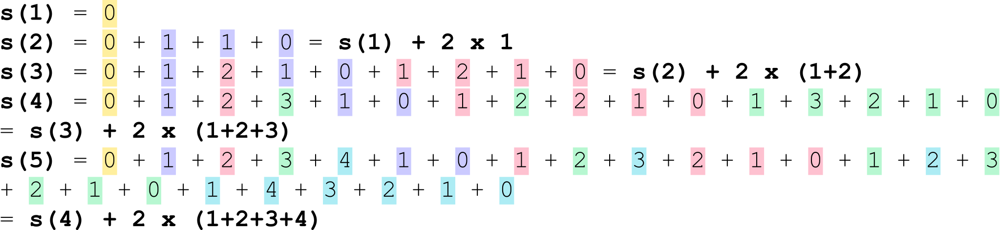

####  [Project Overview](../../../../../../../README.md) > [Distribution, Random, Hash, Encryption](README.md)
-----

# About the average distance of two numbers in an integer interval

We want to find a function that quickly tells us the *average distance* of two *randomly chosen* numbers in an integer interval.

## Definitions

For two numbers $a, b \in \mathbb{Z}$ with $b \ge a$ the *distance* $d$ of two elements $e_1, e_2 \in R$ is defined as $d(e_1,e_2) := |e_2 - e_1|$. The case $e_1 = e_2$ is valid (hence $d(e_1,e_2) \ge 0$).

The *number of elements* $n$ in an interval $R := [a,b]$ with $a, b \in \mathbb{Z}$ and $b \ge a$ is defined as $n := b - a + 1$ (upper and lower bounds included).

The *average distance* $d_{avg}$ of two numbers in an interval $[a, b]$ in $\mathbb{Z}$ is the arithmetic mean of all *possible* distances of two numbers in that interval including the distance $0$ of a number to itself, e.g. $dist(a,a) = 0$.

## Goal

Find a function $f(n)$ to compute the average distance $d_{avg}$ of two numbers in an interval $R := [a,b]$ with $a, b \in \mathbb{Z}$ and $b \ge a$ and $n := (b - a) + 1$ elements including the lower and upper bounds $a$ and $b$.

### Simplification

> Moving an interval by $\delta \in \mathbb{Z}$ on the number line does not change the distance of two numbers in that same interval.

**Proof**

Be $R := [a,b]$ with $a, b \in \mathbb{Z}$ with $b \ge a$ then every number $e \in R$ can be written as $e = a+k$ or $e = b-l$, accordingly for $e_1, e_2 \in R$: $d(e_1,e_2) := |a + k_2 - (a + k_1)|) = |b - l_2 - (b - l_1)|)$.

Moving the whole interval means adding the same $\delta \in \mathbb{Z}$ to $a$ and $b$: $R' := [a + \delta,b + \delta]$.

$\Rightarrow$ for $e_1', e_2' \in R'$: $d(e_1',e_2') := |a + \delta + k_2 - (a + \delta + k_1)|) = |b + \delta - l_2 - (b + \delta - l_1)|) = |a + k_2 - (a + k_1)|) = |b - l_2 - (b - l_1)|) = d(e_1,e_2)$.

> The number of elements in the interval will be unaffected when moving an interval on the number line.

**Proof**

$n := (b - a) + 1 \Rightarrow$ the number of elements in $R'$ is calculated as $n':= (b + \delta - (a + \delta)) + 1 = (b - a) + 1 = n$

Consequently, instead of investigating the distances in $R := [a,b]$ we can focus on $R' := [a + \delta, b + \delta] \Leftrightarrow R' := [a + \delta, (n - 1 + a) + \delta]$ using *any* $\delta \in \mathbb{Z}$.

With $\displaystyle \delta := 1 - a \Rightarrow R' := [1, n]$

**Conclusion** 

If we find and prove an average distance function $f(n)$ for $R' := [1,n]$ with $n \in \mathbb{N}$ being the number of elements in $R'$ then this function will be applicable to *every* interval in $\mathbb{Z}$ with $n$ elements.

## Analysis

First of all we need to get an impression. So, let's take a look at some examples.

For a couple of interval sizes ($n$) we will draw all possible distances in a matrix and measure the results.

*Why a matrix?*

When we compute all distances in both directions, then the number of distances will always be $n^2$, no matter if $n$ is even or odd. This will later be extremely helpful.

* sum of all distances: $s$
* number of distances: $\displaystyle d_{cnt} := n^2$
* average distance: $\displaystyle d_{avg}=\frac{s}{d_{cnt}}=\frac{s}{n^2}$


$n=1, f(1) = 0$:
```
(1,1)
```
$\displaystyle s=0$, $d_{sum}=1$, $\displaystyle d_{avg}=\frac{0}{1}=0$

$\displaystyle n=2, f(2) = \frac{1}{2}$:
```
(1,1) (1,2)
(2,1) (2,2) 
```
$\displaystyle s=2$, $d_{sum}=4$, $d_{avg}=\frac{2}{4}=\frac{1}{2}$

$\displaystyle n=3, f(3) = \frac{8}{9}$:
```
(1,1) (1,2) (1,3)
(2,1) (2,2) (2,3)
(3,1) (3,2) (3,3)
```
$\displaystyle s=8$, $d_{sum}=9$, $d_{avg}=\frac{8}{9}$

$\displaystyle n=4, f(4) = \frac{5}{4}$:
```
(1,1) (1,2) (1,3) (1,4)
(2,1) (2,2) (2,3) (2,4)
(3,1) (3,2) (3,3) (3,4)
(4,1) (4,2) (4,3) (4,4)
```
$s=20$, $d_{sum}=16$, $\displaystyle d_{avg}=\frac{20}{16}=\frac{5}{4}$

$\displaystyle n=5, f(5) = \frac{8}{5}$:



### Observation

* The sum of all distances $s(n)$ for $n>1$ obviously can be described *based on* $s(n-1)$. 
* $\displaystyle f(n) := \frac{s(n)}{n^2}$
* If we can find a closed form for the series $s(n)$ we will also get one for $f(n)$.

Let's take a closer look at $s(n)$.



For every increment of $n$, additionally to the distances summed up before we must add the distances of all smaller numbers to $n$ plus all distances back from $n$ to all smaller numbers.

$\displaystyle s(n+1) := s(n) + 2 \times \displaystyle\sum\limits_{k=1}^n k$ 

## Developing a closed form

> Applying [Gauss, Triangular number](https://en.wikipedia.org/wiki/Triangular_number): $\displaystyle\sum\limits_{k=1}^n k = \frac{n \times (n+1)}{2}$

$\displaystyle \Leftrightarrow s(n+1) = s(n) + 2 \times \frac{n \times (n+1)}{2} = s(n) + n^2 + n$

$\displaystyle \Leftrightarrow s(n) = s(n-1) + n^2 - 2n + 1 + n - 1$

$\displaystyle \Leftrightarrow s(n) = s(n-1) + n^2 - n$

> With $s(1) = 0$

$\displaystyle \Rightarrow s(n) = \displaystyle\sum\limits_{i=1}^n (i^2 - i) = \displaystyle\sum\limits_{i=1}^{n-1} (i^2 - i) + n^2 - n$

$\displaystyle \Leftrightarrow s(n) = \displaystyle\sum\limits_{i=1}^{n-1} i^2 - \displaystyle\sum\limits_{i=1}^{n-1} i + n^2 - n$

> Applying [Gauss, Triangular number](https://en.wikipedia.org/wiki/Triangular_number): $\displaystyle\sum\limits_{k=1}^n k = \frac{n \times (n+1)}{2}$

$\displaystyle \Leftrightarrow s(n) = \displaystyle\sum\limits_{i=1}^{n-1} i^2 - \frac{(n-1) \times ((n-1) + 1)}{2} +n^2 - n$

$\displaystyle \Leftrightarrow s(n) = \displaystyle\sum\limits_{i=1}^{n-1} i^2 - \frac{n^2 - n}{2} +n^2 - n = \displaystyle\sum\limits_{i=1}^{n-1} i^2 - \frac{n^2 - n}{2} + 2 \times \frac{n^2 - n}{2}$

$\displaystyle \Leftrightarrow s(n) = \displaystyle\sum\limits_{i=1}^{n-1} i^2 + \frac{n^2 - n}{2}$

> Applying [Square pyramidal number](https://en.wikipedia.org/wiki/Square_pyramidal_number): $\displaystyle\sum\limits_{k=1}^n k^2 = \frac{n \times (n+1) \times (2n +1)}{6}$

$\displaystyle \Leftrightarrow s(n) = \frac{(n-1) \times ((n-1) + 1) \times (2 \times (n-1) +1)}{6} + \frac{n^2 - n}{2}$

$\displaystyle \Leftrightarrow s(n) = \frac{(n-1) \times n \times (2n -1)}{6} + \frac{n^2 - n}{2} = \frac{2n^3 - 3n^2 + n}{6} + \frac{n^2 - n}{2}$

$\displaystyle \Leftrightarrow s(n) = \frac{\frac{2}{3}n^3 - n^2 + \frac{1}{3}n + n^2 -n}{2} = \frac{\frac{2}{3}(n^3 - n)}{2} = \frac{1}{3}(n^3 - n)$

### Claim

> With $\displaystyle g(n) = \frac{1}{3}(n^3 - n)$

$\displaystyle s(n) = s(n-1) + n^2 -n = g(n)$

### Proof

$\displaystyle s(1) = s(0) + 1^2 -1 = 0 = \frac{1}{3}(1^3 -1) = \frac{1}{3} \times 0 = g(1)$ :white_check_mark:

$\displaystyle s(n+1) = s(n) + (n+1)^2 - n - 1 = \color{blue}g(n)$ $+ (n+1)^2 - n - 1$

$\displaystyle = \frac{1}{3}(n^3 - n) + (n+1)^2 - n- 1$

$\displaystyle = \frac{1}{3}n^3 - \frac{1}{3}n + n^2 + 2n + 1 -n -1$

$\displaystyle = \frac{1}{3}n^3 + n^2 + \frac{2}{3}n$

$\displaystyle = \frac{1}{3}(n^3 + 3n^2 + 2n)$

> For the required formula $\displaystyle g(n+1) = \frac{1}{3}((n+1)^3 - (n+1))$ we need the term $\color{blue}-(n+1)$ *inside* the brackets. We can achieve this by adding and subtraction at the same time.

$\displaystyle \Rightarrow s(n+1) = \frac{1}{3}(n^3 + 3n^2 + 2n \color{blue}+(n+1)-(n+1)$ $\displaystyle ) = \frac{1}{3}(n^3 + 3n^2 + 3n + 1 - (n+1))$

> Applying [binomial expension 3<sup>rd</sup> degree](https://en.wikipedia.org/wiki/Binomial_theorem): $\displaystyle (x+y)^3 = x^3 + 3x^2y + 3xy^2 + y^3 \Rightarrow (x+1)^3 = x^3 + 3x^2 + 3x +1$

$\displaystyle s(n+1) = \frac{1}{3}((n+1)^3 - (n+1)) = g(n+1)$ :white_check_mark:

**qed**

Consequently, we can replace $s(n)$ in $\displaystyle f(n)=\frac{s(n)}{n^2}$ with $g(n)$.

$\displaystyle f(n) = \frac{\frac{1}{3}(n^3 - n)}{n^2} = \frac{1}{3}(n - \frac{1}{n})$

Additionally, we can give a simplified estimation of $\displaystyle dist_{avg} := f(n)$ for large $n$:

$\displaystyle\lim_{n \to \infty}(f(n)) = \lim_{n \to \infty}(\frac{1}{3}(n-\frac{1}{n})) = \frac{1}{3}n$

## Conclusion

$f(n) = \frac{1}{3}(n - \frac{1}{n})$ computes the average distance of two randomly selected numbers in an interval. It's limit $\frac{1}{3}n$ is a convienient estimator for the *expected* average distance in large intervals.

