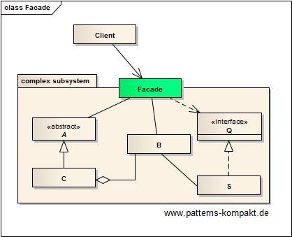
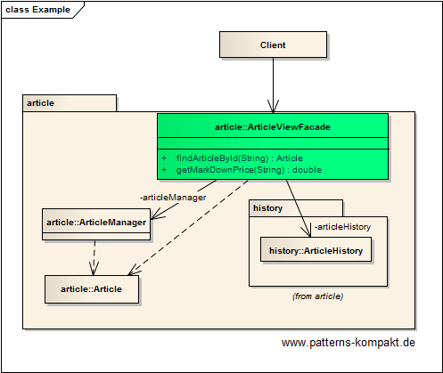

#### [Project Overview](../../../../../../../README.md)
----

# Facade

## Scenario

Multiglom Smart Business, vendor of web shop solutions, wants to include the markdown price information in the common article management view.
This involves the article's history which sits in a separate module.

The article's core information shall be displayed along with the markdown price without mixing the information in the database or existing entities, nor should there be logic in the client to mix the data.

### Requirements Overview

The purpose of the new article view is to display consolidated article data. This information shall be queried by a client without having to deal with different interfaces/endpoints.

_Main Features_

* Query article core data.
* Query markdown price

### Quality Goals

_Table 1. Quality Goals_

No.|Quality|Motivation
---|-------|----------
1|Simplicity|A single client-oriented interface with all the required functionality.

## Choice of Pattern
In this scenario we want to apply the **Facade Pattern** to _provide a unified interface to a set of interfaces in a subsystem_ (GoF). 

The client needs the article data and the markdown price. This is the functionality the facade provides.

From the client's perspective it does not matter that the information about the markdown price comes from a different database. This complexity is hidden in the _ArticleViewFacade_.

## Try it out!

Open [FacadeTest.java](FacadeTest.java) to start playing with this pattern. By setting the log-level for this pattern to DEBUG in [logback.xml](../../../../../../../src/main/resources/logback.xml) you can watch the pattern working step by step.

## Remarks
* Each facade is another layer. This impacts complexity and maintenance.
* It is an organizational challenge to ensure that people are not bypassing facades (direct access, sometimes called _layer bridging_). The latter often happens if the adjustment of a facade cannot be achieved timely. Such cheating can trigger more cheating ("Joe did this, so why shouldn't Jenny?") and it is prone to creating inconsistencies. This makes the project hard to maintain.

## References

* (GoF) Gamma, E., Helm, R., Johnson, R., Vlissides, J.: Design Patterns – Elements of Reusable Object-Oriented Software. Addison-Wesley (1995).

