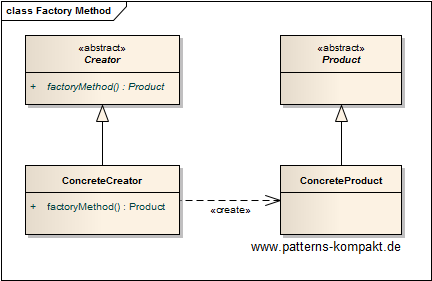
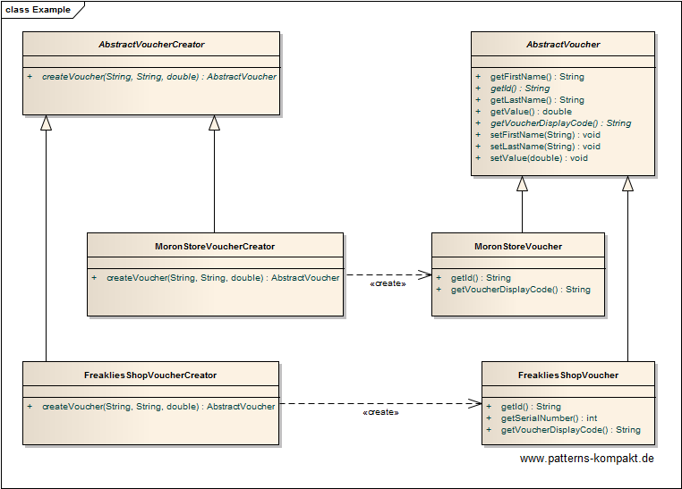

#### [Project Overview](../../../../../../../README.md)
----

# Factory Method

## Scenario

Multiglom Smart Business is a vendor of web shop solutions. Some of the company's clients have recently asked for an improved support for individual voucher code generation. Urgent requests come from _MoronStore Worldwide_ and _Mrs. Freakly_, running a progressive mom-and-pop store in Chicago.

### Requirements Overview

The purpose of the new voucher creater is creating vouchers for the client's web shops, where the vouchers and their generation may vary, customizable by the client.

_Main Features_

* Create a voucher which has a set of base properties.
* For a client through customization it shall be possible to implement the way to fill the properties individually and optionally add further properties.
  * MoronStore has special requirements regarding the **id** and the **display code**.
  * MoronStore thinks of different voucher creation methods in future (e.g. for long-term customers or seasonal specials).
  * Mrs. Freakly additionally needs a **serial number** (int).

### Quality Goals

_Table 1. Quality Goals_

No.|Quality|Motivation
---|-------|----------
1|Customizability|It shall be easy to integrate new voucher creation methods based on client requirements.
2|Extendability|The concrete voucher (its properties) shall not be restricted.
3|Testability|The design shall encourage testing decoupled from the rest of the application.

## Choice of Pattern
In this scenario we want to apply the **Factory Method Pattern** to _define an interface for creating an object, but let subclasses decide which class to instantiate_ (GoF). 

We have identified the _Voucher_ as an object to be created, where we have limited up-front knowledge of its properties and its concrete creation process. The concrete voucher class and its construction shall be customizable and configurable.

In the given solution a base class for vouchers has been defined with properties we assume to be common for most concrete scenarios. The creation process has been encapsulated in a concrete voucher creator inheriting from the _AbstractVoucherCreator_. For the two pilot clients there are now the _FreakliesShopVoucherCreator_ which creates _FreakliesShopVouchers_ and the _MoronStoreVoucherCreator_ producing _MoronStoreVouchers_.

As requested the vouchers for Mrs. Freakly contain an additional field `serialNumber`, which is not part of a MoronStore voucher.

## Try it out!

Open [FactoryMethodTest.java](FactoryMethodTest.java) to start playing with this pattern. By setting the log-level for this pattern to DEBUG in [logback.xml](../../../../../../../src/main/resources/logback.xml) you can watch the pattern working step by step.

## Remarks
* The concrete product (what to create, aka the _representation_) and its construction process (how to create it) are now independent from a single constructor call and customizable/configurable per client.
* A reasonable design of the abstract product (here the voucher) with base properties is crucial, especially when fields are mandatory. The same is true for the Creator's interface. Later changes may trigger cascading change efforts as their may be several concrete implementations, worst case outside the initial code base.

## References

* (GoF) Gamma, E., Helm, R., Johnson, R., Vlissides, J.: Design Patterns – Elements of Reusable Object-Oriented Software. Addison-Wesley (1995).
* (SteMa) Stelting, S., Maassen, O.: Applied Java Patterns. A Hands-On Guide to Design Pattern Developers. Prentice-Hall, Upper Saddle River (NJ, USA) (2001)
