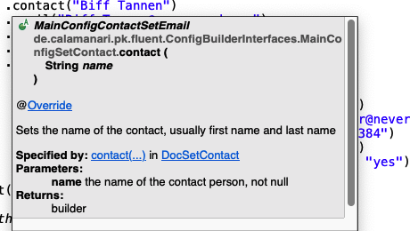

####  [Project Overview](../../../../../../../README.md)

# Fluent builders for custom classes


## Abstract

Projects often have smaller or larger configuration objects, or it is required to frequently setup certain object structures for testing. You may have scratched your head thinking *if only I had a simple [fluent](https://en.wikipedia.org/wiki/Fluent_interface) interface*. This could increase readability, consistency and help others understand how to do a setup correcly. But in the next moment you might think: *No, nice dream, but it's not worth all the effort. Fluent APIs are cumbersome to write, hard to maintain, and the code pollutes my existing classes.*

This article shows that the effort for writing fluent APIs might be smaller than you think, and some of the concerns above can be mitigated.

## Introduction

If you think about creating fluent builders for your classes, you definitely need to plan some time.

The biggest concerns are typically:
 * **Implementation effort** - There is definitely some effort. However, the idea is that you will get it back by saving effort later when you or others take advantage of the fluent API. Self-explaining builders can improve consistency and reduce the chance for mistakes.
 * **Maintenance** - Additional code needs to be tested and maintained. Implemented in the wrong way fluent APIs can *pollute* classes. Maybe you have seen these fat ugly inner monster classes lingering at the bottom of some class to supply it with fluent builder capabilities. This is definitely not what we want!
 * **Complexity** - How to start? The fluent approach has been described many times, and it looks clear, but the first steps to write your own seem to be cumbersome and frustrating.

To address the points above I will list a couple of heuristics below applied to a fictional configuration example. I call them *heuristics* because although they help me most of the time, there are cases were you may have good reasons to decide otherwise.

I hope this example demonstrates that you can add fluent builders to your classes with reasonable effort.

*Have fun!*

## Preliminary considerations

Before starting the implementations there are a few questions that should be answered to avoid wasting time.

 * *How often will the fluent API be required?* - No matter how well it is crafted, useless code always hurts. :smirk:
 * *Is there a certain stability reached?* If the objects to be covered are still wobbling like a pudding because requirements change rate is high, then the idea of writing a fluent API should be postponed.
 * *Is there any flow?* Fluent builders follow the idea that there can be identified a useful *flow* for the setup. If this is not the case or most of the settings are optional, then this is a counter indicator.
 
**:point_right: Heuristic**: If there is no reasonable flow or most settings are optional, a fluent builder is the wrong tool. As we will see later any *optional* setting increases complexity. An artificial unnatural flow can feel like a straitjacket for the user.

## The RegionConfig example

In this example we assume that there is a configuration object `RegionConfig` which we want to cover with a fluent builder.

```java
public record RegionConfig(
	int id, 
	String regionCode, 
	String description, 
	Contact contact, 
	Map<String, String> parameters) {}

public record Contact(
	String name, 
	String email, 
	String phone) {}

```
There are some constraints:
 * `id` - mandatory
 * `regionCode` - mandatory
 * other fields optional

**:point_right: Heuristic**: When you review the object to be covered by a fluent builder look at its properties from left to right. This can indicate a reasonable flow for the setup. If not, then this can mean two things: (A) The order of the fields is random and should be redesigned. (B) There is no reasonable flow because the relationship between the attributes *is random* (counter indication for creating a fluent builder).

In the example above the order of the properties defines a reasonable flow. It makes sense to start with the mandatory information followed by the optional ones. Adding the parameters last sounds perfect.

### Defining the interfaces

In strongly typed object-oriented languages like Java the secret sauce for fluent APIs are interfaces. If you think about a fluent API, then each step presents you with a *menu of options* and if you make a choice, in the next step there is a new menu of options. Technically, **each menu item is an interface**, and **each menu is an interface**. *Huh?* :confused:

Ok, there will be many interfaces, so far so good, but how to start?

**:point_right: Heuristic**: Usually, interfaces reside in their own files, which makes sense for *normal interfaces*. However, the interfaces of a fluent API are *special* (you may say *abused*). They are closely related and - as we will see soon - apart from very few of them *not meant to be ever implemented explicitly by any class*. Thus, it makes sense to put all these interfaces into a single file. This keeps the fluent logic in one place.

First, let's create a "class" `ConfigBuilderInterfaces.java` to hold all the various interfaces. 

```java
@SuppressWarnings("java:S6539")
public class ConfigBuilderInterfaces {

}
```

The first information to be specified is the `id`, followed by the `regionCode`, both mandatory.

```java
    public interface RegionConfigSetId {

        RegionConfigSetRegionCode withId(int id);

    }

    public interface RegionConfigSetRegionCode {

        RegionConfigSetDescriptionOrContactAddParameterOrExit code(String regionCode);

    }
```

By intention the interface `RegionConfigSetDescriptionOrContactAddParameterOrExit` does not exist yet, just ignore the error for now and go on.

The name of this interface reflects the currently available options after providing the region code. The user can either set the optional description or add a contact or add a parameter or obtain the configuration (exit).

Each of these options requires another tiny interface.

```java
    public interface RegionConfigSetDescription {

        RegionConfigSetContactAddParameterOrExit description(String description);

    }
```

Look at the interface names ...
 * `RegionConfigSetDescriptionOrContactAddParameterOrExit`
 * `RegionConfigSetContactAddParameterOrExit`

This reflects the no longer available choice to set a description after setting the description. :smirk:

**:point_right: Heuristic**: Naming is crucial. Write the names, so you can grasp the *current menu* from the interface name. Don't worry about the lengthy names. Remember: **These interfaces are never referenced outside this file!**


```java
    public interface RegionConfigSetContact {

        RegionConfigContactSetEmail contact(String name);

    }

```

*Wait! Did we just enter a **nested** element?*

Yes, the flow requires that we either do not specify a contact or we provide at least a name and an email address. The interface `RegionConfigContactSetEmail` enforces entering the email address when the user decided to specify a contact. You cannot continue otherwise.

```java
    public interface RegionConfigContactSetEmail {

        RegionConfigContactSetPhoneOrAddParameterOrExit email(String email);

    }

    public interface RegionConfigContactSetPhone {

        RegionConfigAddParameterOrExit phone(String phone);
    }
```

Again, please ignore the temptation and leave `RegionConfigContactSetPhoneOrAddParameterOrExit` and `RegionConfigAddParameterOrExit` unimplemented. Later, these errors will act as reminders.

```java
    public interface RegionConfigAddParameter extends DocAddParameter {

        RegionConfigAddParameterOrExit parameter(String name, String value);
    }

    public interface RegionConfigExit extends DocExit {

        RegionConfig get();
    }
```
*Phew!* End of round 1, all simple interfaces are defined. Now we can look at the complex ones. Thanks to the *descriptive names* the definition of the missing interfaces is just a matter of combination.

```java
    public interface RegionConfigAddParameterOrExit extends RegionConfigAddParameter, RegionConfigExit {}

    public interface RegionConfigContactSetPhoneOrAddParameterOrExit extends RegionConfigContactSetPhone, RegionConfigAddParameter, RegionConfigExit {}

    public interface RegionConfigSetContactAddParameterOrExit extends RegionConfigSetContact, RegionConfigAddParameter, RegionConfigExit {}

    public interface RegionConfigSetDescriptionOrContactAddParameterOrExit
            extends RegionConfigSetDescription, RegionConfigSetContact, RegionConfigAddParameter, RegionConfigExit {}
```
Round 2 completed. The flow is defined.

As I mentioned earlier, none of these interfaces should leave the context of this file. This is a matter of separation of concerns. The flow is defined here, and these interfaces are purely supplementary.

Let's define a sleek interface that hides the whole ramalamadingdong above!

This requires a bit of concentration but there is a simple algorithm you can apply:
 * Find a good name for the interface, usually what you build, followed by `Builder`
 * Scroll up and find all interface names *returned* by any method.
 * Add the start interface (here `RegionConfigSetId`) to the list.
 * Let your combined interface extend all of them.

```java
    public interface RegionConfigBuilder extends 
		RegionConfigSetDescriptionOrContactAddParameterOrExit, 
		RegionConfigSetContactAddParameterOrExit,
        RegionConfigContactSetPhoneOrAddParameterOrExit, 
		RegionConfigAddParameterOrExit, 
		RegionConfigExit, 
		RegionConfigSetRegionCode,
        RegionConfigContactSetEmail, 
		RegionConfigSetId {}
```

**:point_right: Heuristic**: Define a combined interface for the later builder implementation. This has several advantages: First of all, the *flow* logic remains in this file (`ConfigBuilderInterfaces.java`). Second, the concrete implementation looks cleaner. Third, the compiler will detect coarse-grained problems for us *here*, before we waste any time with the implementation. Incompatible return types can occur if you accidentally defined two methods with the same name but different result type.

*Done with round 3, making progress!*

Now we finally need an implementation. As mentioned earlier we should not pollute the object we want to provide a fluent API for more than necessary. Thus we will create a separate builder class. 

*But, wait, now we get all these weird step-interfaces into the builder! Didn't you tell me that they only live in `ConfigBuilderInterfaces.java`?* 

The solution to this problem is **generics**.

**:point_right: Heuristic**: Introduce an abstract base class that does *not* implement the builder interface for the implementation of the concrete methods. This way the weird step-interfaces won't appear in your code, and to some extent you *isolate* the builder implementation from later flow changes. As a side effect, during implementation you have less headaches with red flags. :smirk:

```java
public abstract class AbstractConfigBuilder<T extends AbstractConfigBuilder<T>> {

    /**
     * builder instance (concrete class is parameterized with itself (T))
     */
    private final T builder;

    protected int id;

    protected String contactName;

    protected String contactEmail;

    protected String contactPhone;

    protected Map<String, String> parameters = new HashMap<>();

    protected String regionCode;

    protected String description;

    protected AbstractConfigBuilder() {
        // need explicit cast, otherwise the compiler does not understand
        // that T must be the "type of this"
        @SuppressWarnings("unchecked")
        T instance = (T) this;
        this.builder = instance;
    }

    public T withId(int id) {
        this.id = id;
        return builder;
    }

    public T contact(String name) {
        this.contactName = name;
        return builder;
    }

    public T email(String email) {
        this.contactEmail = email;
        return builder;
    }

    public T phone(String phone) {
        this.contactPhone = phone;
        return builder;
    }

    public T parameter(String name, String value) {
        this.parameters.put(name, value);
        return builder;
    }

    public T code(String regionCode) {
        this.regionCode = regionCode;
        return builder;
    }

    public T description(String description) {
        this.description = description;
        return builder;
    }

    protected Contact createContact() {
        return contactName == null ? null : new Contact(contactName, contactEmail, contactPhone);
    }

}
```

Round 4 complete. The implementation is done.

Now we finally must connect that thing to `RegionConfig`.

```java
public record RegionConfig(int id, String regionCode, String description, Contact contact, Map<String, String> parameters) {

    public static RegionConfigSetRegionCode withId(int id) {
        return new Builder().withId(id);
    }

    private static class Builder extends AbstractConfigBuilder<Builder> implements RegionConfigBuilder {

        @Override
        public RegionConfig get() {
            return new RegionConfig(id, 
									regionCode, 
									description, 
									createContact(), 
									parameters);
        }

    }
}
```

This single statement `extends AbstractConfigBuilder<Builder> implements RegionConfigBuilder` does all the magic. It connects the interface with the implementation. We only must implement the `get()` method which returns the concrete result.

*Mission accomplished!*

```java
        // @formatter:off
        RegionConfig regionConf01 = 
			RegionConfig.withId(313)
                            .code("R313")
                            .description("Some region")
                            .contact("Harry")
                            .email("Harry.Miller@neversend.com")
                            .parameter("f123", "8273")
                            .parameter("f456", "ok")
                            .parameter("active", "no")
                        .get();

        RegionConfig regionConf02 = 
			RegionConfig.withId(987)
                            .code("R987")
                            .contact("Laura")
                            .email("Laura.Giller@neversend.com")
                            .phone("+1555-62372384")
                            .parameter("op4", "yes")
                            .parameter("proactive", "yes")
                        .get();

        RegionConfig regionConf03 = 
			RegionConfig.withId(101)
                            .code("R101")
                            .description("Test")
                        .get();
        
        // @formatter:on

```

## A MainConfig with RegionConfigs

The scenario was pretty simple so far. Now we want to make the example a little more interesting. There shall be a `MainConfig` object with some properties and an optional list of `RegionConfig`s.

```java
public record MainConfig(int id, String systemType, Contact contact, Map<String, String> parameters, List<RegionConfig> regionConfigs) {}
```

Interestingly, there a many similarities between creating a `MainConfig` and a `RegionConfig`.

**:point_right: Heuristic**: When there are objects with similarities, carefully look for akward deviations in terms of naming or constraints. In early project phases you may be able to correct such design flaws before reality prevents any refactoring.

**:point_right: Heuristic**: Before implementing several builders look for similarities. You may save time (and maintenance effort) if you can create a common concrete implementation.

I won't go through the process step by step again. Unfortunately, because of the return type problem you must implement a similar set of interfaces for the `MainConfig`. These *flows* are independent, hence their interface sets, too.

In this example I will include the interfaces for `MainConfig` in the same file `ConfigBuilderInterfaces.java`.

```java
public class ConfigBuilderInterfaces {


    public interface MainConfigSetId {

        MainConfigSetSystemType withId(int id);

    }

    public interface MainConfigSetSystemType {

        MainConfigSetContactOrAddParameterOrAddRegionConfigOrExit type(String systemType);

    }

    public interface MainConfigSetContact {

        MainConfigContactSetEmail contact(String name);

    }

    public interface MainConfigContactSetEmail {

        MainConfigContactSetPhoneOrAddParameterOrAddRegionConfigOrExit email(String email);

    }

    public interface MainConfigContactSetPhone {

        MainConfigAddParameterOrAddRegionConfigOrExit phone(String phone);
    }

    public interface MainConfigAddParameter {

        MainConfigAddParameterOrAddRegionConfigOrExit parameter(String name, String value);
    }

    public interface MainConfigAddRegionConfig {

        MainConfigAddRegionConfigOrExit regionConfig(RegionConfig regionConfig);
    }

    public interface MainConfigExit {

        MainConfig get();
    }

    public interface MainConfigAddRegionConfigOrExit extends MainConfigAddRegionConfig, MainConfigExit {}

    public interface MainConfigAddParameterOrAddRegionConfigOrExit extends MainConfigAddParameter, MainConfigAddRegionConfig, MainConfigExit {}

    public interface MainConfigContactSetPhoneOrAddParameterOrAddRegionConfigOrExit
            extends MainConfigContactSetPhone, MainConfigAddParameter, MainConfigAddRegionConfig, MainConfigExit {}

    public interface MainConfigSetContactOrAddParameterOrAddRegionConfigOrExit
            extends MainConfigSetContact, MainConfigAddParameter, MainConfigAddRegionConfig, MainConfigExit {}

    public interface MainConfigBuilder extends 
			MainConfigSetContactOrAddParameterOrAddRegionConfigOrExit,
            MainConfigContactSetPhoneOrAddParameterOrAddRegionConfigOrExit, 
			MainConfigAddParameterOrAddRegionConfigOrExit, 
			MainConfigAddRegionConfigOrExit,
            MainConfigExit, 
			MainConfigSetContact, 
			MainConfigContactSetEmail, 
			MainConfigSetSystemType, 
			MainConfigSetId {
        // combined
    }

// RegionConfig interfaces ...
}
```

Above, the method `regionConfig(RegionConfig regionConfig)` takes a complete `RegionConfig` object as input rather than opening a *sub-flow*. 
 * Advantages:
   * `RegionConfig`s can be setup fluently indendependent from the `MainConfig`
   * `MainConfig` builder does not face any context switch when adding a `RegionConfig`.
   * `MainConfig` builder interfaces are simpler.
   * Independent testing.
 * Disadvantages:
   * Separate flows, potential inconvenience for the user.
   * No shared context. The `RegionConfig` does not know that is being built *inside* a `MainConfig`.

You may have already guessed: it is no surprise that the class `AbstractConfigBuilder` only needs very few adjustments to serve both interfaces `MainConfigBuilder` and `RegionConfigBuilder` - of course not at the same time. 

You can find the complete implementation here: **[AbstractConfigBuilder](AbstractConfigBuilder.java)**.

To bind it to `MainConfig` class we make the same adjustments as we did for `RegionConfig`.

```java
public record MainConfig(int id, String systemType, Contact contact, Map<String, String> parameters, List<RegionConfig> regionConfigs) {

    public static MainConfigSetSystemType withId(int id) {
        return new Builder().withId(id);
    }

    private static class Builder extends AbstractConfigBuilder<Builder> implements MainConfigBuilder {

        @Override
        public MainConfig get() {
            return new MainConfig(id, 
								  systemType, 
								  createContact(), 
								  parameters, 
								  regionConfigs);
        }

    }

}
```

Here are examples how the fluent configuration looks:
```java
        // @formatter:off
        
        MainConfig mainConf01 = 
			MainConfig.withId(1007)
            	          .type("ZULUFIX")
                          .contact("Ronda Ruthless")
                      	  	  .email("Ronda.Ruthless@neversend.com")
                          .parameter("q8", "true")
                          .parameter("global", "yes")
                      .get();

        MainConfig mainConf02 = 
			MainConfig.withId(1009)
                          .type("TETRA")
                          .contact("Biff Tannen")
                              .email("Biff.Tannen@neversend.com")
                          .parameter("delay", "8173")
                          .parameter("wipe", "no")
                          .regionConfig(
                              RegionConfig.withId(987)
                                  .code("R987")
                                  .contact("Laura Giller")
                                      .email("Laura.Giller@neversend.com")
                                      .phone("+1555-62372384")
                                  .parameter("op4", "yes")
                                  .parameter("proactive", "yes")
                              .get())
                          .get();

        MainConfig mainConf03 = MainConfig.withId(9999)
                                              .type("TEST")
                                          .get();
        
        // @formatter:on

```

## Documentation

A big plus of fluent builders is the availability to provide useful documentation on each step. However, as we have seen there are many similar interfaces. Of course, we don't want to create (and maintain!) the same java-doc comments over and over again.

This problem can be addressed - *with even more interfaces!* :smirk:

Here is an example:

```java

    public interface MainConfigSetContact {
        MainConfigContactSetEmail contact(String name);
    }

	public interface RegionConfigSetContact {
        RegionConfigContactSetEmail contact(String name);
    }

```
The `contact`-methods should share the same documentation, and we don't want to repeat it.

Therefore we introduce a **documentation interface**:

```java
    public interface DocSetContact {

        /**
         * Sets the name of the contact, usually first name and last name
         * 
         * @param name the name of the contact person, not null
         * @return builder
         */
        Object contact(String name);

    }

```

Interface inheritance does the rest:

```java
    public interface MainConfigSetContact extends DocSetContact {

        @Override
        MainConfigContactSetEmail contact(String name);

    }

    public interface RegionConfigSetContact extends DocSetContact {

        @Override
        RegionConfigContactSetEmail contact(String name);

    }	

```



**:point_right: Heuristic**: Documentation interfaces can help avoid duplicate documentation.

Please review [ConfigBuilderInterfaces](ConfigBuilderInterfaces.java).

Here you can find the full example with some tests: **[ConfigTest](ConfigTest.java)**.


## Nesting and similarities

**:point_right: Heuristic**: If you have complex nested objects (here the `RegionConfig` inside the `MainConfig`), then it is better to **keep the builder instances unrelated** as it reduces complexity and simplifies testing.

A weak point of the fluent builder approach are *similar sub-flows*.

Let's assume you want to introduce an *emergencyContact* (just if you can't reach out to the regular contact). What sounds trivial at first glance is in fact *pest*! The problem is that the methods `email` and `phone` are already *burned*. You cannot have another method with the same name but a different return type. But you need a different return type to reflect the different flow!

Above, you could fix this by introducing a builder for the `contact`.

**:point_right: Heuristic**: Stay away from hardcore magic. In the example above it would be possible to introduce a *parameterized contact-builder* (generics) with the *next step interface* (parent builder) to be returned after entering the email or phone. For the user it would look like one continuous flow. But it significantly increases complexity and decreases code readability.

## Default values

**:point_right: Heuristic**: General defaults belong to the Object that is being created and should be applied as late as possible, e.g., if a field is empty or null, set it to `fooBar`. This avoids the issue that different creation methods (builder, DB-retrieval, JSON) apply different defaults and thus inconsistent results.

**:point_right: Heuristic**: In a builder there can be additional contextual default values. E.g., let there be a `lazy()` method to set a flag per `mapping` item to indicate that they may exist or not. To ease the configuration, you decided to allow the user to initially specify that all mappings are lazy by default (e.g., `withLazyMappings()`). This does not add any new information to your config, it just automatically sets the `mapping`s to `lazy` while building the configuration. Nice idea, but what if all `mapping`s are `lazy` except for a few? Again, the user would have to specify the flag for each mapping, which limits the value of the builder's `withLazyMappings()` feature. So, when a builder introduces a custom default for a boolean, then there should be corresponding methods (e.g., `lazy()` and `notLazy()`) to avoid one-way roads.

## Validation and error handling

Validation of objects should be implemented once and once only. It should be part of the construction to prevent broken instances from causing subtle problems later on.

**:point_right: Heuristic**: Implement the validation as part of the objects you are creating, not in the fluent builder. Instances may be created using the fluent API or not (e.g., loaded from a DB or JSON). Then the same validation logic must be applied. Although being convenient for the user to validate early, it bloats the builder code and increases testing effort. Implementing the rules twice is prone to inconsistencies and errors. If you really need the additional convenience, move the validation into a separate component and delegate whenever you need the validation.