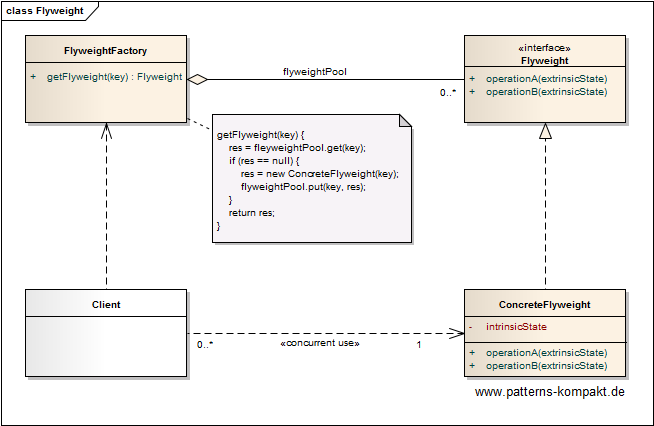
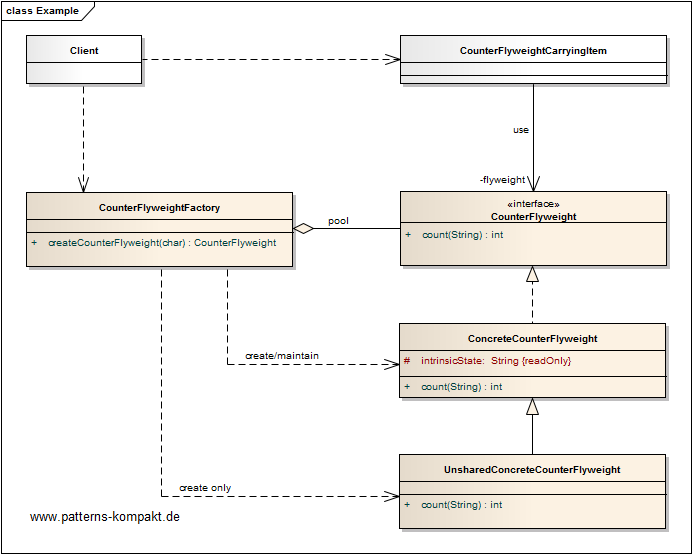

#### [Project Overview](../../../../../../../README.md)
----

# Flyweight

## Scenario

Apart from GUI-examples (renderers) it is hard to find small and reasonable examples for demonstration.

Thus this synthetic example introduces a trivial use case (counting the number of occurrences of a configurable character in a string) as the purpose of the counter component.

We assume that due to its intrinsic state holding one counter per element to be processed in memory is expensive.

## Choice of Pattern
In this scenario we want to apply the **Flyweight Pattern** to _use sharing to support large numbers of fine-grained objects efficiently_ (GoF). 

We have identified the _Counter_ as an object that is required quite often in parallel. Its size makes it hard to keep many instances in memory at the same time. Thus we introduce the _CounterFlyweight_.

Because there are different counters required (per character to count, one may count 'A's, the other 'B's), the _FlyweightFactory_ takes care of the creation and pooling. So, if a counter for a particular character is requested twice the same object will be returned.

I have also included an _UnsharedFlyweightCounter_ to see the differences when not using the flyweight.

## Try it out!

Open [FlyweightTest.java](FlyweightTest.java) to start playing with this pattern. By setting the log-level for this pattern to DEBUG in [logback.xml](../../../../../../../src/main/resources/logback.xml) you can watch the pattern working step by step.

## Remarks
* In backend development I have rarely seen this pattern implemented _explicitly_. However, very often you can see the principles of this pattern applied, when the goal is to reduce duplication of expensive objects which - initialized once - are thread-safe (final).
* Please not that the pool inside the CounterFlyweightFactory has a **different purpose** than a typical object pool. When applying the [Object Pool pattern](../objectpool/README.md) we want to ensure that a pooled object is *not* used in parallel. In the Flyweight scenario it is the opposite, here we want to ensure all clients are using the same instance (in parallel). Flyweights do not need to be returned to the pool nor do they need any cleaning.
* Before implementing Flyweight be sure it really makes sense. In the book you can find some tips to estimate a possible benefit. Often the effect on memory and performance will not justify the complexity this pattern adds.

## References

* (GoF) Gamma, E., Helm, R., Johnson, R., Vlissides, J.: Design Patterns – Elements of Reusable Object-Oriented Software. Addison-Wesley (1995).
* (SteMa) Stelting, S., Maassen, O.: Applied Java Patterns. A Hands-On Guide to Design Pattern Developers. Prentice-Hall, Upper Saddle River (NJ, USA) (2001)
