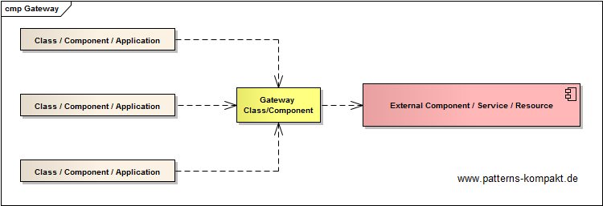
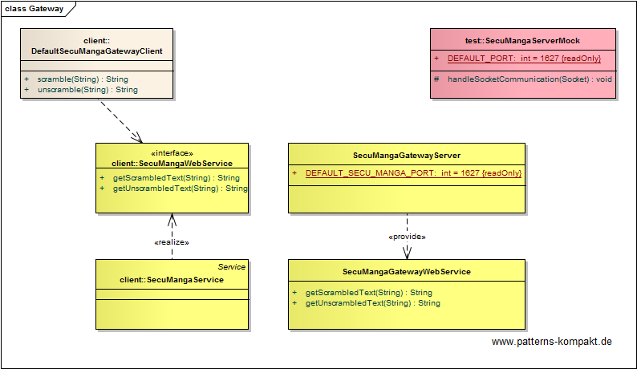

#### [Project Overview](../../../../../../../README.md)
----

# Gateway

## Scenario

Multiglom Medical, market leader for artificial appendixes and famous for their armpit hair prosthesis, currently reworks the internal information system IELO. 

The existing solution directly uses the SecuManga server for encryption, a legacy software originally developed by Obscuration Ltd., a vendor that for some reason no longer exists. This software must be deployed separately and requires direct access to port 1627. Especially, this need for an open port and the lack of detail documentation of the SecuManga RPC-interface has lead to controversial discussions with the security department.

However, for some time, IELO will have to support SecuManga as moving away from this system (and related data migration) may take many months.
The architects look for a clean solution with low coupling to details of SecuManga like unknown RPCs and open ports.

### Requirements Overview

The purpose of the SecuManga isolation component is a clean and modern interface to the SecuManga server focused on required API-calls.

_Main Features_

* Scramble text leveraging SecuManga.
* Unscramble text using SecuManga.

### Quality Goals

_Table 1. Quality Goals_

No.|Quality|Motivation
---|-------|----------
1|Isolation|The legacy software shall be kept separated from the new IELO modules. We want to avoid new direct dependencies to the legacy software SecuManga.
2|Security|The network security department does not want to open additional ports and has raised concerns about the more or less unknown RPC-interface of SecuManga. This interface must not be exposed.
3|Testability|Developers look for easier ways to test IELO without having to run an instance of SecuManga. 

## Choice of Pattern
In this scenario we want to apply the **Gateway Pattern** to create _an object that encapsulates access to an external system or resource_ (Fowler). 

We have identified the _SecuMangaServer_ and a part of its interface we further want to make accessible in the new version of IELO while isolating the third-party software deployment as far as possible from our software.

The _SecuMangaGatewayServer_ runs together with the legacy _SecuMangaServer_ in an isolated (secured) environment where open ports and a partially undocumented RPC-interface are unproblematic. The _SecuMangaGatewayServer_ provides a small well-documented web service interface to its clients with a feature set reduced to the still required SecuManga-decoder functionality. It is impossible for any client to bypass the gateway.

Now a developers can use a **mock gateway** to simplify integration testing.

## Try it out!

Open [GatewayTest.java](GatewayTest.java) to start playing with this pattern. By setting the log-level for this pattern to DEBUG in [logback.xml](../../../../../../../src/main/resources/logback.xml) you can watch the pattern working step by step. The scenario involves remoting, output from the two "servers" running in the background has been redirected to the main console for better visibility.

## Remarks
* An interesting aspect of the _Gateway_ pattern is that it allows access but can restrict access at the same time along with logging and rate limitation. 
* A gateway can do both: protect the client from unwanted aspects of the target system (API-design concerns, missing documentation, error handling etc.), and protect the target system from unwanted client behavior (overload, security issues, wrong usage etc.).

## References

* (Fowler) Fowler, M.: Patterns of Enterprise Application Architecture. Addison-Wesley (2002)

