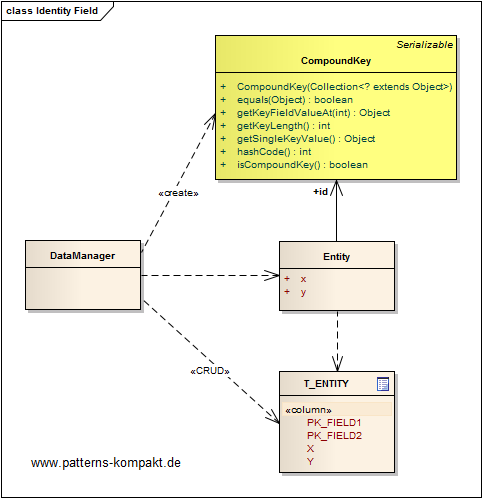
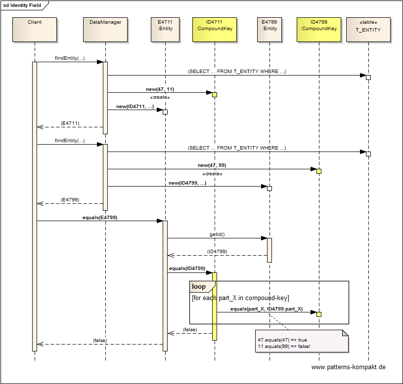

#### [Project Overview](../../../../../../../README.md)
----

# Identity Field

## Scenario

In this abstract example we look at the database table _T&#95;CUSTOMER_, which has a primary key composed of the two columns _PK&#95;FIELD1_ and _PK&#95;FIELD2_. When loading an _Entity_ instance into the application (or a cache) we want to identify it, so we need any unique identifier.

We want to avoid any "workaroundish" solution like introducing an additional field with a concatenation of the two PK-fields.

## Choice of Pattern
In this scenario we want to apply the **Identity Field pattern** to _save a database ID field in an object to maintain identity between an in-memory object and a database row_ (Fowler). 

The pattern introduces the class _CompoundKey_ to represent the composite key (_PK&#95;FIELD1_, _PK&#95;FIELD2_) as an identifier instance in memory. Comparison (`equals()`) and hashing (`hashCode()`) are implemented based on the two primary key fields.

As a result we get a single identifier for the _Entity_ instance. The translation between the representation in the database and the in-memory-object with the new compound key is part of the [O/R-mapping](https://en.wikipedia.org/wiki/Object%E2%80%93relational_mapping), which above happens inside the _DataManager_.

## Try it out!

Open [IdentiyFieldTest.java](IdentityFieldTest.java) to start playing with this pattern. By setting the log-level for this pattern to DEBUG in [logback.xml](../../../../../../../src/main/resources/logback.xml) you can watch the pattern working step by step.

## Remarks
* This pattern is rather implemented by frameworks than in other application code. However, the principles are applicable whenever an object needs an identifier based on properties that identify it (e.g. a cache key).
* The _CompoundKey_ is technically a [Value Object](../valueobject/README.md).

## References

* (Fowler) Fowler, M.: Patterns of Enterprise Application Architecture. Addison-Wesley (2002)
