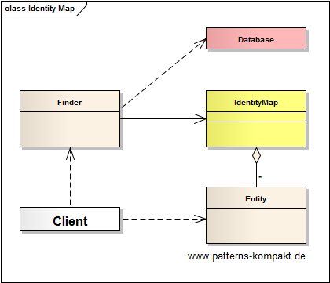
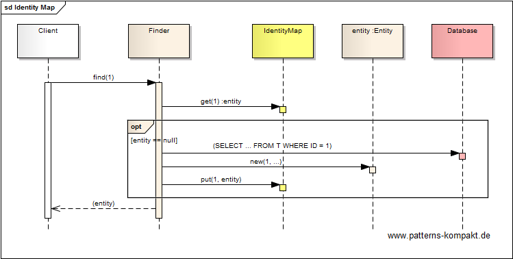
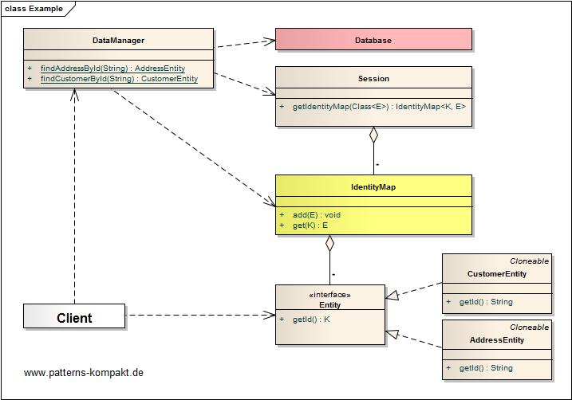

#### [Project Overview](../../../../../../../README.md)
----

# Identity Map

## Scenario

Multiglom B2B, vendor of a CRM suite for small businesses, currently reworks its home-grown framework WHEEL.

To speed-up dealing with business entities and for better consistency in application sessions the engineering team looks
for a way to ensure that a particular entity only gets loaded once from a database into a WHEEL-context. The framework shall keep track of usage of the entity, modification management and persistence.

## Choice of Pattern
In this scenario we want to apply the **Identity Map Pattern** to _ensure that each object gets only loaded once by keeping every loaded object in a map_ (Fowler). 

The finder either returns the requested entity from internal map or performs a lookup on the underlying database to put the entity into the map. This happens transparent for the client that works with a particular entity.

In the given scenario WHEEL's _DataManager_ takes the role of the Finder. 

Here, the _Session_ holds the map with the already loaded (managed) entities, _CustomerEntity_ and _AddressEntity_ in the example.

## Try it out!

Open [IdentityMapTest.java](IdentityMapTest.java) to start playing with this pattern. By setting the log-level for this pattern to DEBUG in [logback.xml](../../../../../../../src/main/resources/logback.xml) you can watch the pattern working step by step.

## Remarks
* This pattern is usually only implemented by frameworks. A prominent example is [Hibernate](https://hibernate.org/). However, it is useful to be familiar with this pattern to understand its implications, especially in conjunction with caching.

## References

* (Fowler) Fowler, M.: Patterns of Enterprise Application Architecture. Addison-Wesley (2002)

