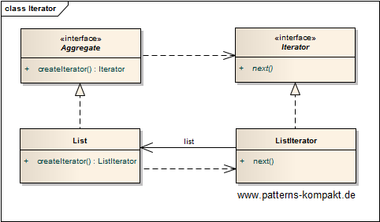
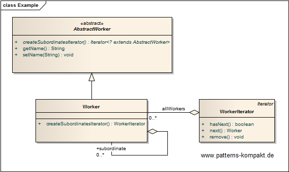

#### [Project Overview](../../../../../../../README.md)
----

# Iterator

## Scenario

Multiglom HR maintains an internal application to manage its employees (workers). 

A couple of use cases require listing all direct and indirect subordinates of an employee. To avoid implementing the iteration logic several times in the application and ensure that the list order is consistent the iteration logic shall only be implemented once be moved closely to the aggregate.

### Requirements Overview

The purpose of subordinate list is to list all direct and indirect subordinates of a worker.

_Main Features_

* Return all direct and indirect subordinates.
* Return an empty result rather than any exception if a worker has no subordinates.

### Quality Goals

_Table 1. Quality Goals_

No.|Quality|Motivation
---|-------|----------
1|Simplicity|Any arbitrary employee (worker instance) can be queried for its subordinates.
2|Consistency|No matter where listing the subordinates of a particular worker, the order should be the same.
3|Testability|The design shall encourage testing iteration logic decoupled from the rest of the application.

## Choice of Pattern
In this scenario we want to apply the **Iterator Pattern** to _provide a way to access elements of an aggregate object sequentially without exposing its underlying representation_ (GoF). 

We have identified the Worker as the object that can have subordinates or not. Thus it is easer an aggregate or a leave, and the goal shall be to handle both in the same way.

So, we always return a WorkerIterator instead of null or throwing any exception. The WorkerIterator can transparently handle the case that there is not a single subordinate.

## Try it out!

Open [IteratorTest.java](IteratorTest.java) to start playing with this pattern. By setting the log-level for this pattern to DEBUG in [logback.xml](../../../../../../../src/main/resources/logback.xml) you can watch the pattern working step by step.

## Remarks
* As mentioned in the book, while Iterators are quite handy from the usage perspective, they effectively hide potentially important aspects. The client of an Iterator does not (want to) know, how the iteration works, but sometimes this knowledge is crucial. Especially, in conjunction with internal lazy loading or prefetching there can be surprising performance or memory effects.

## References

* (GoF) Gamma, E., Helm, R., Johnson, R., Vlissides, J.: Design Patterns – Elements of Reusable Object-Oriented Software. Addison-Wesley (1995).
