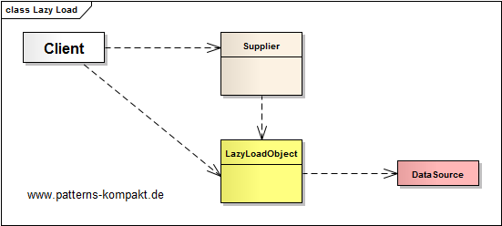
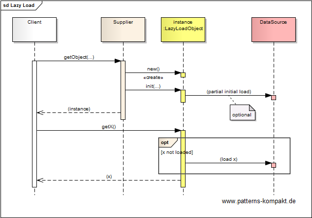
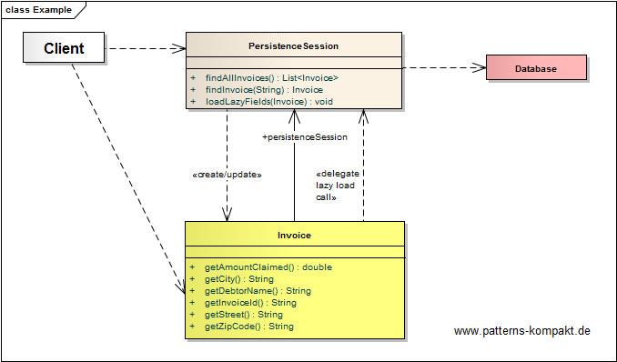
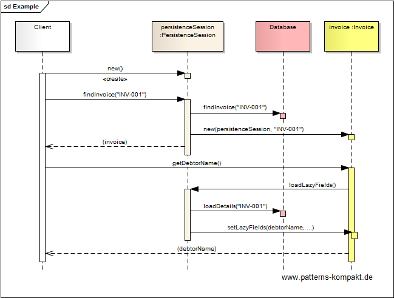

#### [Project Overview](../../../../../../../README.md)
----

# Lazy Load

## Scenario

Multiglom B2B, vendor of the CRM suite Manjok for small businesses, got a couple of customer complaints about performance problems in the finance module. Investigations have shown that the problem is related to invoices, especially if there are many. Due to the fact how invoices are stored it takes too much time for loading, even if the user is only interested in the overview and not in the details.

The goal is improving the invoice list view performance without affecting the application functionality.

## Choice of Pattern
In this scenario we want to apply the **Lazy Load Pattern** to provide _an object that doesn't contain all of the data you need but knows how to get it_ (Fowler). 

Initially, the supplier only partially fills the _LazyLoadObject_ with data. 

When the client later tries to access not yet loaded information, a retrieval process gets triggered. The latter happens transparent to the client.

In the given scenario the _Invoice_ is the object which takes long to entirely load it. Thus we implement _Invoice_ as a _LazyLoad_ object.

The _PersistenceSession_ first returns a _LazyLoad_ object to the client.

In the moment when the client tries to access not yet loaded invoice details (call `getDebtorName()` for example), the information will be loaded from the database.

This way the invoice list view provided by Manjok can be loaded quickly. Loading the details of a particular invoice will be deferred or omitted at all if the user is not interested in the invoice details.

## Try it out!

Open [LazyLoadTest.java](LazyLoadTest.java) to start playing with this pattern. By setting the log-level for this pattern to DEBUG in [logback.xml](../../../../../../../src/main/resources/logback.xml) you can watch the pattern working step by step.

## Remarks
* As discussed in the book a lazy loading can be tricky. Thus, besides the _Lazy Load_ functionality, the code-example demonstrates some common issues: the _ripple-effect_, _closed session_ and _lost session_.   

## References

* (Fowler) Fowler, M.: Patterns of Enterprise Application Architecture. Addison-Wesley (2002)

