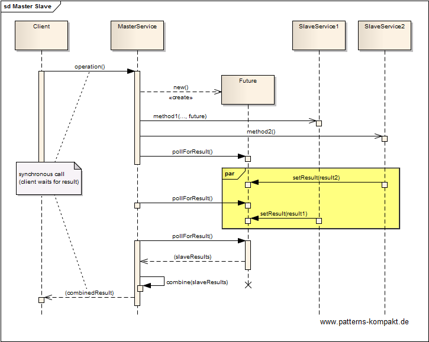
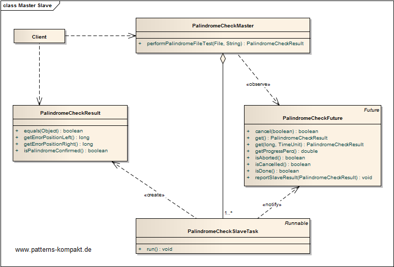
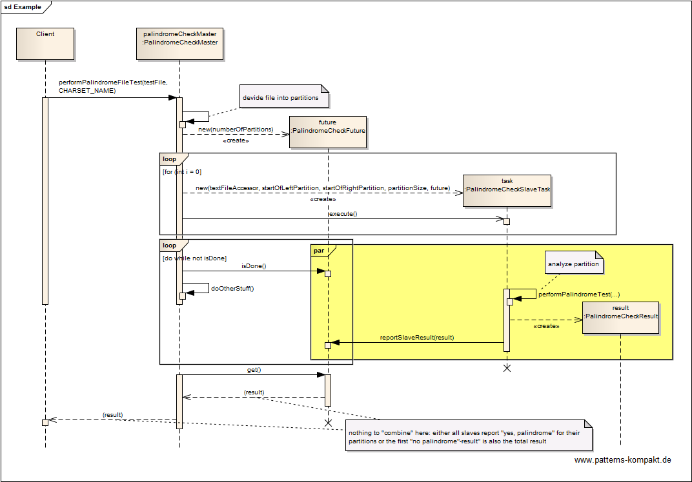

#### [Project Overview](../../../../../../../README.md)
----

# Leader-Follower

## Scenario

In this example we want to test (long) character sequences for being a [palindrome](https://en.wikipedia.org/wiki/Palindrome) or not.
The process of testing large sequences shall be sped up.

## Choice of Pattern

In this scenario we want to apply the **Leader-Follower Pattern** to _meet the performance, fault-tolerance, or accuracy requirements of the component via a 'divide and conquer' strategy. Split its services into independent subtasks that can be executed in parallel, and combine the partial results returned by these subtasks to provide the service's final result_ (POSA). 

The palindrome test checks if the sequence is exactly the same when being read from the start to the end or vice-versa. This makes it quite easy to parallelize the test because we can cut the total sequence in subsequences, each consisting of some characters from the begin plus the same number of characters from the end of the source sequence. These _partitions_ all must be palindromes. If any of the partitions is not a palindrome, the source sequence cannot be a palindrome. 

The _PalindromeCheckLeader_ (virtually) cuts the input sequence into subsequences, each of these partitions becomes a _PalindromeCheckFollowerTask_. A configurable number of threads (the followers) execute the follower tasks asynchronously.

The _PalindromeCheckLeader_ derives the total test result (input sequence is a palindrome or not) from the partial results reported by the followers.

An important aspect is the ability of the leader to stop processing the follower tasks as soon as one follower reported that a subsequence was _not_ a palindrome.

## Try it out!

Open [LeadrFollowerTest.java](LeaderFollowerTest.java) to start playing with this pattern. By setting the log-level for this pattern to DEBUG in [logback.xml](../../../../../../../src/main/resources/logback.xml) you can watch the pattern working step by step. 

To process large palindrome files I use here the [IndexedTextFileAcessor](../../../../../../main/java/de/calamanari/pk/util/itfa/IndexedTextFileAccessor.java) to index the input file not to entirely load it into memory. This utility internally also implements the Leader-Follower pattern for indexing with multiple threads.

## Remarks
* Originally, this pattern was called "Master-Slave". Later, this name became a subject of controversy due to its association with slavery. The name _Leader-Follower_ avoids any offense.

## References

* (POSA) Buschmann, F., Henney, K., Schmidt, D.C.: Pattern-Oriented Software Architecture: A Pattern Language for Distributed Computing. Wiley, Hoboken (NJ, USA) (2007)
