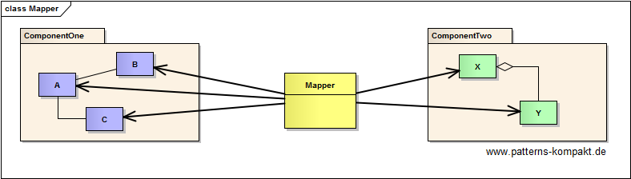
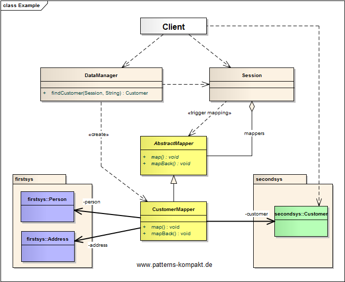
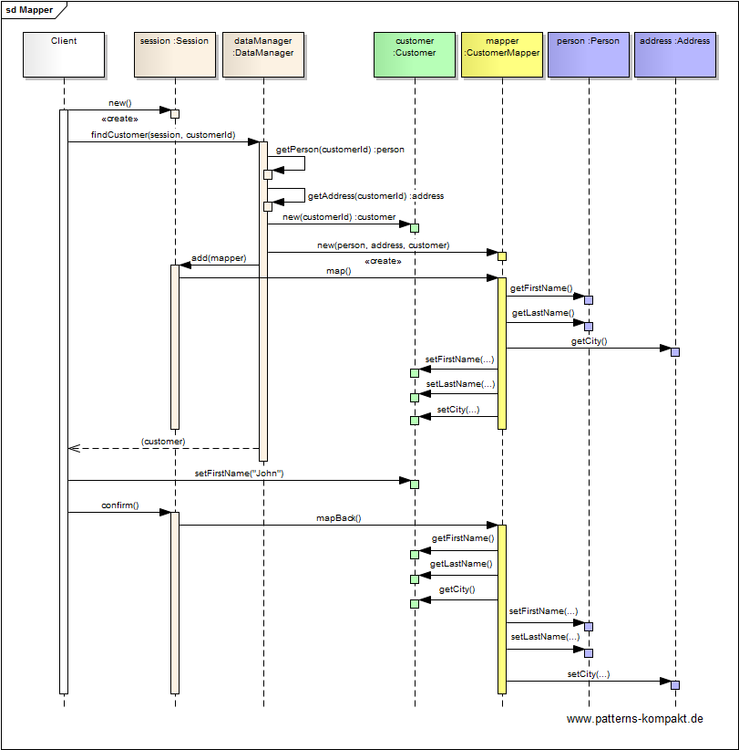

#### [Project Overview](../../../../../../../README.md)
----

# Mapper

## Scenario

Foobar&Sons, vendor of Multigrate, a platform that aims to integrate CRM data from various vendors, wants to handle data transfer between a growing number of systems, starting with FirstSYS and SecondSYS.

Both systems Multigrate deals with, have customer data (person and address) but represented in a different way. Multigrate shall transfer customer data between the two platforms.

## Choice of Pattern

In this scenario we want to apply the **Mapper Pattern** to provide _an object that sets up a communication between two independent objects_ (Fowler). 

We have identified the customer as the object that exists in _firstsys_ and _secondsys_ but represented in a different way. To connect both sides we introduce the _CustomerMapper_.

The _CustomerMapper_ moves data from _firstsys_ to _secondsys_ and vice-versa.

Here the mapping process (when to map) is triggered by the _Session_. 

## Try it out!

Open [MapperTest.java](MapperTest.java) to start playing with this pattern. By setting the log-level for this pattern to DEBUG in [logback.xml](../../../../../../../src/main/resources/logback.xml) you can watch the pattern working step by step.

## Remarks
* The pattern effectively limits dependencies. The _CustomerMapper_ depends on details in firstsys and secondsys, none of them depends in any way on the mapper.

## References

* (Fowler) Fowler, M.: Patterns of Enterprise Application Architecture. Addison-Wesley (2002)
