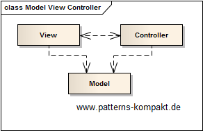
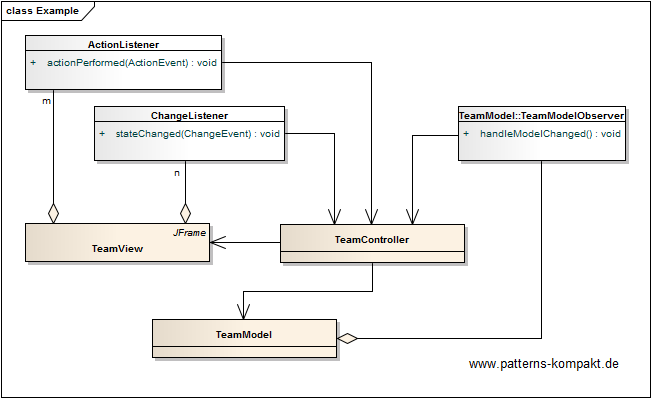

#### [Project Overview](../../../../../../../README.md)
----

# Model View Controller (MVC)

## Scenario

In her free time Linda develops a little Java Swing application for the local amateur sports club, the Chicago Flatliners.

The new team builder module shall help managing teams.

### Requirements Overview

The purpose of the team manager application is to provide a UI for setting up and changing teams.

_Main Features_

* Add a team member.
* Remove a team member.
* Signal if a team has less than 4 members.
* Signal if a team is invalid because it has less than two members.

### Quality Goals

_Table 1. Quality Goals_

No.|Quality|Motivation
---|-------|----------
1|Reactivity|The UI shall give immediate feedback (e.g. color/marker) to indicate validity/warning while entering the data.
2|Customizeability|The design shall allow later changes to the visual appearance/layout independent from the remaining application.
3|Testability|The design shall encourage testing the backend and UI components independently.

## Choice of Pattern
In this scenario we want to apply the **Model View Controller (MVC) Pattern** to _divide a component or subsystem into three logical parts - model, view, and controller - making it easier to modify or customize each part_ (SteMa). 

Linda has identified the three parts _TeamModel_ (the data, members of a team), the _TeamView_ (currently a JFrame, displaying the current state of the model to the user) and the _TeamController_, the latter manages the interaction with the user.

The controller acts as an _[Observer](../observer/README.md)_ of the model and the view to update both accordingly. If for example a team has less than 2 members a read mark will be displayed (invalid team), as long as there are less than 4 members you will see a yellow mark to indicate a small team.

## Try it out!

Open [ModelViewControllerTest.java](ModelViewControllerTest.java) to start playing with this pattern. By setting the log-level for this pattern to DEBUG in [logback.xml](../../../../../../../src/main/resources/logback.xml) you can watch the pattern working step by step.

## Remarks
* Linda's MVC-variation above is called **Passive View**, because the _TeamController_ takes care of the view updates. Alternatively, the view could observe the model and update itself.
* The classical 3-part MVC implies a high coupling of GUI-aspects to the basic data model. To avoid that, a **Presentation Model** (Fowler) can be introduced between the _Model_ on the one end and _View_/_Controller_ on the other. This further decouples the GUI layer from the domain model and allows the Presentation Model to contain (state) data purely related to GUI display. In other words: GUI aspects should not pollute the domain model.

## References

* (SteMa) Stelting, S., Maassen, O.: Applied Java Patterns. A Hands-On Guide to Design Pattern Developers. Prentice-Hall, Upper Saddle River (NJ, USA) (2001)
* (Fowler) [Fowler on Presentation Model](https://martinfowler.com/eaaDev/PresentationModel.html)
