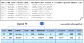
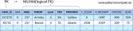
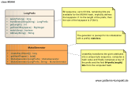
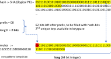

#### [Project Overview](../../../../../../../README.md)
----

# MUHAI (Mostly Unique Hashed Attributes Identifier)

## Scenario

Multiglom Smart Business, vendor of the web shop suite WANNAWEB, has decided to improve the analytics capapilities of the software. Instead of running the queries on the shops database tables which are [OLTP](https://en.wikipedia.org/wiki/Online_transaction_processing)-optimized, a new schema has been introduced called warehouse. Every day up to several million rows (from several logs) must be loaded. For some tables a merge is required and it shall be possible to join current data with data from the past.

For most of the tables the team could identify stable identifiers, which can be used as [primary keys](https://en.wikipedia.org/wiki/Primary_key). Unfortunately, there is a large daily import, that does not contain any identifier. The key (required for merging) is a logical composition of several fields.

A composite key solution is not well supported by the underlying database (especially at scale) and clumsy to work with. The team looks for a way to introduce a stable _DWH&#95;ID_ for the imported data.

### Requirements Overview

During the data load each row shall be enriched with a _DWH&#95;ID_ that is unique for the combination (Area, tenant, level, PXD, Provider), so that data from various imports can be merged. The _DWH&#95;ID_ shall further enable convenient joins between the table with the current data and data tables holding historic data.

_Main Features_

* Create a stable identifier for a specific value combination.

### Quality Goals

_Table 1. Quality Goals_

No.|Quality|Motivation
---|-------|----------
1|Performance|It is crucial to use a single identifier of type INT64, so that the underlying database is capable of processing queries with an acceptable response time.
2|Usability|One goal is query flexibility, even custom queries may have to be supported, soon. Thus keys must be easy to simplify joins.

## Choice of Pattern
In this scenario we want to apply the **MUHAI Pattern** to _map a list of attributes to a handy identifier that is almost unique by hashing the combination of values_. 

The _MuhaiGenerator_ generates the _DWH&#95;ID_ for each row of the data to be imported.

The potentially available keyspace is INT64, means 2^64 keys. However, we will use a prefix to make the keys easier to work with.

Consequently, the chosen keyspace contains 2^62 unique keys and collisions are very unlikely to happen.

For this scenario a MUHAI is _unique enough_, because we know that we most likely will never see any collision. And even if a few collisions occurred over time, this would not matter as the impact on the processes that operate on this data would be negligible.

## Try it out!

Open [MuhaiTest.java](MuhaiTest.java) to start playing with this pattern. By setting the log-level for this pattern to DEBUG in [logback.xml](../../../../../../../src/main/resources/logback.xml) you can watch the pattern working. In the **[collider package](../../../../../../main/java/de/calamanari/pk/muhai/collider/README.md)** you can find a little toolkit for creating and analyzing billions of generated keys (see also [KeyCollisionTest](collider/KeyCollisionTest.java)).

## Remarks
* Using a [prefix](../../../../../../main/java/de/calamanari/pk/muhai/LongPrefix.java) for MUHAIs is not required but recommended. Sacrificing bits reduces the size of the keyspace and thus increases the likelihood of collisions, which may sound scaring. But for most scenarios a keyspace of 2^62 keys should be still sufficient. On the other hand, the prefix ensures that you won't run negative if any system (e.g. Java) uses signed 64-bit datatypes. Also, you get up to 3 **backup keyspaces** that can be used in future, should you ever face the need for a complicated data merge or migration.
* If you plan to use MUHAIs do some simulation upfront. This won't take too much time but will increase your confidence and help convincing other stakeholders.
* The [MuhaiGenerator](../../../../../../main/java/de/calamanari/pk/muhai/LongPrefix.java) has a [hash pepper](https://en.wikipedia.org/wiki/Pepper_(cryptography) option. This is a simple way of pseudonymization. Usually, within the same keyspace (database) you won't use different peppers. However, you can safely do so, because the chance of collision only depends on the number of generated keys. If you create **n** keys without any pepper vs. **n/2** keys with pepper1 and **n/2** with pepper2, the expected number of collisions after generating the **n** keys remains the same.
* INT32 (4 billion keys possible) is in general too small for MUHAIs.

