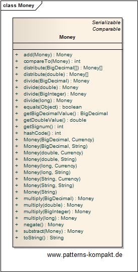

#### [Project Overview](../../../../../../../README.md)
----

# MUHAI (Mostly Unique Hashed Attributes Identifier)

## Scenario

Demo common issues with monetary amounts represented as floating point values and how this problem can be addressed.

## Choice of Pattern

In this scenario we want to apply the **Money Pattern** to _represent a monetary value_ (Fowler). 

Instead of using `float` or `double` values, for dealing with monetary values we have introduced the _Money_ class, which exactly represents an immutable amount of a given currency and provides typical operations for addition, subtraction, multiplication etc. Because it uses `BigDecimal` internally we can avoid the problems of floating point arithmetic.

## Try it out!

Open [MoneyTest.java](MoneyTest.java) to start playing with this pattern. The first test case demonstrates the problem we want to address: Harry, Laura and Ben wonder about a missing cent. The second test case solves the problem by leveraging the new _Money_ class.

## Remarks
* _Money_ is technically a [Value Object](../valueobject/README.md).
* Sometimes, people just need (much) higher precision, and when re-implementing computations using `BigDecimal`to achieve that, they literally get out of the frying pan into the fire, because doing large (maybe recursive) computations using `BigDecimal` can be extremely slow and exhaust memory. Libraries like [apfloat](http://www.apfloat.org/apfloat_java/tutorial.html) are worth looking at.

## References

* (Fowler) Fowler, M.: Patterns of Enterprise Application Architecture. Addison-Wesley (2002)
