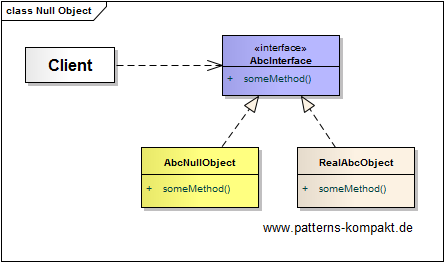
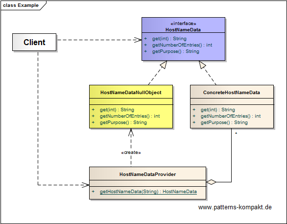
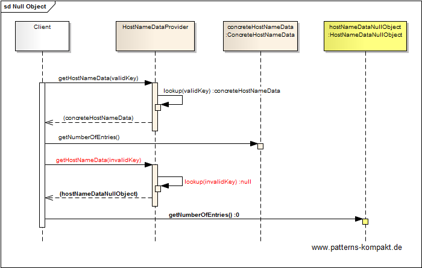

#### [Project Overview](../../../../../../../README.md)
----

# Null Object

## Scenario

Foobar&Sons develops Multigrate, a platform that aims integrating CRM data from various vendors. A recent review session of Team Lemon has shown a recurring problem with the _HostNameDataProvider_, which is part of the low-level integrator package and returns common information about hosts of remote partners. The problem is not the module itself, it seems the usage "invites clients to create `NullPointerException`s" (NPEs).

During the review it was discovered that the core method `getHostNameData(key)` returns **null**, if the key was unknown/invalid. The latter is rarely the case, but if it happens in production (usually due to misconfiguration), the resulting NPE blurs the cause and impedes the investigation.

The goal is to encourage a more robust use of the interface by design.

## Choice of Pattern
In this scenario we want to apply the **Null Object Pattern** to _ensure that functions always return valid objects, even when they fail. Those objects that represent failure do “nothing”_ (Martin). 

In the scenario above the team has decided that the _HostNameDataProvider_ should no longer return **null**. 

Instead clients should get a placeholder that behaves just like a regular _HostNameData_ object but logically represents a missing entry (a lookup failure).

The returned _HostNameDataNullObject_ consistently implements the methods of the _HostNameData_ interface, e.g. by returning **0** when `getNumberOfEntries()` is called. So clients can deal transparantly (safely) with a failed lookup without the need for null-checking.

## Try it out!

Open [NullObjectTest.java](NullObjectTest.java) to start playing with this pattern. By setting the log-level for this pattern to DEBUG in [logback.xml](../../../../../../../src/main/resources/logback.xml) you can watch the pattern working step by step.

## Remarks
* It is a nice topic for (dogma) discussions whether returning `null` should be always considered evil or not :smirk:. However, there are examples for return types that **should never be null**, i.e. `List`, `Map` and `array[]`, especially, as it can be avoided so easily.
* An empty aggregation should return a Null-[Iterator](../iterator/README.md) rather than **null** if the underlying aggregation is empty.
* A _Null Object_ pattern can be applied _implicitly_ (clients can handle the value correctly but not distinguish it from any regular result) or _explicitly_ (clients can test it to react on the special case). In the latter case the API usually exposes the _Null Object_ (constant) for comparing results against. E.g. sometimes clients need to distinguish between a regularly returned empty list and an _empty list Null Object_ that was returned because of a special case.
* (Fowler) introduces the _Null Object_ as a special case of the [_Special Case pattern_](https://martinfowler.com/eaaCatalog/specialCase.html).

## References

* (Martin) Martin, R.C.: Agile Software Development: Principles, Patterns and Practices. Addison-Wesley (2002)
* (Fowler) Fowler, M.: Patterns of Enterprise Application Architecture. Addison-Wesley (2002)