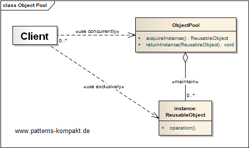
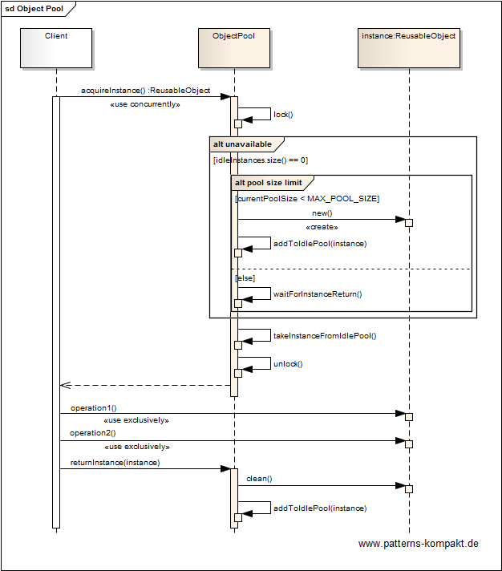
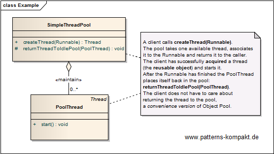

#### [Project Overview](../../../../../../../README.md)
----

# Object Pool

## Scenario

Here we don't have any concrete scenario, the example just shows some aspects of object pools. Additionally - and **strictly only for demonstration** I have included an ancient implementation of a thread pool, because it is still useful to explain problems like ramp-up, pool shrinking and cleaning returned objects.

### Requirements Overview

The purpose of the Object Pool is reuse of objects to avoid repeated construction/disposal and limit the maximum number of instances at the same time.

_Main Features_

* Provide a way to control the number of instances of a particular object type and pool them for potential reuse.

### Quality Goals

_Table 1. Quality Goals_

No.|Quality|Motivation
---|-------|----------
1|Memory Consumption| Avoid overloading the VM and GC with too many fat objects.
2|Performance|Construction of complex objects takes time, only a few are used in parallel. Ensure these precious instances get reused rather than disposed after use.
3|Limitation|Instances contain references to resources which are limited. Ensure there is only a limited number of instances active at the same time.

## Choice of Pattern
We want to demonstrate the **Object Pool Pattern** to _manage the reuse of objects when it is either expensive to create an object or there is a limit on the number objects of a particular type that can be created_ (Shalloway-Trott). 

The first synthetic example above works with an artificial payload to visualize the runtime impact of expensive objects as well as warm-up.

The second example shows an ancient thread pool at work.

## Try it out!

Open [ObjectPoolTest.java](ObjectPoolTest.java) resp. [SimpleThreadPoolTest.java](SimpleThreadPoolTest.java) to start playing with this pattern. By setting the log-level for this pattern to DEBUG in [logback.xml](../../../../../../../src/main/resources/logback.xml) you can watch the pattern working step by step.

## Remarks
* Object pools can greatly speed-up applications. Sometimes, they are even inevitable to prevent resource exhaustion.
* The more features (warm-up, shrinking, cleaning, error handling etc.), the more testing effort. Prefer managed pools (e.g. [Apache Commons Pool](https://commons.apache.org/proper/commons-pool/) over hand-made implementations.
* As mentioned in the book, object pools can have unwanted side-effects on memory management. Always keep in mind that pooled objects stay longer in memory, often for the lifetime of the application.
* No longer use any old thread pools, Java has the ExecutorService! :wink:

## References

* (Shalloway-Trott) Shalloway, A., Trott, J.R.: Design Patterns Explained – A New Perspective on Object-Oriented Design. Addision-Wesley (2002). Additional information at www.netobjectives.com.

