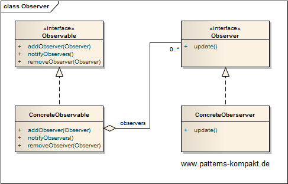
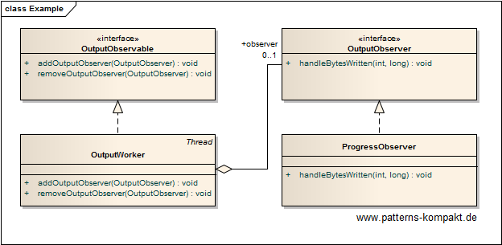
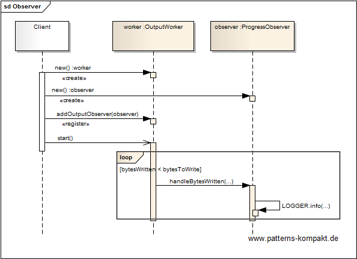

#### [Project Overview](../../../../../../../README.md)
----

# Observer

## Scenario

Multiglom Data sells MagiConv, a command-line tool for declarative record file conversion. Based on user feedback the decision was made to improve the progress indication. 

Mechanisms shall be implemented to better track the progress of a running conversion.

### Requirements Overview

The purpose of the progress indication lib is to log MagiConv progress either synchronously or asynchronously.

_Main Features_

* Allow progress output synchronously (from inside the worker thread).
* Allow progress output asynchronously (do not bother worker thread).

### Quality Goals

_Table 1. Quality Goals_

No.|Quality|Motivation
---|-------|----------
1|Performance|If required (high throughput scenario, many threads) the worker shall not be impacted by the progress indication.

## Choice of Pattern
In this scenario we want to apply the **Observer Pattern** to _define a one-to-many dependency between objects so that when one object changes, all its dependents are notified and updated automatically_ (GoF). 

We have identified the _OutputWorker_ in the scenario as the source (object that changes, making progress). A monitoring shall listen and print the progress messages.

At runtime the interplay looks as follows:

## Try it out!

Open [ObserverTest.java](ObserverTest.java) to start playing with this pattern. By setting the log-level for this pattern to DEBUG in [logback.xml](../../../../../../../src/main/resources/logback.xml) you can watch the pattern working step by step. There are two implementations, one prints the messages within the same thread as the worker. The other scenario simulates high throughput where observers are not called from the working thread(s) but from a dedicated monitoring thread that has no other purpose but periodically notifying observers about the progress. This avoids negative impact on the operation we are observing.

## Remarks
* The major challenges with this pattern are keeping control over registering (and unregistering!) observers on the one hand and not to block the notification thread on the other. Additionally, observing many sources running in separate threads can be tricky.
* A message queue (e.g. Kafka or RabbitMQ) can be involved to further decouple Observable and Observer, but it also makes the scenario more complex.

## References

* (GoF) Gamma, E., Helm, R., Johnson, R., Vlissides, J.: Design Patterns – Elements of Reusable Object-Oriented Software. Addison-Wesley (1995).
* (SteMa) Stelting, S., Maassen, O.: Applied Java Patterns. A Hands-On Guide to Design Pattern Developers. Prentice-Hall, Upper Saddle River (NJ, USA) (2001)
