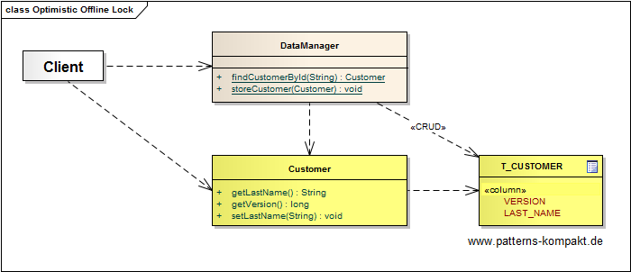
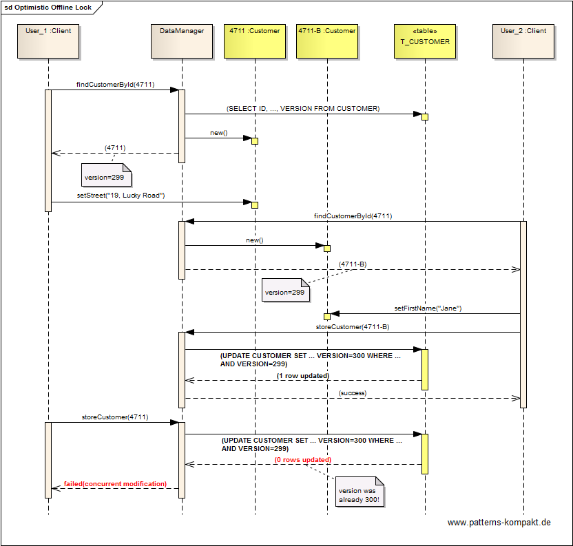

#### [Project Overview](../../../../../../../README.md)
----

# Optimistic Offline Lock

## Scenario

Multiglom B2B, vendor of the CRM suite Manjok for small businesses, wants to rework the concurrent access control for certain entities.

The existing rather simple approach implements a _last-wins-strategy_ when saving a _Customer_ entity. This can lead to changes being lost without notice. Especially, in conjunction with the new caching layer this is painful.

Discussions have lead to the conclusion that it would be sufficient to tell _User&#95;1_ about a conflict if his save-operation would overwrite any change that was made by _User&#95;2_ in the meantime. _User&#95;1_'s operation should be denied, to be restarted after a manual or assisted merge.

## Choice of Pattern
In this scenario we want to apply the **Optimistic Offline Lock Pattern** to _prevent conflicts between concurrent business transactions by detecting a conflict and rolling back the transaction_ (Fowler). 

The pattern maps the problem solution to the underlying [DBMS](https://en.wikipedia.org/wiki/Database#Database_management_system) and its transactional processing ([ACID](https://en.wikipedia.org/wiki/ACID)). By adding a VERSION column to the _T&#95;CUSTOMER_ table and incrementing it with every update, the system tracks the _latest version_ of the corresponding row and returns it when reading the _Customer_ as a part of its state.

By including the version obtained at retrieval time in the condition (where-clause) of the update when storing the _Customer_, we guarantee to only update a row in _T&#95;CUSTOMER_ if there was no update in the meantime. Any such update by anybody else between querying and updating a _Customer_ would have caused a _VERSION increment_ and would consequently cause the reported number of successfully updated records to be **0**.

The indicator (**0** vs. **1** row updated) can be evaluated by the process that attempts to perform the store operation. Either the operation (database transaction) succeeded or not. 

As a consequence, it can no longer happen that any change to a _Customer_ record gets swallowed without notice.

## Try it out!

Open [OptimisticOfflineLockTest.java](OptimisticOfflineLockTest.java) to start playing with this pattern. By setting the log-level for this pattern to DEBUG in [logback.xml](../../../../../../../src/main/resources/logback.xml) you can watch the pattern working step by step.

## Remarks
* As discussed in the book the user experience _Optimistic Offline Lock_ creates may be bad if you expect many conflicts or if repeating the operation after updating with latest version is painful for the user. Here, a differences visualization on field level or (automatic) merge utilities can help. However, sometimes [Pessimistic Offline Lock](../pessimisticofflinelock/README.md) may be the better choice.  

## References

* (Fowler) Fowler, M.: Patterns of Enterprise Application Architecture. Addison-Wesley (2002)

