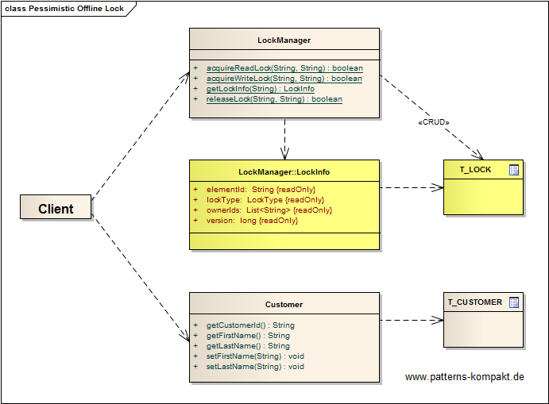
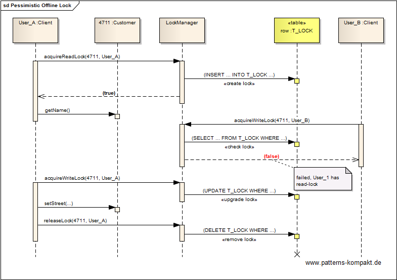

#### [Project Overview](../../../../../../../README.md)
----

# Pessimistic Offline Lock

## Scenario

Multiglom B2B, vendor of the CRM suite Manjok for small businesses, faces a series of complaints about their customer management module. Due to the way the workflow is organized and because the current data model focuses on the _Customer_, possibly concurrent business transactions need to modify the same customer instance. The currently implemented [optimistic](../optimisticofflinelock/README.md) locking approach causes to a lot of extra work (repetition) and thus frustration to the users.

People want _exclusive access_ to the customer data while they are working on it. For better workflow management they would like to know in advance if another user (and who) is currently working on a customer they want to access.

## Choice of Pattern
In this scenario we want to apply the **Pessimistic Offline Lock Pattern** to _prevent conflicts between concurrent business transactions by allowing only one business transaction at a time to access data_ (Fowler). 

The pattern introduces a _LockManager_ that leverages an underlying [DBMS](https://en.wikipedia.org/wiki/Database#Database_management_system) to maintain locks. Here the table _T&#95;LOCK_ contains the locks side-by-side with the data table _T&#95;CUSTOMER_.

Before working with the customer entity the clients (above _User&#95;A_ and _User&#95;B_) must successfully acquire a lock. After completion the lock must be released actively. If a client tries to obtain a lock on a _Customer_ already locked by another client, the request will be denied including an information who currently owns the lock.

## Try it out!

Open [PessimisticOfflineLockTest.java](PessimisticOfflineLockTest.java) to start playing with this pattern. By setting the log-level for this pattern to DEBUG in [logback.xml](../../../../../../../src/main/resources/logback.xml) you can watch the pattern working step by step. In the demo five concurrent users deal with a customer entity, some want read access, others write access, and even an upgrade from read to write access happens. The log output shows a detailed protocol of the lock status during its life-cycle.

## Remarks
* Explicit locking always comes with the risk of orphaned locks. It is a good idea to provide some remote interface (or guidelines) to monitor locks and to be able to release them forcibly. :wink:
* By introducing a time-to-live (TTL) for each lock entry (expiration field in _T&#95;LOCK_) you can mitigate the risk of "orphaned locks" (e.g. caused by client process abortion) or deal with potentially long-running business transactions. In the latter case a client first needs to _probe_ its potentially expired lock before continuing. It may be necessary to _re-acquire_ the lock (in conjunction with a merge) before proceeding.
* If your environment consists of a single container process and your business transactions anyway won't survive a container restart, an in-memory lock manager (i.e. a [Singleton](../singleton/README.md) bean in Spring or JEE) can simplify things.

## References

* (Fowler) Fowler, M.: Patterns of Enterprise Application Architecture. Addison-Wesley (2002)

