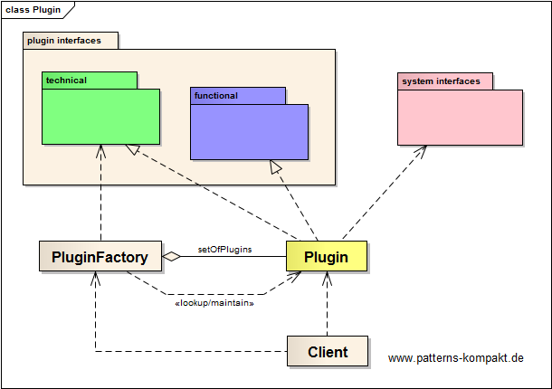
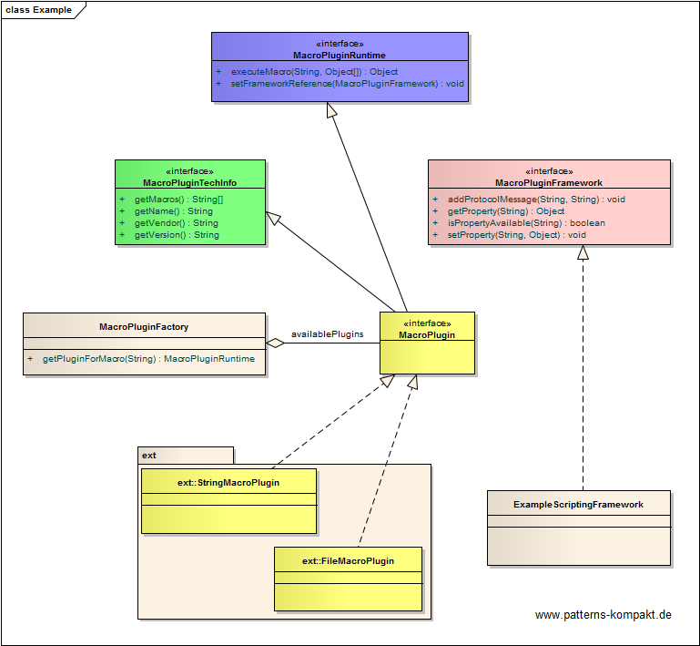
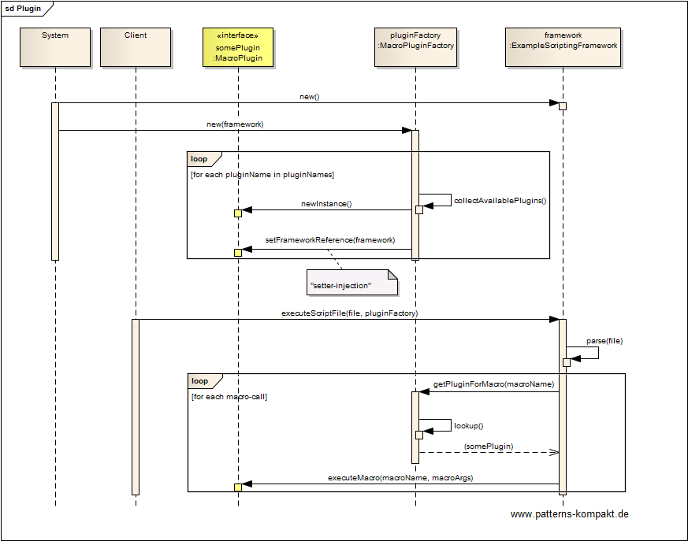

#### [Project Overview](../../../../../../../README.md)
----

# Plugin

## Scenario

Multiglom Media, vendor of the popular archiving solutions Devnull, has identified the need for a customizable functionality.

The new Macro-Scripting feature shall allow adding new features and their flexible usage.

Architects want to provide an [SPI](https://en.wikipedia.org/wiki/Service_provider_interface) to allow for new macro functionality implemented independently from the core software (by other vendors).

### Requirements Overview

The purpose of the new macro-based scripting framework is to extend Devnull with new features (macros) that can be leveraged by users of Devnull in scripts.

_Main Features_

* Provide an interface for implementing and loading new macro features in Devnull.
* The macro has access to Devnull core features.
* A script written by a user can use macros by name.

### Quality Goals

_Table 1. Quality Goals_

No.|Quality|Motivation
---|-------|----------
1|Flexibility|Adding and using macros (custom features) in Devnull shall be independent from the Devnull release cycle.

## Choice of Pattern
In this scenario we want to apply the **Plugin Pattern** to _link classes during configuration rather than compilation_ (Fowler). 

In the scenario above _macros_ shall be added by configuration. The implementor of a plugin just needs to implement some interfaces (SPI) and to provide an artifact that can be looked up by Devnull at runtime. 

The _ExampleScriptingFramework_ is a concrete implementation of the _MacroPluginFramework_. Two macros have been implemented (marked as "ext", possibly provided by other vendors), one for String operations and one for accessing files. At startup time the _MacroPluginFactory_ looks for configured plugins and initializes them at startup.

At runtime the _ExampleScriptingFramework_ identifies macro calls, performs a macro lookup by name and executes it.

## Try it out!

Open [PluginTest.java](PluginTest.java) to start playing with this pattern. By setting the log-level for this pattern to DEBUG in [logback.xml](../../../../../../../src/main/resources/logback.xml) you can watch the pattern working step by step.

## Remarks
* The downside of flexible feature-rich plugin interfaces is the potential security vulnerability. Even with **signed plugins** (assuming untrusted macros won't be loaded) scripting always leaves room for creating an exploit consisting of a sequence of macro calls, each one assumed to be harmless.

## References

* (Fowler) Fowler, M.: Patterns of Enterprise Application Architecture. Addison-Wesley (2002)
