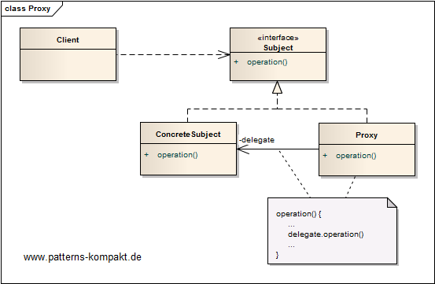
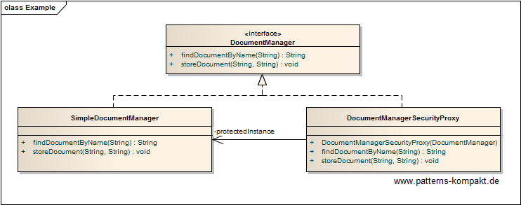

#### [Project Overview](../../../../../../../README.md)
----

# Proxy

## Scenario

Multiglom Media, vendor of the popular archiving solution Devnull, wants to secure the document manager which does not have any auth/auth-checking so far, albeit clients communicate to Devnull in a secure way ([OAUTH](https://oauth.net/2/)). It seems now that some customized client applications accidentally give users the chance to exploit this weakness. 

Without causing much change effort to the client applications it shall be ensured that clients of the Devnull service can no longer illegally access documents by playing with certain input parameters.

### Requirements Overview

The purpose of the security checker is to ensure that actions on the underlying Devnull _DocumentManager_ happen properly authenticated and authorized.

_Main Features_

* Check the acting user is authenticated.
* Check the acting user is authorized.
* Deny the action by throwing an exception if any of the security related preconditions are not met.

### Quality Goals

_Table 1. Quality Goals_

No.|Quality|Motivation
---|-------|----------
1|Transparency|We don't want to adjust the clients of the Devnull interface. 
2|Testability|The design shall encourage testing of the security checks decoupled from the underlying functionality.

## Choice of Pattern
In this scenario we want to apply the **Proxy Pattern** to _provide a surrogate placeholder for another object to control access to it_ (GoF). 

We have identified the _SimpleDocumentManager_ as the service to be protected without touching its implementation.

Because the client only depends on the _DocumentManager_ **interface** it is possible to replace the concrete instance the client talks to with a proxy. In this scenario the _DocumentManagerSecurityProxy_ performs an authorization check before delegating any action to the _SimpleDocumentManager_.
The client does not know about the new checks except that there may occur exceptions if an action is attempted without proper authorization.

The _DocumentManagerSecurityProxy_ can be tested against a dummy document manager to focus on the security responsibility rather than the functionality of a document manager.

## Try it out!

Open [ProxyTest.java](ProxyTest.java) to start playing with this pattern. By setting the log-level for this pattern to DEBUG in [logback.xml](../../../../../../../src/main/resources/logback.xml) you can watch the pattern working step by step.

## Remarks
* The scenario above is not as unrealistic as you might think. This has to do with the problem that security often was added later "evolutionary" to a software and some services were just overlooked or effort was considered being too high (for checking auth/auth down to the services). Often such problems are buried deeply and cannot be practically exploited (intranet-only app, fat client) - until the day comes and a web interface replaces the old UI, followed by the day the web interface will be opened to the internet because some partner does not like VPN ... _booom!_
* To make my life easier I created the [LambdaSupportLoggerProxy](../../../../../../main/java/de/calamanari/pk/util/LambdaSupportLoggerProxy.java) a proxy for the [SLF4J](http://www.slf4j.org/)-logger to conveniently use lambda expressions for conditional logging in this project.

## References

* (GoF) Gamma, E., Helm, R., Johnson, R., Vlissides, J.: Design Patterns – Elements of Reusable Object-Oriented Software. Addison-Wesley (1995).
* (Martin) Martin, R.C.: Agile Software Development: Principles, Patterns and Practices. Addison-Wesley (2002)
