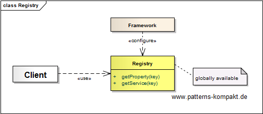
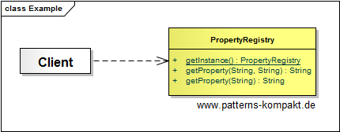

#### [Project Overview](../../../../../../../README.md)
----

# Registry

## Scenario

Multiglom Crapjew, a vendor of compostable jewels, has decided to rework its legacy home-grown CRM-platform BABBLER rather than replacing it.

Team Gogo is in charge to rework the way the different modules deal with properties. Currently, it is a mix of property file access, database calls and startup parameters. After discussing different approaches the decision was made to provide a central facility where properties can be queried (read-access).

Property management (storage/maintenance/change tracking) is a different concern (out-of-scope here). However, there is rumor that team Custos will implement anything based on git, but this is a different story. :smirk: 

### Requirements Overview

The purpose of the Property Access Facitily (PAF) is to provide access to properties from various modules of BABBLER.

_Main Features_

* Read-only access to properties.
* Provide a method to query a property by name, return an empty string if not found.
* Provide a method to query a property by name and to specify a default value to be returned if the property was not found.

### Quality Goals

_Table 1. Quality Goals_

No.|Quality|Motivation
---|-------|----------
1|Availability|It shall be easy to use PAF from any code location.
2|Robustness|PAF is supplementary and shall handle problems gracefully if possible.
3|Testability|It shall be easy for developers to mock PAF for integration testing.

## Choice of Pattern
In this scenario we want to apply the **Registry Pattern** to provide _a well-known object that other objects can use to find common objects and services_ (Fowler). 

In the scenario above we realize PAF as a _PropertyRegistry_.

This _PropertyRegistry_ will be made available throughout the application code of BABBLER.

Independent from the progress of the Custos team a **local** _PropertyRegistry_ can be provided (based on a property file). For integration testing developers can even configure a **Mock-**_PropertyRegistry_ providing just the values required for the test.

## Try it out!

Open [RegistryTest.java](RegistryTest.java) to start playing with this pattern. By setting the log-level for this pattern to DEBUG in [logback.xml](../../../../../../../src/main/resources/logback.xml) you can watch the pattern working step by step.

## Remarks
* As mentioned in the book implementing the _Registry pattern_ and _[Dependency Injection](../dependencyinjection/README.md)_ is rather complementary than contradictory. In the given example code the access to the _PropertyRegistry_ (a [singleton](../singleton/README.md)) is static. In other environments a reference to the registry might be injected in the using component.
* A registry can easily refresh values on a regular basis (for the same key, next time the updated value/reference will be returned). Updating references and values set via _[Dependency Injection](../dependencyinjection/README.md)_ is quite complicated, especially in conjunction with multi-threading.

## References

* (Fowler) Fowler, M.: Patterns of Enterprise Application Architecture. Addison-Wesley (2002)
