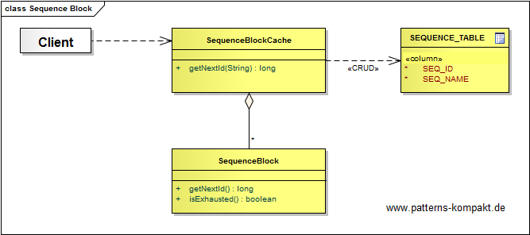
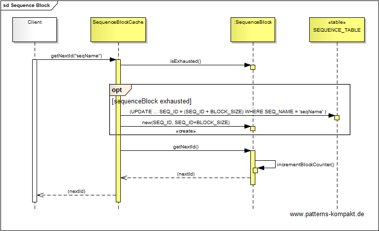

#### [Project Overview](../../../../../../../README.md)
----

# Sequence Block

## Scenario

Mrs. Freaklies, a progressive mom-and-pop store in Chicago, recently introduced a new voucher creation process for their web shop.

After successfully fixing the voucher generator (see [Decorator](../decorator/README.md)), Mrs. Freakly's grandchild Linda wants to improve the performance. Creating a single voucher is still based on a database sequence. In case of online-specials where a nightly job needs to create many vouchers in a row, the process is a little slow.

Linda wants to replace the database sequence for generating the basic keys.

### Requirements Overview

The purpose of the number generator is to provide an upcounting sequence of long values. The mechanism shall support concurrency as a batch run for specials may run in parallel with the use case "buy a voucher" in the shop.

_Main Features_

* Provide an upcounting number sequence (type long).

### Quality Goals

_Table 1. Quality Goals_

No.|Quality|Motivation
---|-------|----------
1|Performance|The process of obtaining the next valid number must be fast (< 2 milliseconds on average).
2|Consistency|Across processes (batch runs for specials vs. "buy a voucher") we must ensure that no number will be used twice.

## Choice of Pattern
In this scenario we want to apply the **Sequence Block Pattern** to create _incrementing, integer primary keys with very few database accesses_ (Marinescu). 

Instead of obtaining a new key by accessing the database sequence each time, we  instead fetch a block of keys in advance, the _SequenceBlock_. The block increment happens transactional on a database table. 

As long as the block is not exhausted, assigning the next valid key happens fast in-memory. Only, when a new block needs to be fetched a certain delay for the database access is required. 

Multiple processes (here batch runs for specials vs. "buy a voucher") can fetch and expend blocks independently.

## Try it out!

Open [SequenceBlockTest.java](SequenceBlockTest.java) to start playing with this pattern. By setting the log-level for this pattern to DEBUG or TRACE in [logback.xml](../../../../../../../src/main/resources/logback.xml) you can watch the pattern working step by step. I have also added a demo to show how performance can be bad and waste high if the circumstances are unlucky or the configuration is wrong.

## Remarks
* A trade-off is the potential waste of keys if a process could not spend all the keys in a block before terminating. The larger the blocks, the better the performance (less database access for block-fetching) but the bigger the potential waste.
* As long as a database sequence was used in the scenario above there was an implicit relation between the time keys were issued and the order of the keys, even across processes. For any key K2 assigned at the time T2 > T1 (key K1 was issued before K2), we could guarantee K2 > K1. This is no longer the case if multiple processes expend different blocks of sequences. This _should_ be irrelevant, but when changing an existing system, a potential impact needs to be verified. :smirk: 
* A special challenge can be migrating an existing key generation process to _SequenceBlock_, if existing keys already "pollute" the key-space. If the assigned keys don't follow any pattern (like "all keys below M") finding a solution can be tricky. If the number of legacy keys is not too large, then the _SequenceBlock_ pattern can be combined with an in-memory blacklist.
* An interesting aspect is the impact of [scale out](https://en.wikipedia.org/wiki/Scalability) on this pattern. In general the _Sequence Block_ pattern supports horizontal scaling very well: multiple process instances can obtain and expend blocks independently. However, it can happen that the number of block requestors overload the underlying DB ([resource contention](https://en.wikipedia.org/wiki/Resource_contention)), or the enormous waste of keys just becomes inaccaptable.
* You can decouple the worker nodes which need to obtain and expend sequence blocks from direct connectivity to an underlying database by introducing a [microservice](https://en.wikipedia.org/wiki/Microservices) responsible for block management. This service can even internally prefetch one or two blocks to further reduce delays.

## References

* (Marinescu) Marinescu, F.: EJB Design Patterns. Wiley, Hoboken (NJ, USA), (2002).

