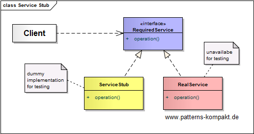
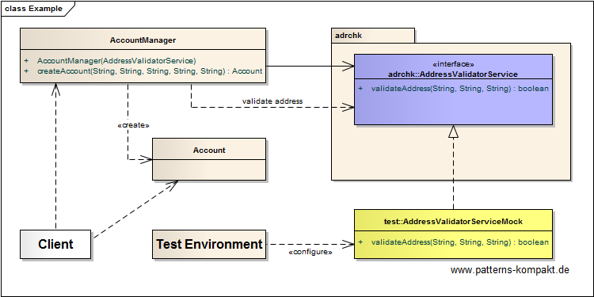

#### [Project Overview](../../../../../../../README.md)
----

# Service Stub

## Scenario

Linda, who maintains a little application for the local amateur sports club Chicago Flatliners, got the opportunity to use Multiglom's address validation service ADDREMA free of charge, because her application is for a non-profit organization. She quickly added the required calls to the _AccountManager_ of her software, but soon, she realized problems. Now, often her integration tests are red, and worse, she gets locked out for 24 hours from ADDREMA. Unfortunately, Linda's ADDREMA-key is rate-limited and does not allow concurrency. The server seems to detect and block access from different environments (e.g. her local machine, integration, production).

Linda looks for a way to become independent from the availability of ADDREMA. Her ADDREMA-key shall be reserved for the real deployment (aka production).

## Choice of Pattern
In this scenario we want to apply the **Service Stub Pattern** to _remove dependence upon problematic services during testing_ (Fowler). 

Linda wants to avoid accessing ADDREMA during local and integration testing. Therefore, she provides the _AddressValidatorServiceMock_, which implements the _AddressValidatorService_ interface but does not perform any calls to ADDREMA. 

Instead the _AddressValidatorServiceMock_ answers address validation requests in a predictable way for testing against the interface without depending on external services.

## Try it out!

Open [ServiceStubTest.java](ServiceStubTest.java) to start playing with this pattern. By setting the log-level for this pattern to DEBUG in [logback.xml](../../../../../../../src/main/resources/logback.xml) you can watch the pattern working step by step.

## Remarks
* Before implementing a _ServiceStub_ from scratch check whether you can simplify your life by leveraging one of the popular frameworks. E.g. in this project I occasionally use [Mockito 3](https://site.mockito.org/), which supports several variations of mocks.
* Beware of mocking to pretend test coverage, I would call it "green mocking". My worst experience was spending a full day understanding an integration test which looked quite elaborated at first glance. This test involved mocks for a lot of dependencies and finally turned out to test - rataplan - effectively nothing. :flushed: 

## References

* (Fowler) Fowler, M.: Patterns of Enterprise Application Architecture. Addison-Wesley (2002)
