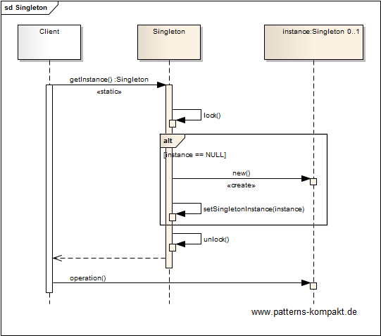
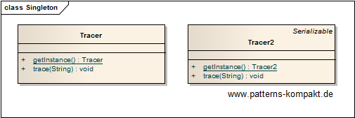

#### [Project Overview](../../../../../../../README.md)
----

# Singleton

## Scenario

Multiglom Care Ltd. among other systems maintains a legacy application.
Due to pressing legal requirements they need to add any kind of [ledger](https://en.wikipedia.org/wiki/Ledger) very quickly.

The engineering department has identified the need for a tracing component that writes messages to a trace file. These messages can come from various locations (classes) in the application logic. 

It shall be ensured that (static) access is possible and the written messages won't corrupt each other when being appended to the file.
Messages shall be written in the order they were produced.

Performance is not a major concern because the code of the legacy application may be complex (many messages) but does not run very frequently. 

### Requirements Overview

The purpose of the tracer is common write access to the destination file avoiding any message corruption.

_Main Features_

* Provide a central tracer component with static access.
* The tracer shall have a single method `trace(String)` (when call returns, message has been written).

### Quality Goals

_Table 1. Quality Goals_

No.|Quality|Motivation
---|-------|----------
1|Availability|Due to the time pressure it is crucial that the access to the tracer is easy, no matter where in the existing code.
2|Consistency|Under no circumstances messages shall corrupt other messages written to the tracer.

## Choice of Pattern
In this scenario we want to apply the **Singleton Pattern** to _ensure that a class only has one instance, and provide a global point of access to it_ (GoF). 

The Tracer is the object that shall exist only once to encapsulate the synchronized access to an underlying file. For comparison there are two implementations given, _Tracer_ and _Tracer2_. The latter is more sophisticated.

However, both implementations fulfill the requirements. There is static access, and they both protect the destination file from corruption by synchronizing write access.

## Try it out!

Open [SingletonTest.java](SingletonTest.java) to start playing with this pattern. By setting the log-level for this pattern to DEBUG in [logback.xml](../../../../../../../src/main/resources/logback.xml) you can watch the pattern working step by step.

## Remarks
* As described in the book, singletons can be problematic citizens (life-cycle management, state, contention etc.). Whenever possible framework alternatives should be preferred over bare-metal singletons (e.g. Spring and EJB offer managed singletons with controlled life-cycle and dependency injection).
* When implementing a singleton by hand, look for simplicity rather than elegance or coolness. The _discussion_ in the API-doc of [Tracer2](../../../../../../../src/main/java/de/calamanari/pk/singleton/Tracer2.java) is noteworthy.

## References

* (GoF) Gamma, E., Helm, R., Johnson, R., Vlissides, J.: Design Patterns – Elements of Reusable Object-Oriented Software. Addison-Wesley (1995).

