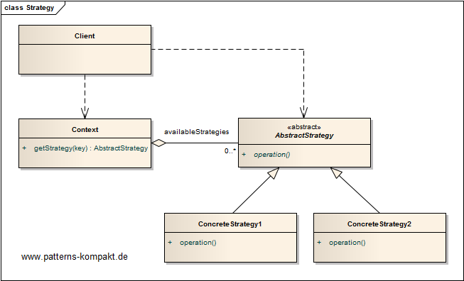
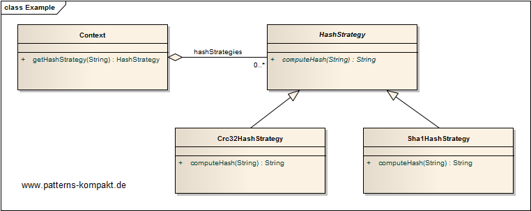

#### [Project Overview](../../../../../../../README.md)
----

# Strategy

## Scenario

Multiglom Media, vendor of archiving solutions, wants to add hashing to their external messaging system after a couple of inexplainable data changes were discovered.

It shall be possible to automatically compute a hash (method configurable) over each message.

### Requirements Overview

The purpose of the hasher is computing a hash over given message content. The hash algorithm shall be chosen based on the system context.

_Main Features_

* Compute hash (String) over each message (String).
* Make the hash algorithm configurable, so it can be selected from the context at runtime.

### Quality Goals

_Table 1. Quality Goals_

No.|Quality|Motivation
---|-------|----------
1|Performance|The performance impact shall be minimal, for certain scenarios it shall be possible to define a dummy algorithm not impacting processing speed at all.
2|Extendability|It shall be easy to add more algorithms.
3|Testability|The design shall encourage testing decoupled from the rest of the application.

## Choice of Pattern
In this scenario we want to apply the **Strategy Pattern** to _define a family of algorithms, encapsulate each one, and make them interchangeable. Strategy lets the algorithm vary independently from clients that use it_ (GoF). 

We have identified the hash algorithm to be encapsulated in a strategy.

Initially, we provide two concrete strategies: _Crc32HashStrategy_ and _Sha1HashStrategy_.
The only method `computeHash()` of the _HashStrategy_ interface takes a String and returns a String, so a dummy implementation (without performance impact) would be easy to implement.

## Try it out!

Open [StrategyTest.java](StrategyTest.java) to start playing with this pattern. By setting the log-level for this pattern to DEBUG in [logback.xml](../../../../../../../src/main/resources/logback.xml) you can watch the pattern working step by step.

## Remarks
* It is worth mentioning that a _Strategy_ by definition only provides a single operation (method). If you intend to encapsulate multiple operations that typically belong together, you should call that **Policy** rather than Strategy as described by (Shalloway-Trott).

## References

* (GoF) Gamma, E., Helm, R., Johnson, R., Vlissides, J.: Design Patterns – Elements of Reusable Object-Oriented Software. Addison-Wesley (1995).
* (Shalloway-Trott) Shalloway, A., Trott, J.R.: Design Patterns Explained – A New Perspective on Object-Oriented Design. Addision-Wesley (2002). Additional information at www.netobjectives.com.
