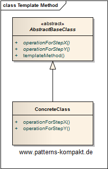
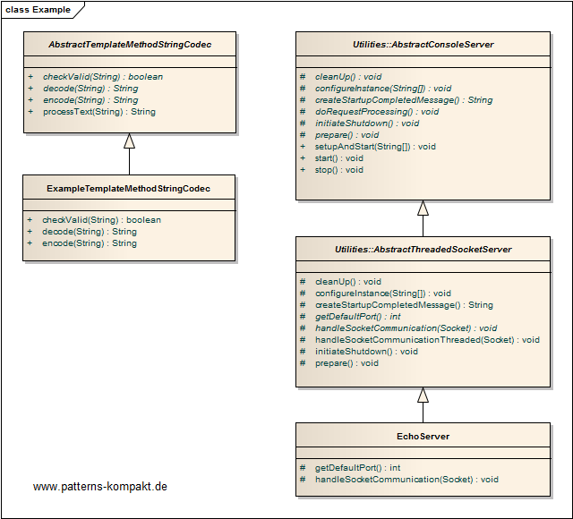

#### [Project Overview](../../../../../../../README.md)
----

# Template Method

## Scenario

Multiglom Media, vendor of archiving solutions, has decided to support encoded (encrypted) Storage of field values (String).

Therefore they want to create a family of decoders to support different string encoding algorithms.

### Requirements Overview

The purpose of the String decoder is encrypting and decrypting Strings, supporting several algorithms.

_Main Features_

* Encode given String.
* Decode given encoded String.
* Check validity of encoded String

### Quality Goals

_Table 1. Quality Goals_

No.|Quality|Motivation
---|-------|----------
1|Performance|The performance impact shall be minimal, for certain scenarios it shall be possible to define a dummy decoder not impacting processing speed at all.
2|Extendability|It shall be easy to add further decoders.
3|Testability|The design shall encourage testing decoupled from the rest of the application.

## Choice of Pattern
In this scenario we want to apply the **Template Method Pattern** to _define the skeleton of an algorithm in an operation, deferring some steps to subclasses_ (GoF). 

In the defined scenario we assume that the String Codec has some general code. Thus there is an abstract base class _AbstractTemplateMethodStringCodec_ with this common logic. The encryption and decryption shall happen in concrete subclasses, `encode`, `decode` as well as `checkValid` are _Template Methods_. The _ExampleTemplateMethodStringCodec_ is currently the only concrete implementation.

You can see this depicted below on the left side.

There is a more interesting example of _Template Method_ in the `util`-package. You can see the _AbstractConsoleServer_ with its subclasses above on the right side. I use external processes in some pattern examples to make them a little more interesting. The _AbstractConsoleServer_ only provides basic functionality and declares _Template Methods_ for the remaining logic. The same is true for the _AbstractThreadedSocketServer_ which adds the magic of threading. Finally, the _EchoServer_ is a concrete subclass that implements the remaining _Template Methods_ to be functional.

## Try it out!

Open [TemplateMethodTest.java](TemplateMethodTest.java) to start playing with this pattern. By setting the log-level for this pattern to DEBUG in [logback.xml](../../../../../../../src/main/resources/logback.xml) you can watch the pattern working step by step. Be aware that I have redirected the output of the _EchoServer_ (running in the background) to the log output for better visualization. 

## Remarks
* Template method is an excellent way to realize abstraction not appearing "over-engineered". The classes get smaller with better focus.
* Template method can potentially impede testing as it uses inheritance: You implicitly run the construction process of the base class. So, it is a good idea to avoid any heavy-weight actions in the constructor chain.
* The [MuhaiGenerator](../../../../../../../src/main/java/de/calamanari/pk/muhai/MuhaiGenerator.java) implements _Template Method_ to allow subclasses to change details of the MUHAI-creation process without having to re-implement the whole generator.

## References

* (GoF) Gamma, E., Helm, R., Johnson, R., Vlissides, J.: Design Patterns – Elements of Reusable Object-Oriented Software. Addison-Wesley (1995).

