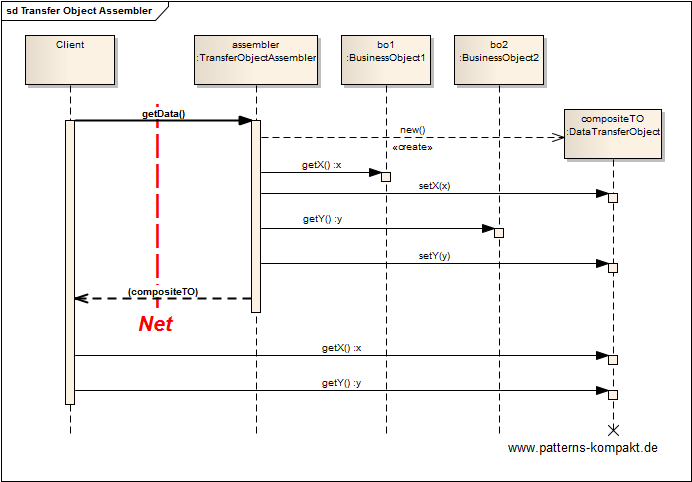
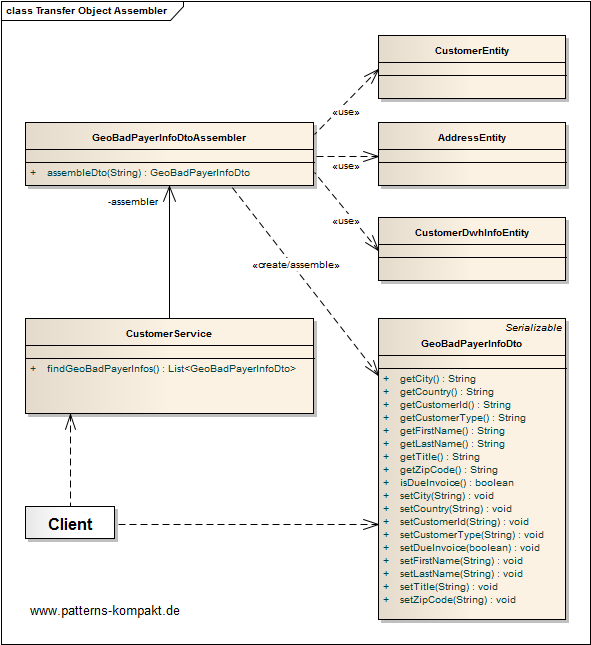
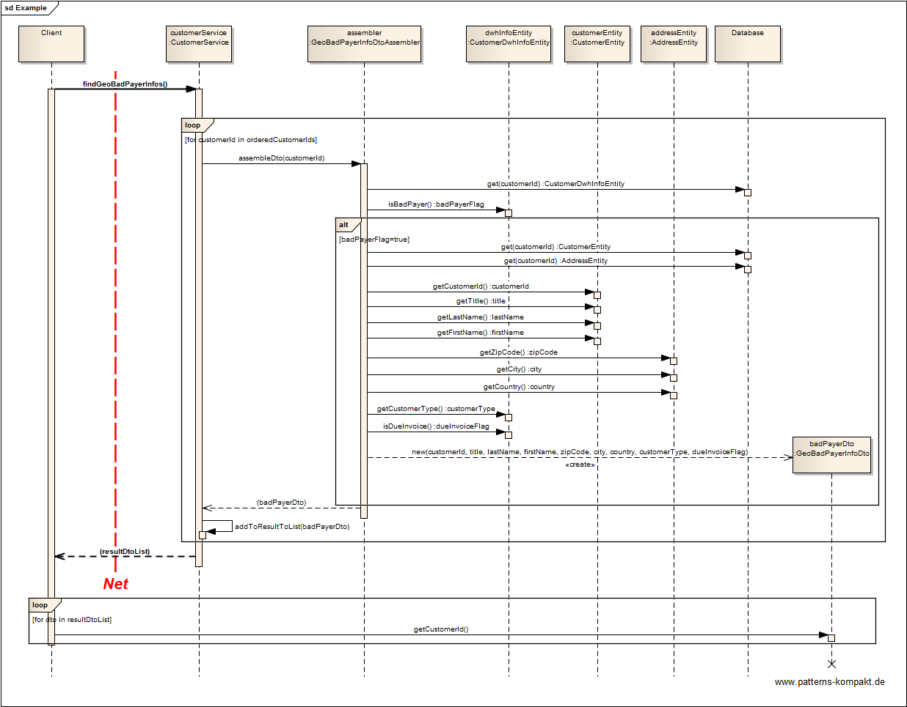

#### [Project Overview](../../../../../../../README.md)
----

# Transfer Object Assembler

## Scenario

Multiglom Sillitek, vendor of the Product Management Suite PMS, has recently introdued [Data Transfer Objects](../datatransferobject/README.md) to improve the new distributed architecture replacing the monolithic deployment.

It was discovered that the introduction of the DTO improved the performance but certain use cases like the "bad payer check" are still not back to the old responsiveness as they are dealing with several business objects and now with several DTOs to be transmitted over the network.

## Choice of Pattern
In this scenario we want to apply the **Transfer Object Assembler Pattern** to to build a _required model or submodel. The Transfer
Object Assembler uses Transfer Objects to retrieve data from various business objects_ (Bien). 

In the scenario above the _GeoBadPayerInfoDto_ is a submodel of the underlying data model (customer, address, customer data from DWH). 

The selection of the required data from these entities to compose the _GeoBadPayerInfoDto_ is the job of the _GeoBadPayerInfoDtoAssembler_, so that all information can be retrieved in a single call, while unrelated fields can be omitted. 

As a result latency goes down to a single call, the clients reads the field values locally after transferring the whole assembled DTO.

## Try it out!

Open [TransferObjectAssemblerTest.java](TransferObjectAssemblerTest.java) to start playing with this pattern. By setting the log-level for this pattern to DEBUG in [logback.xml](../../../../../../../src/main/resources/logback.xml) you can watch the pattern working step by step.

## Remarks
* Nowadays, you won't find this pattern implemented _explicitly_ in any recent project. The Transfer Object Assembler was invented in the days of J2EE. However, if you look how the layer of client-oriented REST-entities maps **n:m** to business entities (see also [Fielding](https://www.ics.uci.edu/~fielding/pubs/dissertation/rest_arch_style.htm#sec_5_2_1_1)), there are obviously many implicit invisible transfer object assemblers working behind the scenes.

## References

* (Bien) Bien, A.: J2EE Patterns – Entwurfsmuster für die J2EE. Addison-Wesley (2002)
* (SUN) Alur, D., Crupi, J., Malks, D.: Core J2EE Patterns: Best Practices and Design Strategies. Prentice Hall, Upper Saddle River (NJ, USA) (2001).

