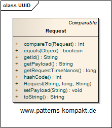

#### [Project Overview](../../../../../../../README.md)
----

# UUID

## Scenario

In her free time Linda develops a little application for the local amateur sports club, the Chicago Flatliners.

For better linking, she wants to add an id to every comment request users can place in the chat module.

### Requirements Overview

The purpose of the comment request identifier is the ability to identify and link comments.
The existing REV-field (String) of the comment entity shall be used for storing the new id.

_Main Features_

* Each new comment request shall have an id.
* The id shall uniquely identify a comment in the system starting with the comment request.

### Quality Goals

_Table 1. Quality Goals_

No.|Quality|Motivation
---|-------|----------
1|Simplicity|Linda looks for a quick and simple solution that won't involve any database changes (the framework's comment object has already a REV-field that can be used). Linda wants to create the id in-memory without the need for a database sequence or implementing [Sequence Block](../sequenceblock/README.md).

## Choice of Pattern
In this scenario we want to apply the **UUID pattern** to create _primary keys in memory by creating a universally unique
identifier (UUID) that combines enough system information to make it unique across space and time_ (Marinescu). 

All modern languages provide support for UUID-generation either out-of-the-box or through well-tested libraries. In Java the UUID-class helps creating and working with standard UUIDs. 

In the scenario, whenever a new request is created, a UUID will be obtained (generated based on various runtime parameters), which can be used as a practically unique identifier.

## Try it out!

Open [UUIDTest.java](UUIDTest.java) to start playing with UUID. Because UUID-creation is a standardized mechanism available in all modern programming languages, the code does not show the UUID-creation itself but only the application.

## Remarks
* UUIDs are _practically unique_ but - other than for example a transactional incremental database sequence - they are not guaranteed to be unique.
* UUIDs are **not random** and their bits are not uniformly distributed.
* A nice article about the UUID-generation process including remarks about the likelyhood of collisions can be found at [UUID](https://en.wikipedia.org/wiki/Universally_unique_identifier).

## References

* (Marinescu) Marinescu, F.: EJB Design Patterns. Wiley, Hoboken (NJ, USA), (2002).
