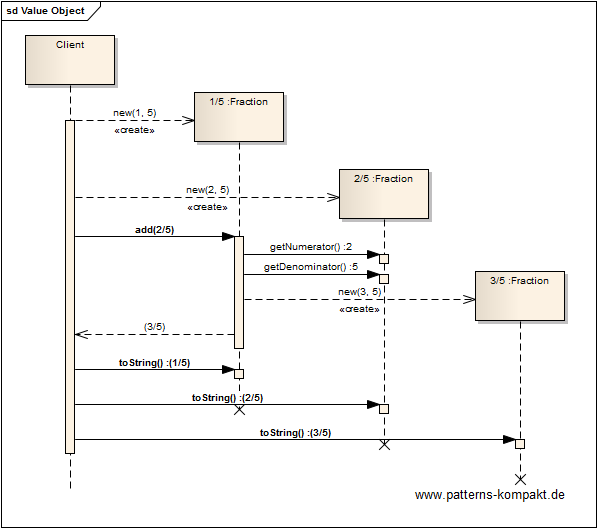

#### [Project Overview](../../../../../../../README.md)
----

# Value Object

## Scenario

In this demo we want to do some fractional arithmetic. A fraction is an example for an entity that represents a defined value on the one hand but has structure on the other: numerator and denominator. Even more interesting: two fractions looking different can be equal, such as: `1/3 == 2/6`.

## Choice of Pattern
Here we want to apply the **Value Object Pattern** to introduce a _small simple object, like money or date range, whose equality isn't based on identity_ (Fowler). 

A _Fraction_ is an immutable tuple of numerator and denominator.

Every operation on a _Fraction_ instance that would modify it, instead creates a new _Fraction_ instance.

## Try it out!

Open [ValueObjectTest.java](ValueObjectTest.java) to start playing with this pattern. By setting the log-level for this pattern to DEBUG in [logback.xml](../../../../../../../src/main/resources/logback.xml) you can watch the pattern working step by step. Take a look, how equality of _Fraction_s is defined (`equals(), hashCode(), compareTo()`).

## Remarks
* [Identity Field](../identityfield/README.md), [Money](../money/README.md) and also [Null Object](../nullobject/README.md) are value objects.
* [Records](https://openjdk.java.net/jeps/359) simplify implementing _ValueObject_s in Java.
* The above _Fraction_ implementation shows a common pitfall when defining equality deviating from the representational state. If you put 1/3, 2/6 and 4/12 into a `HashSet`, it will afterwards contain just a single entry.

## References

* (Fowler) Fowler, M.: Patterns of Enterprise Application Architecture. Addison-Wesley (2002)
